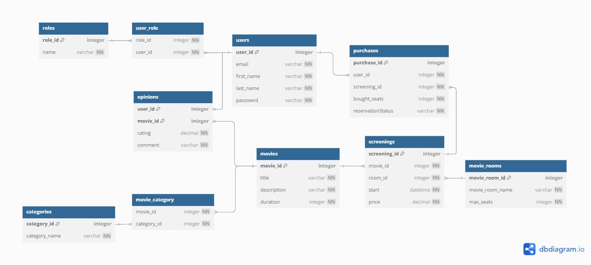
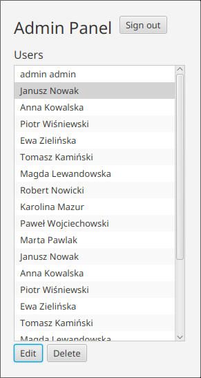
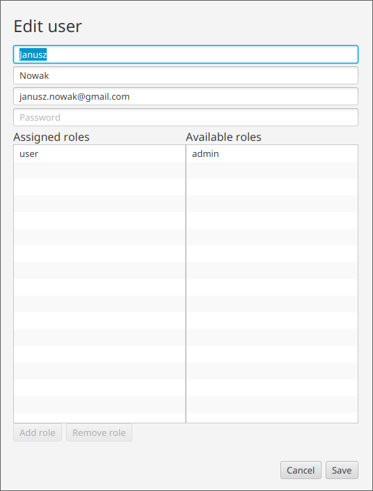

# Temat projektu
## *System do obsługi "Multipleksu kinowego"*

# Skład zespołu

- Krystian Sienkiewicz
- Krzysztof Gołuchowski
- Ernest Szlamczyk
- Mateusz Ścianek

# Wykorzystane technologie

Projekt został zaimplementowany jako aplikacja **Spring Boot** w języku *Java*. Wykorzystaliśmy bazę danych **H2**


# Uruchomienie:

```txt
Plik CinemaProjectApplication.java

./gradlew bootRun
```

# Schemat bazy danych



# Model obiektowy

## Category

Tabela *categories* przechowuje kategorie, które mogą być przypisane do filmów w systemie.

#### Model bazodanowy

Klasa Category zawiera pola:
- id - ID kategorii
- categoryName - nazwa kategorii
- movies - zestaw filmów przypisanych do kategorii

Relacje:
- Relacja wiele-do-wielu z tabelą movies przez pole movies, z mapowaniem pośrednim w tabeli łączącej. Film może należeć do wielu kategorii, a każda kategoria może być przypisana do wielu filmów. Relacja jest realizowana przez tabelę pośrednią movie_category. 

```java
@Entity
@Table(name = Category.TABLE_NAME)
public class Category {

    public static final String TABLE_NAME = "categories";

    @Id
    @GeneratedValue(strategy = GenerationType.IDENTITY)
    @Column(name = "category_id")
    private Long id;

    @Column(name = "category_name", nullable = false)
    private String categoryName;

    @ManyToMany(mappedBy = "categories")
    private Set<Movie> movies = new HashSet<>();

    public Category() {}

    public Category(String categoryName) {
        this.categoryName = categoryName;
    }

    public Long getCategoryId() {
        return id;
    }

    public String getCategoryName() {
        return categoryName;
    }

    public void setCategoryName(String categoryName) {
        this.categoryName = categoryName;
    }

    public Set<Movie> getMovies() {
        return movies;
    }

    public void setMovies(Set<Movie> movies) {
        this.movies = movies;
    }

    public void addMovie(Movie movie) {
        movies.add(movie);
    }
}
```
#### Klasy pomocnicze

Dodatkowa klasa typu DTO
```java
public record CategoryDto (
    Long id,
    String categoryName
) {
    public CategoryDto(String categoryName) {
        this(null, categoryName);
    }

    public static CategoryDto categoryToCategoryDto(Category category) {
        if (category == null) {
            return null;
        }

        return new CategoryDto(
                category.getCategoryId(),
                category.getCategoryName()
        );
    }
}
```

#### Warstwa serwisowa

Warstwa serwisowa implementuje następujące podstawowe funkcjonalności

- `createCategory` przyjmuje obiekt DTO i jeżeli nie ma już kategorii z taką 
nazwą to dodaje ją do bazy danych
- `getCategoryByName` wyszukuje kategorie po jej nazwie,
a następnie to co zostało znalezione konwertuje na obiekt DTO
- `getCategoryIdsByName` robi to samo tylko zwraca ich ID zamiast całego obiektu
- `editCategory` edytuje kategorie
- `deleteCategory` i `deleteCategories` usuwa kategorie po id (lub liście je zawierających)

```java
@Service
@Transactional
public class CategoryService {

    private final CategoryRepository categoryRepository;

    @Autowired
    public CategoryService(CategoryRepository categoryRepository) {
        this.categoryRepository = categoryRepository;
    }

    public List<CategoryDto> getCategories() {
        return categoryRepository.findAll().stream()
                .map(CategoryDto::categoryToCategoryDto)
                .toList();
    }

    public boolean createCategory(CategoryDto categoryDto) {
        if (categoryRepository.findByCategoryName(categoryDto.categoryName()).isPresent()) {
            return false;
        }
        Category category = new Category(categoryDto.categoryName());
        categoryRepository.save(category);
        return true;
    }

    public Optional<CategoryDto> getCategoryByName(String categoryName) {
        return categoryRepository.findByCategoryName(categoryName)
                .map(CategoryDto::categoryToCategoryDto);
    }

    public List<Long> getCategoryIdsByName(List<String> categoryNames) {
        return categoryNames.stream()
                .map(this::getCategoryByName)
                .filter(Optional::isPresent)
                .map(Optional::get)
                .map(CategoryDto::id)
                .toList();
    }

    public boolean editCategory(Long id, CategoryDto categoryDto) {

        Optional<Category> categoryWithName = categoryRepository.findByCategoryName(categoryDto.categoryName());

        if (categoryWithName.isPresent() &&
                categoryDto.categoryName().equals(categoryWithName.get().getCategoryName()) &&
                !Objects.equals(categoryWithName.get().getCategoryId(), id)) {
            return false;
        }

        Optional<Category> optionalCategory = categoryRepository.findById(id);
        if (optionalCategory.isPresent()) {
            Category category = optionalCategory.get();
            category.setCategoryName(categoryDto.categoryName());
            categoryRepository.save(category);
            return true;
        }
        return false;
    }

    public boolean deleteCategory(Long id) {
        Optional<Category> optionalCategory = categoryRepository.findById(id);
        if (optionalCategory.isPresent()) {
            Category category = optionalCategory.get();
            categoryRepository.delete(category);
            return true;
        }
        return false;
    }

    public List<String> deleteCategories(List<Long> ids) {
        List<String> deletedCategories = new ArrayList<>();
        for (Long id : ids) {
            Optional<Category> optionalCategory = categoryRepository.findById(id);
            if (optionalCategory.isPresent()) {
                Category category = optionalCategory.get();
                categoryRepository.delete(category);
                deletedCategories.add(category.getCategoryName());
            }
        }
        return deletedCategories;
    }
}
```

#### Warstwa repozytorium

Warstwa repozytorium implementuje dodatkowo:
- wyszukiwanie po nazwie kategorii

```java
public interface CategoryRepository extends JpaRepository<Category, Long> {

    Optional<Category> findByCategoryName(String categoryName);
}
```

## Movie

Tabela *movies* przechowuje filmy jakie oferuje kino.

#### Model bazodanowy

Klasa Movie zawiera pola:
- id - ID filmu.
- title - tytuł filmu.
- description - opis filmu.
- duration - długość filmu w minutach.
- screenings - zestaw seansów powiązanych z filmem.
- categories - zestaw kategorii przypisanych do filmu.
- opinions - zestaw opinii użytkowników na temat filmu.

Relacje:
- Relacja jeden-do-wielu z tabelą screenings przez pole screenings: Film może mieć wiele seansów, ale każdy seans jest przypisany do jednego filmu.
- Relacja wiele-do-wielu z tabelą categories przez pole categories: Film może należeć do wielu kategorii, a każda kategoria może być przypisana do wielu filmów. Relacja jest realizowana przez tabelę pośrednią movie_category.
- Relacja jeden-do-wielu z tabelą opinions przez pole opinions: Film może mieć wiele opinii, ale każda opinia jest przypisana do jednego filmu.

```java
@Entity
@Table(name = Movie.TABLE_NAME)
public class Movie {

    public static final String TABLE_NAME = "movies";

    @Id
    @GeneratedValue(strategy = GenerationType.IDENTITY)
    @Column(name = "movie_id")
    private Long id;

    @Column(nullable = false)
    private String title;

    @Column(nullable = false)
    private String description;

    @Column(nullable = false)
    private int duration;

    @OneToMany(mappedBy = "movie", cascade = CascadeType.ALL)
    private Set<Screening> screenings = new HashSet<>();

    @ManyToMany
    @JoinTable(
            name = "movie_category",
            joinColumns = @JoinColumn(name = "movie_id"),
            inverseJoinColumns = @JoinColumn(name = "category_id")
    )
    private Set<Category> categories;

    @OneToMany(mappedBy = "movie", cascade = CascadeType.ALL)
    private Set<Opinion> opinions;

    public Movie() {}

    public Movie(String title, String description, int duration) {
        this.title = title;
        this.description = description;
        this.duration = duration;
    }

    public Long getId() {
        return id;
    }

    public String getTitle() {
        return title;
    }

    public void setTitle(String title) {
        this.title = title;
    }

    public String getDescription() {
        return description;
    }

    public void setDescription(String description) {
        this.description = description;
    }

    public int getDuration() {
        return duration;
    }

    public void setDuration(int duration) {
        this.duration = duration;
    }

    public Set<Screening> getScreenings() {
        return screenings;
    }

    public void setScreenings(Set<Screening> screenings) {
        this.screenings = screenings;
    }

    public Set<Category> getCategories() {
        return categories;
    }

    public void setCategories(Set<Category> categories) {
        this.categories = categories;
    }

    public Set<Opinion> getOpinions() {
        return opinions;
    }

    public void setOpinions(Set<Opinion> opinions) {
        this.opinions = opinions;
    }

    public void addScreening(Screening screening) {
        screenings.add(screening);
        screening.setMovie(this);
    }

    public void addCategory(Category category) {
        categories.add(category);
    }

    public void addOpinion(Opinion opinion) {
        opinions.add(opinion);
    }
}
```

#### Klasy pomocnicze

#### Warstwa serwisowa

#### Warstwa repozytorium

```java
public interface MovieRepository extends JpaRepository<Movie,Long> {
}
```


## MovieRoom

Tabela *movie_rooms* przechowuje sale kinowe, w których wyświetlane są filmy.

#### Model bazodanowy

Klasa MovieRoom zawiera pola:
- id - ID sali kinowej.
- movieRoomName - nazwa sali kinowej.
- maxSeats - maksymalna liczba miejsc w sali.
- screenings - zestaw seansów powiązanych z tą salą.

Relacje:
- Relacja jeden-do-wielu z tabelą screenings przez pole screenings: Sala kinowa może być przypisana do wielu seansów, ale każdy seans jest związany z jedną salą kinową.

```java
@Entity
@Table(name = MovieRoom.TABLE_NAME)
public class MovieRoom {

    public static final String TABLE_NAME = "movie_rooms";

    @Id
    @GeneratedValue(strategy = GenerationType.IDENTITY)
    @Column(name = "movie_room_id")
    private Long id;

    @Column(name = "movie_room_name", nullable = false, unique = true)
    private String movieRoomName;

    @Column(name = "max_seats", nullable = false)
    private int maxSeats;

    @OneToMany(mappedBy = "room", cascade = CascadeType.ALL)
    private Set<Screening> screenings = new HashSet<>();

    public MovieRoom() {}

    public MovieRoom(String movieRoomName, int maxSeats) {
        this.movieRoomName = movieRoomName;
        this.maxSeats = maxSeats;
    }

    public Long getMovieRoomId() {
        return id;
    }

    public String getMovieRoomName() {
        return movieRoomName;
    }

    public void setMovieRoomName(String movieRoomName) {
        this.movieRoomName = movieRoomName;
    }

    public int getMaxSeats() {
        return maxSeats;
    }

    public void setMaxSeats(int maxSeats) {
        this.maxSeats = maxSeats;
    }

    public Set<Screening> getScreenings() {
        return screenings;
    }

    public void setScreenings(Set<Screening> screenings) {
        this.screenings = screenings;
    }

    public void addScreening(Screening screening) {
        screenings.add(screening);
        screening.setRoom(this);
    }
}
```

#### Klasy pomocnicze

Została zaimplementowana dodatkowa klasa typu DTO `MovieRoomDTO`

```java
public record MovieRoomDto(
        Long id,
        String movieRoomName,
        int maxSeats
) {

    public MovieRoomDto(String movieRoomName, int maxSeats) {
        this(null,movieRoomName, maxSeats);
    }

    public static MovieRoomDto movieRoomtoMovieRoomDto(MovieRoom movieRoom) {
        if (movieRoom == null) {
            return null;
        }

        return new MovieRoomDto(
                movieRoom.getMovieRoomId(),
                movieRoom.getMovieRoomName(),
                movieRoom.getMaxSeats()
        );
    }

}
```

#### Warstwa serwisowa

Warstwa Serwisowa zawiera podstawowe operacje potrzebne do obsługi poszczególnych
operacji dotyczących sal w kompleksie kinowym.

- `createMovieRoom` przyjmuje pomocniczą klase `movieRoomDto`, poczym przekształca ją 
na klase typu entity, a następnie przy użyciu repozytorium dodaje ją do bazy danych
- `getMovieRoom` przyjmuje nazwe sali poczym poszukuje sali wg tej nazwy, a następnie mapuje ją na klase DTO
- `getAllMovieRooms` zwraca liste wszystkich sal w formacie DTO
- `editMovieRoom` przy użyciu id oraz klasy DTO determinuje czy została wykonana jakaś zmiana i jak tak to 
zapisuje ją w bazie danych
- `deleteMovieRoom` i `deleteMovieRooms` przyjmują odpowiednio id oraz liste id, poczym próbują usunąć 
wszystkie odpowiadające im recordy z bazy

```java
@Service
public class MovieRoomService {

    private final MovieRoomRepository movieRoomRepository;

    @Autowired
    public MovieRoomService(MovieRoomRepository movieRoomRepository) {
        this.movieRoomRepository = movieRoomRepository;
    }

    public MovieRoom save(MovieRoomDto movieRoomDto) {
        MovieRoom movieRoom = new MovieRoom(movieRoomDto.movieRoomName(), movieRoomDto.maxSeats());
        return movieRoomRepository.save(movieRoom);
    }

    public boolean createMovieRoom(MovieRoomDto movieRoomDto) {
        if (movieRoomRepository.findByMovieRoomName(movieRoomDto.movieRoomName()).isPresent()) {
            return false;
        }
        MovieRoom movieRoom =  new MovieRoom(
                movieRoomDto.movieRoomName(),
                movieRoomDto.maxSeats());

        movieRoomRepository.save(movieRoom);
        return true;
    }

    public Optional<MovieRoomDto> getMovieRoom(String movieRoomName) {
        return movieRoomRepository.findByMovieRoomName(movieRoomName)
                .map(MovieRoomDto::movieRoomtoMovieRoomDto);
    }

    public List<MovieRoomDto> getAllMovieRooms() {
        return movieRoomRepository.findAll()
                .stream().map(MovieRoomDto::movieRoomtoMovieRoomDto).collect(Collectors.toList());
    }

    public boolean editMovieRoom(Long id, MovieRoomDto movieRoomDto) {
        Optional<MovieRoom> movieRoomWithTheName =
                movieRoomRepository.findByMovieRoomName(movieRoomDto.movieRoomName());

        if (movieRoomWithTheName.isPresent() &&
                (movieRoomWithTheName.get().getMovieRoomName().equals(movieRoomDto.movieRoomName()) &&
                    !Objects.equals(movieRoomWithTheName.get().getMovieRoomId(), id))) {
            return false;
        }

        Optional<MovieRoom> optionalMovieRoom = movieRoomRepository.findById(id);
        if(optionalMovieRoom.isPresent()) {

            MovieRoom movieRoom = optionalMovieRoom.get();
            movieRoom.setMovieRoomName(movieRoomDto.movieRoomName());
            movieRoom.setMaxSeats(movieRoomDto.maxSeats());
            return true;
        }
        return false;
    }

    public boolean deleteMovieRoom(Long id) {
        Optional<MovieRoom> optionalMovieRoom = movieRoomRepository.findById(id);
        if(optionalMovieRoom.isPresent()) {
            MovieRoom movieRoom = optionalMovieRoom.get();
            movieRoomRepository.delete(movieRoom);
            return true;
        }
        return false;
    }

    public List<String> deleteMovieRooms(List<Long> ids) {
        List<String> successfullyDeletedMovieRooms = new ArrayList<>();
        for (Long id : ids) {
            Optional<MovieRoom> optionalMovieRoom = movieRoomRepository.findById(id);
            if (optionalMovieRoom.isPresent()) {
                MovieRoom movieRoom = optionalMovieRoom.get();
                movieRoomRepository.delete(movieRoom);
                successfullyDeletedMovieRooms.add(movieRoom.getMovieRoomName());
            }
        }
        return successfullyDeletedMovieRooms;
    }
}
```

#### Warstwa repozytorium

Repozytorium zawiera dodatkową metode mającą na celu znajdowanie recordów
(zawsze będzie maksymalnie jeden ze względu na unikalność kolumny `movieRoomName`)
poprzez ich nazwę

```java
@Repository
public interface MovieRoomRepository extends JpaRepository<MovieRoom, Long> {

    Optional<MovieRoom> findByMovieRoomName(String movieRoomName);

}
```


## Opinion

Tabela *opinions* przechowuje opinie użytkoników na temat filmów.

#### Model bazodanowy

Klasa Opinion zawiera pola:
- user - użytkownik, który wystawił opinię.
- movie - film, którego dotyczy opinia.
- rating - ocena filmu w postaci liczby (np. od 1 do 10).
- comment - treść komentarza użytkownika.

Relacje:
- Relacja wiele-do-jednego z tabelą users przez pole user: Każda opinia jest przypisana do jednego użytkownika, ale użytkownik może wystawić wiele opinii.
- Relacja wiele-do-jednego z tabelą movies przez pole movie: Każda opinia dotyczy jednego filmu, ale film może mieć wiele opinii.

##### Klucz główny OpinionId

Klucz główny jest złożony, tworzony na podstawie kombinacji pól user i movie, co zapewnia, że użytkownik może wystawić tylko jedną opinię na dany film.

```java
public class OpinionId implements Serializable {

    private User user;

    private Movie movie;

    public OpinionId(User user, Movie movie) {
        this.user = user;
        this.movie = movie;
    }

    @Override
    public boolean equals(Object o) {
        if (this == o) return true;
        if (o == null || getClass() != o.getClass()) return false;
        OpinionId that = (OpinionId) o;
        return Objects.equals(user, that.user) && Objects.equals(movie, that.movie);
    }

    @Override
    public int hashCode() {
        return Objects.hash(user, movie);
    }
}
```


```java
@Entity
@Table(name = Opinion.TABLE_NAME)
@IdClass(OpinionId.class)
public class Opinion {

    public static final String TABLE_NAME = "opinions";

    @Id
    @ManyToOne
    @JoinColumn(name = "user_id", nullable = false)
    private User user;

    @Id
    @ManyToOne
    @JoinColumn(name = "movie_id", nullable = false)
    private Movie movie;

    @Column(nullable = false)
    private Double rating;

    @Column(nullable = false)
    private String comment;

    public Opinion() {}

    public Opinion(User user, Movie movie, Double rating, String comment) {
        this.user = user;
        this.movie = movie;
        this.rating = rating;
        this.comment = comment;
    }

    public User getUser() {
        return user;
    }

    public void setUser(User user) {
        this.user = user;
    }

    public Movie getMovie() {
        return movie;
    }

    public void setMovie(Movie movie) {
        this.movie = movie;
    }

    public Double getRating() {
        return rating;
    }

    public void setRating(Double rating) {
        this.rating = rating;
    }

    public String getComment() {
        return comment;
    }

    public void setComment(String comment) {
        this.comment = comment;
    }
}
```


#### Klasy pomocnicze

#### Warstwa serwisowa

#### Warstwa repozytorium

```java
public interface OpinionRepository extends JpaRepository<Opinion, OpinionId> {
}
```

## Purchase

Tabela *purchases* przechowuje informacje na temat zakupów dokonanych przez użytkowników.

#### Model bazodanowy

Klasa Purchase zawiera pola:
- id - ID zakupu.
- user - użytkownik, który dokonał zakupu.
- screening - seans, na który dokonano zakupu.
- boughtSeats - liczba miejsc zakupionych przez użytkownika.
- reservationStatus - status rezerwacji

Relacje:
- Relacja wiele-do-jednego z tabelą users przez pole user: Każdy zakup jest przypisany do jednego użytkownika, ale użytkownik może mieć wiele zakupów.
- Relacja wiele-do-jednego z tabelą screenings przez pole screening: Każdy zakup dotyczy jednego seansu, ale seans może mieć wiele zakupów przypisanych do różnych użytkowników.

```java
@Entity
@Table(name = Purchase.TABLE_NAME)
public class Purchase {

    public static final String TABLE_NAME = "purchases";

    @Id
    @GeneratedValue(strategy = GenerationType.IDENTITY)
    @Column(name = "purchase_id")
    private Long id;

    @ManyToOne
    @JoinColumn(name = "user_id", nullable = false)
    private User user;

    @ManyToOne
    @JoinColumn(name = "screening_id", nullable = false)
    private Screening screening;

    @Column(name = "bought_seats", nullable = false)
    private int boughtSeats;

    @Column(name = "reservation_status", nullable = false)
    private String reservationStatus;

    public Purchase() {}

    public Purchase(User user, Screening screening, int boughtSeats, String reservationStatus) {
        this.user = user;
        this.screening = screening;
        this.boughtSeats = boughtSeats;
        this.reservationStatus = reservationStatus;
    }

    public void setUser(User user) {
        this.user = user;
    }

    public User getUser() {
        return user;
    }

    public void setScreening(Screening screening) {
        this.screening = screening;
    }

    public Screening getScreening() {
        return screening;
    }

    public void setBoughtSeats(int boughtSeats) {
        this.boughtSeats = boughtSeats;
    }

    public int getBoughtSeats() {
        return boughtSeats;
    }

    public void setReservationStatus(String reservationStatus) {
        this.reservationStatus = reservationStatus;
    }

    public String getReservationStatus() {
        return reservationStatus;
    }

    public Long getId() {
        return id;
    }
}
```

#### Klasy pomocnicze

#### Warstwa serwisowa

#### Warstwa repozytorium

```java
public interface PurchaseRepository extends JpaRepository<Purchase, Long> {
}
```


## Role

Tabela *roles* przechowuje role jakie mogą mieć użytkownicy (np. administrator, zwykły użytkownik).

#### Model bazodanowy

Klasa Role zawiera pola:
- id - ID roli.
- name - nazwa roli (np. "admin", "user").
- users - zestaw użytkowników przypisanych do tej roli.

Relacje:
- Relacja wiele-do-wielu z tabelą users przez pole users: Rola może być przypisana do wielu użytkowników, a każdy użytkownik może mieć przypisane wiele ról. Relacja jest realizowana przez tabelę pośrednią w encji User.

```java
@Entity
@Table(name = Role.TABLE_NAME)
public class Role {

    public static final String TABLE_NAME = "roles";

    @Id
    @GeneratedValue(strategy = GenerationType.IDENTITY)
    @Column(name = "role_id")
    private Long id;

    @Column(nullable = false)
    private String name;

    @ManyToMany(mappedBy = "roles")
    private Set<User> users = new HashSet<>();

    public Role() {}

    public Role(String name) {
        this.name = name;
    }

    public Long getId() {
        return id;
    }

    public String getName() {
        return name;
    }

    public void setName(String name) {
        this.name = name;
    }

    public Set<User> getUsers() {
        return users;
    }

    public void setUsers(Set<User> users) {
        this.users = users;
    }

    public void addUser(User user) {
        users.add(user);
    }
}
```


#### Klasy pomocnicze

#### Warstwa serwisowa

- `RoleService`

> Serwis obsługujący role - zarządzanie tabelą `ROLES`

Funkcjonalności:
- zwracanie wszystkich rekordów w tabeli
- tworzenie nowej roli
- dodawanie roli użytkownikowi
- usuwanie roli użytkownikowi

```java
@Service
public class RoleService {
    private final RoleRepository roleRepository;

    private final UserRepository userRepository;

    @Autowired
    public RoleService(RoleRepository roleRepository, UserRepository userRepository) {
        this.roleRepository = roleRepository;
        this.userRepository = userRepository;
    }

    public List<Role> getAllRoles() {
        return roleRepository.findAll();
    }

    public Role createRole(String roleName) {
        var role = new Role(roleName);
        roleRepository.save(role);
        return role;
    }

    public void updateRoles(User user, Set<Role> roles) {
       user.setRoles(roles);
       userRepository.save(user);
    }

    public void addRoleToUser(User user, Role role) {
        if (!user.getRoles().contains(role)) {
            Set<Role> newRoles = new HashSet<>(user.getRoles());
            newRoles.add(role);
            user.setRoles(newRoles);
            userRepository.save(user);
        }
    }

    public void removeRoleFromUser(User user, Role role) {
        if (user.getRoles().contains(role)) {
            Set<Role> newRoles = new HashSet<>(user.getRoles());
            newRoles.remove(role);
            user.setRoles(newRoles);
            userRepository.save(user);
        }
    }
}
```

#### Warstwa repozytorium

```java
public interface RoleRepository extends JpaRepository<Role, Long> {
}
```

## Screening

Tabela *screenings* przechowuje informacje na temat konkretnego seansu.

#### Model bazodanowy

Klasa Screening zawiera pola:
- id - ID seansu.
- movie - film, który jest wyświetlany w seansie.
- room - sala kinowa, w której odbywa się seans.
- start - data i godzina rozpoczęcia seansu.
- price - cena biletu na seans.

Relacje:
- Relacja wiele-do-jednego z tabelą movies przez pole movie: Każdy seans jest związany z jednym filmem, ale film może mieć wiele seansów.
- Relacja wiele-do-jednego z tabelą movie_rooms przez pole room: Każdy seans odbywa się w jednej sali kinowej, ale sala może mieć wiele seansów.

```java
@Entity
@Table(name = Screening.TABLE_NAME)
public class Screening {

    public static final String TABLE_NAME = "screenings";

    @Id
    @GeneratedValue(strategy = GenerationType.IDENTITY)
    @Column(name = "screening_id")
    private Long id;

    @ManyToOne
    @JoinColumn(name = "movie_id", nullable = false)
    private Movie movie;

    @ManyToOne
    @JoinColumn(name = "room_id", nullable = false)
    private MovieRoom room;

    @Column(nullable = false)
    private LocalDateTime start;

    @Column(nullable = false)
    private Double price;

    public Screening() {}

    public Screening(Movie movie, MovieRoom room, LocalDateTime start, Double price) {
        this.movie = movie;
        this.room = room;
        this.start = start;
        this.price = price;
    }

    public Long getScreeningId() {
        return id;
    }

    public Movie getMovie() {
        return movie;
    }

    public void setMovie(Movie movie) {
        this.movie = movie;
    }

    public MovieRoom getRoom() {
        return room;
    }

    public void setRoom(MovieRoom room) {
        this.room = room;
    }

    public LocalDateTime getStart() {
        return start;
    }

    public void setStart(LocalDateTime start) {
        this.start = start;
    }

    public Double getPrice() {
        return price;
    }

    public void setPrice(Double price) {
        this.price = price;
    }

}
```

#### Klasy pomocnicze

#### Warstwa serwisowa

#### Warstwa repozytorium

```java
public interface ScreeningRepository extends JpaRepository<Screening, Long> {
}
```


## User

Tabela *users* przechowuje informacje na temat użytkowników.

#### Model bazodanowy

Klasa User zawiera pola:
- id - ID użytkownika.
- email - adres email użytkownika, unikalny.
- firstName - imię użytkownika.
- lastName - nazwisko użytkownika.
- password - hasło użytkownika.
- roles - zestaw ról przypisanych do użytkownika.
- purchases - zestaw zakupów dokonanych przez użytkownika.
- opinions - zestaw opinii użytkownika o filmach.

Relacje:
- Relacja wiele-do-wielu z tabelą roles przez pole roles: Użytkownik może mieć przypisane wiele ról, a rola może być przypisana wielu użytkownikom. Relacja jest realizowana przez tabelę pośrednią user_role.
- Relacja jeden-do-wielu z tabelą purchases przez pole purchases: Użytkownik może mieć wiele zakupów, ale każdy zakup należy do jednego użytkownika.
- Relacja jeden-do-wielu z tabelą opinions przez pole opinions: Użytkownik może napisać wiele opinii o filmach, ale każda opinia należy do jednego użytkownika.

```java
@Entity
@Table(name = User.TABLE_NAME)
public class User {

    public static final String TABLE_NAME = "users";

    @Id
    @GeneratedValue(strategy = GenerationType.IDENTITY)
    @Column(name = "user_id")
    private Long id;

    @Column(nullable = false, unique = true)
    private String email;

    @Column(name = "first_name", nullable = false)
    private String firstName;

    @Column(name = "last_name", nullable = false)
    private String lastName;

    @Column(nullable = false)
    private String password;

    @ManyToMany(fetch = FetchType.EAGER)
    @JoinTable(
            name = "user_role",
            joinColumns = @JoinColumn(name = "user_id"),
            inverseJoinColumns = @JoinColumn(name = "role_id")
    )
    private Set<Role> roles = new HashSet<>();

    @OneToMany(mappedBy = "user", cascade = CascadeType.ALL)
    private Set<Purchase> purchases = new HashSet<>();

    @OneToMany(mappedBy = "user", cascade = CascadeType.ALL)
    private Set<Opinion> opinions = new HashSet<>();

    public User() {}

    public User(String firstName, String lastName, String email, String password) {
        this.firstName = firstName;
        this.lastName =lastName;
        this.email = email;
        this.password = password;
    }

    public void setEmail(String email) {
        this.email = email;
    }

    public String getEmail() {
        return email;
    }

    public void setFirstName(String firstName) {
        this.firstName = firstName;
    }

    public String getFirstName() {
        return firstName;
    }

    public void setLastName(String lastName) {
        this.lastName = lastName;
    }

    public String getLastName() {
        return lastName;
    }

    public void setPassword(String password) {
        this.password = password;
    }

    public String getPassword() {
        return password;
    }

    public Long getId() {
        return id;
    }

    public Set<Role> getRoles() {
        return roles;
    }

    public void setRoles(Set<Role> roles) {
        this.roles = roles;
    }
}
```

#### Klasy pomocnicze

- `UserValidator`

> Walidacja wprowadzanych danych użytkownika

Funkcjonalności:
- walidacja poprawności adresu email
- walidacja poprawności hasła
  - minimalna długość
  - duże i małe litery
  - cyfry
  - znak specjalny
  
```java
@Component
public class UserValidator {

    public boolean validatePassword(String password) {
        if (password.length() < 8) {
            return false;
        }

        boolean hasUpperCase = false;
        boolean hasLowerCase = false;
        boolean hasDigit = false;
        boolean hasSpecialChar = false;

        String specialCharacters = "!@#$%^&*()-_+=<>?/|.,";

        for (char c : password.toCharArray()) {
            if (Character.isUpperCase(c)) {
                hasUpperCase = true;
            }
            if (Character.isLowerCase(c)) {
                hasLowerCase = true;
            }
            if (Character.isDigit(c)) {
                hasDigit = true;
            }
            if (specialCharacters.contains(String.valueOf(c))) {
                hasSpecialChar = true;
            }
        }

        return hasUpperCase && hasLowerCase && hasDigit && hasSpecialChar;
    }

    public boolean validateEmail(String email) {
        try {
            InternetAddress emailAddr = new InternetAddress(email);
            emailAddr.validate();
            return true;
        } catch (AddressException ex) {
            return false;
        }
    }

    public boolean validateString(String string) {
        if (string == null || string.isEmpty()) {
            return false;
        }
        return !string.contains(" ");
    }
}
```

- `CreateUserStatus`

> Wynik operacji dodania użytkownika

Funkcjonalności:
- Zwracane wartości:
  - operacja zakończona sukcesem
  - operacja zakończona błędem
    - użytkownik o danym adresie email już istnieje
    - email jest niepoprawny
    - hasło nie spełnia wymagań
    - dane nie zostały w pełni wypełnione lub wypełnione błędnie
    - błąd po stronie bazy danych

```java
public enum CreateUserStatus {
    SUCCESS,
    USER_ALREADY_EXISTS,
    INVALID_EMAIL,
    INVALID_PASSWORD,
    MISSING_DATA,
    DATABASE_ERROR;

    public String message() {
        return switch(this) {
            case SUCCESS -> "Successfully registered";
            case USER_ALREADY_EXISTS -> "User with given email already exists";
            case INVALID_EMAIL -> "Incorrect email";
            case INVALID_PASSWORD -> "Incorrect password: use lowercase and uppercase letters, a number and a special character";
            case MISSING_DATA -> "Please fill up the data correctly";
            case DATABASE_ERROR -> "Something went wrong in our database";
        };
    }
}
```

#### Warstwa serwisowa

- `UserService`

> Serwis obsługujący użytkowników - zarządzanie tabelą `USERS`

Funkcjonalności:
- zwracanie wszystkich użytkowników
- tworzenie nowego użytkownika (weryfikacja poprawności danych)
- operacja logowania użytkownika do systemu
- edycja użytkownika
- usuwanie użytkownika

`Record UserDto` - do komunikacji między serwisem a kontrolerem

```java
@Service
public class UserService {

    private final UserRepository userRepository;

    private final PasswordHasher passwordHasher;

    private final UserValidator userValidator;

    @Autowired
    public UserService(
            UserRepository userRepository,
            PasswordHasher passwordHasher,
            UserValidator userValidator) {

        this.userRepository = userRepository;
        this.passwordHasher = passwordHasher;
        this.userValidator = userValidator;
    }

    public User findByEmail(String email){
        return userRepository.findByEmail(email);
    }

    public User save(User entity){
        return userRepository.save(entity);
    }

    public boolean authenticate(String email, String password){
        User user = this.findByEmail(email);
        if (user == null){
            return false;
        }else{
            String hashedPassword = passwordHasher.hashPassword(password);
            return hashedPassword.equals(user.getPassword());
        }
    }

    public List<User> getUsers() {
        return userRepository.findAll();
    }

    public boolean editUser(UserDto oldUser, UserDto newUser) {
        User existingUser = userRepository.findByEmail(oldUser.email());
        if (existingUser == null) {
            return false;
        }

        existingUser.setFirstName(newUser.firstName());
        existingUser.setLastName(newUser.lastName());

        if (!userValidator.validateEmail(newUser.email)) {
            return false;
        }
        existingUser.setEmail(newUser.email());

        if (newUser.password() != null) {
            if (!userValidator.validatePassword(newUser.password())) {
                return false;
            }
            String hashedPassword = passwordHasher.hashPassword(newUser.password());
            existingUser.setPassword(hashedPassword);
        } else {
            existingUser.setPassword(oldUser.password());
        }

        userRepository.save(existingUser);
        return true;
    }

    public CreateUserStatus createUser(UserDto userDto) {
        if (!userValidator.validateString(userDto.firstName)
                || !userValidator.validateString(userDto.lastName)
                || !userValidator.validateString(userDto.email)
                || !userValidator.validateString(userDto.password)
        ) {
            return CreateUserStatus.MISSING_DATA;
        }

        System.out.println("to jest email: (" + userDto.email + ")");

        User presentUser = userRepository.findByEmail(userDto.email);
        if (presentUser != null) {
            return CreateUserStatus.USER_ALREADY_EXISTS;
        }

        if (!userValidator.validateEmail(userDto.email)) {
            return CreateUserStatus.INVALID_EMAIL;
        }
        if (!userValidator.validatePassword(userDto.password)) {
            return CreateUserStatus.INVALID_PASSWORD;
        }

        String hashedPassword = passwordHasher.hashPassword(userDto.password);
        User user = new User(
                userDto.firstName,
                userDto.lastName,
                userDto.email,
                hashedPassword);
        try {
            save(user);
            return CreateUserStatus.SUCCESS;
        } catch (Exception e) {
            return CreateUserStatus.DATABASE_ERROR;
        }
    }

    public void deleteUser(User user) {
        userRepository.delete(user);
    }

    public record UserDto(
            String email,
            String firstName,
            String lastName,
            String password
    ) {}
}
```

#### Warstwa repozytorium

```java
@Repository
public interface UserRepository extends JpaRepository<User, Long> {

    User findByEmail(String email);
}
```

# KontroleryREST

Kontrolery REST używają technologii webowych aby wysyłać i obsługiwać requesty, które
gui wysyła

## Dodatkowe klasy DTO

### AuthResponse

```java
public class AuthResponse {
    private List<RoleDto> roles;

    public AuthResponse(List<RoleDto> roles) {
        this.roles = roles;
    }

    public List<RoleDto> getRoles() {
        return roles;
    }

    public void setRoles(List<RoleDto> roles) {
        this.roles = roles;
    }
}
```

### LoginRequest

```java
public class LoginRequest {
    private String email;
    private String password;

    public LoginRequest(String email, String password) {
        this.email = email;
        this.password = password;
    }

    public void setEmail(String email) {
        this.email = email;
    }

    public void setPassword(String password) {
        this.password = password;
    }

    public String getEmail() {
        return email;
    }

    public String getPassword() {
        return password;
    }
}
```

## AdminPanelController

```java
@RestController
@RequestMapping("/api/admin-panel")
public class AdminPanelController {

    private final UserService userService;

    public AdminPanelController(UserService userService) {
        this.userService = userService;
    }

    @GetMapping("/users")
    public List<UserDto> getAllUsers() {
        return userService.getUsers();
    }

    @DeleteMapping("/users/{id}")
    public void deleteUser(@PathVariable Long id) {
        userService.deleteUserById(id);
    }
}
```

## AuthController

```java
@RestController
@RequestMapping("/api/auth")
public class AuthController {

    private final UserService userService;

    private final RoleService roleService;

    @Autowired
    public AuthController(UserService userService, RoleService roleService) {
        this.userService = userService;
        this.roleService = roleService;
    }

    @PostMapping("/login")
    public ResponseEntity<?> login(@RequestBody LoginRequest loginRequest) {
        boolean isAuthenticated = userService.authenticate(loginRequest.getEmail(), loginRequest.getPassword());
        UserDto userDto = userService.findByEmail(loginRequest.getEmail()).get();

        if (isAuthenticated) {
            AuthResponse authResponse = new AuthResponse(roleService.getUserRoles(userDto.id()).stream().toList());
            return ResponseEntity.ok(authResponse);
        } else {
            return ResponseEntity.status(HttpStatus.UNAUTHORIZED).body("Invalid email or password");
        }
    }
}
```

## CategoryController

```java
@RestController
@RequestMapping("api/categories")
public class CategoryController {

    private final CategoryService categoryService;

    @Autowired
    public CategoryController(CategoryService categoryService) {
        this.categoryService = categoryService;
    }

    @GetMapping()
    public ResponseEntity<List<CategoryDto>> getCategories() {
        return ResponseEntity.ok().body(categoryService.getCategories());
    }
}
```

## MovieController

```java
@RestController
@RequestMapping("api/movies")
public class MovieController {

    private final MovieService movieService;

    @Autowired
    public MovieController(MovieService movieService) {
        this.movieService = movieService;
    }

    @GetMapping()
    public ResponseEntity<List<MovieDto>> getMovies() {
        return ResponseEntity.ok().body(movieService.getMovies());
    }

    @DeleteMapping("delete/{id}")
    public ResponseEntity<String> deleteMovie(@PathVariable Long id) {
        if (movieService.deleteMovie(id)) {
            return ResponseEntity.ok().body("Successfully deleted the movie");
        }
        String message = String.format("Movie with given id (id = %d) doesn't exist", id);
        return ResponseEntity.status(HttpStatus.NOT_FOUND).body(message);
    }

    @PutMapping("/create")
    public ResponseEntity<String> createMovie(@RequestBody MovieWithCategoriesDto wrapperDto) {
        Status createMovieStatus = movieService.createMovie(wrapperDto.movieDto(), wrapperDto.categories());

        if (createMovieStatus.isSuccess()) {
            return ResponseEntity.ok(createMovieStatus.message());
        }

        return ResponseEntity.status(HttpStatus.BAD_REQUEST).body(createMovieStatus.message());
    }

    @PutMapping("/edit/{id}")
    public ResponseEntity<String> editMovie(@PathVariable Long id, @RequestBody MovieWithCategoriesDto wrapperDto) {
        Status editMovieStatus = movieService.editMovie(id, wrapperDto.movieDto(), wrapperDto.categories());

        if (editMovieStatus.isSuccess()) {
            return ResponseEntity.ok(editMovieStatus.message());
        }

        return ResponseEntity.status(HttpStatus.BAD_REQUEST).body(editMovieStatus.message());
    }

    @GetMapping("/categories/{id}")
    public ResponseEntity<List<CategoryDto>> editMovie(@PathVariable Long id) {
        List<CategoryDto> categories = movieService.getMovieCategories(id);

        return ResponseEntity.ok().body(categories);
    }
}
```

## MovieRoomController

```java
@RestController
@RequestMapping("/api/movieRooms")
public class MovieRoomController {

    private final MovieRoomService movieRoomService;

    @Autowired
    public MovieRoomController(MovieRoomService movieRoomService) {
        this.movieRoomService = movieRoomService;
    }

    @GetMapping
    public List<MovieRoomDto> getAllMovieRooms() {
        return movieRoomService.getAllMovieRooms();
    }

    @GetMapping("/movieRoom/{movieRoomName}")
    public Optional<MovieRoomDto> getMovieRoom(@PathVariable String movieRoomName) {
        return movieRoomService.getMovieRoom(movieRoomName);
    }

    @PutMapping("/{movieRoomID}")
    public boolean updateMovieRoom(@PathVariable Long movieRoomID,
                                   @RequestBody MovieRoomDto movieRoomDto) {
        return movieRoomService.editMovieRoom(movieRoomID,movieRoomDto);
    }

    @PostMapping
    public boolean addMovieRoom(@RequestBody MovieRoomDto movieRoomDto) {
        return movieRoomService.createMovieRoom(movieRoomDto);
    }

    @DeleteMapping("delete/{movieRoomID}")
    public boolean deleteMovieRoom(@PathVariable Long movieRoomID) {
        return movieRoomService.deleteMovieRoom(movieRoomID);
    }

    @DeleteMapping
    public List<String> deleteMovieRooms(@RequestBody List<Long> movieRoomIDs) {
        return movieRoomService.deleteMovieRooms(movieRoomIDs);
    }

}
```

## RegistrationController

```java
@RestController
@RequestMapping("/api/registration")
public class RegistrationController {

    private final UserService userService;

    @Autowired
    public RegistrationController(UserService userService){
        this.userService = userService;
    }


    @PostMapping
    public String register(@RequestBody UserDto userDto){
        return userService.createUser(userDto).message();
    }

}
```

## RoleController

```java
@RestController
@RequestMapping("/api/roles")
public class RoleController {
    UserService userService;
    RoleService roleService;

    @Autowired
    public RoleController(UserService userService, RoleService roleService){
        this.userService = userService;
        this.roleService = roleService;
    }

    @GetMapping("/assigned/{userId}")
    List<RoleDto> getUserRoles(@PathVariable Long userId){
        Optional<UserDto> optionalUser = userService.findById(userId);
        if (optionalUser.isEmpty()){
            return List.of();
        }
        UserDto userDto = optionalUser.get();
        return roleService.getUserRoles(userDto.id());
    }

    @GetMapping("/available/{userId}")
    List<RoleDto> getAvailableRolesForUser(@PathVariable Long userId){
        Optional<UserDto> optionalUser = userService.findById(userId);
        if (optionalUser.isEmpty()){
            return List.of();
        }
        UserDto userDto = optionalUser.get();
        return roleService.getAvailableRoles(userDto.id());
    }

    @PostMapping("/update/{userId}")
    public ResponseEntity<Void> updateRoles(
            @PathVariable Long userId,
            @RequestBody List<Long> roleIds
    ) {
        Optional<UserDto> optionalUser = userService.findById(userId);
        if (optionalUser.isEmpty()) {
            return ResponseEntity.notFound().build();
        }

        UserDto userDto = optionalUser.get();
        Set<Long> roleIdsSet = new HashSet<>(roleIds);
        roleService.updateRoles(userDto.id(), roleIdsSet);
        return ResponseEntity.ok().build();
    }
}
```

## ScreeningController

```java
@RestController
@RequestMapping("/api/screenings")
public class ScreeningController {

    @Autowired
    private ScreeningService screeningService;

    @GetMapping
    public ResponseEntity<List<ScreeningDto>> getAllScreenings() {
        List<ScreeningDto> screenings = screeningService.getAllScreenings();
        return ResponseEntity.ok(screenings);
    }

    @PutMapping
    public ResponseEntity<ScreeningDto> createScreening(@RequestBody ScreeningDto screeningDto) {
        ScreeningDto createdScreening = screeningService.saveScreening(screeningDto);
        return ResponseEntity.ok(createdScreening);
    }

    @GetMapping("/{id}")
    public ResponseEntity<ScreeningDto> getScreeningById(@PathVariable Long id) {
        Optional<ScreeningDto> screening = screeningService.getScreeningById(id);
        return screening.map(ResponseEntity::ok).orElseGet(() -> ResponseEntity.notFound().build());
    }

    @PutMapping("/{id}")
    public ResponseEntity<ScreeningDto> updateScreening(@PathVariable Long id, @RequestBody ScreeningDto screeningDto) {
        return ResponseEntity.ok(screeningService.updateScreening(id, screeningDto));
    }

    @DeleteMapping("/{id}")
    public ResponseEntity<String> deleteScreening(@PathVariable Long id) {
        if (screeningService.deleteScreening(id)) {
            return ResponseEntity.ok().body("Successfully deleted the screening");
        } else {
            return ResponseEntity.notFound().build();
        }
    }

    @GetMapping("/by-date")
    public ResponseEntity<List<ScreeningDto>> getScreeningsByDate(@RequestParam LocalDate date) {
        List<ScreeningDto> screenings = screeningService.getScreeningsByDate(date);
        return ResponseEntity.ok(screenings);
    }

    @GetMapping("/upcoming")
    public ResponseEntity<List<ScreeningDto>> getUpcomingScreenings(@RequestParam LocalDateTime dateTime) {
        List<ScreeningDto> screenings = screeningService.getUpcomingScreeningsAfter(dateTime);
        return ResponseEntity.ok(screenings);
    }
}
```

## UserController

```java
@RestController
@RequestMapping("/api/users")
public class UserController {

    private final UserService userService;

    public UserController(UserService userService, RoleService roleService) {
        this.userService = userService;
    }

    @PutMapping("/{userId}")
    public ResponseEntity<String> updateUser(
            @PathVariable Long userId,
            @RequestBody UserDto userDto
    ) {

        Status editStatus = userService.editUser(userId, userDto);

        if (editStatus.isSuccess()) {
            return ResponseEntity.ok(editStatus.message());
        }
        return ResponseEntity.status(HttpStatus.BAD_REQUEST).body(editStatus.message());
    }

}
```

# GUI

## Style CSS

`Styles.css`

```css
.btnGreen{
    -fx-background-color:  #3cbc53;
}

.background{
    -fx-background-color: DODGERBLUE;
}
```

## Rejestracja użytkownika

`Registration.fxml`

> interfejs okna rejestracji


```xml
<AnchorPane stylesheets="@../styles/Styles.css" xmlns="http://javafx.com/javafx/8.0.72"
            xmlns:fx="http://javafx.com/fxml/1" fx:controller="monaditto.cinemaproject.controller.RegistrationController">

    <Rectangle fill="CRIMSON" height="500.0" stroke="#ffffff8b" strokeType="INSIDE" width="600.0"/>
    <VBox layoutX="100" layoutY="100" spacing="20">
        <TextField fx:id="emailField" promptText="Email" prefWidth="250"/>
        <PasswordField fx:id="passwordField" promptText="Password" prefWidth="250"/>
        <TextField fx:id="firstNameField" promptText="First Name" prefWidth="250"/>
        <TextField fx:id="lastNameField" promptText="Last Name" prefWidth="250"/>

        <Button fx:id="registerButton" onAction="#register" prefHeight="40" prefWidth="150" text="Register"/>

        <Label fx:id="statusLabel" prefWidth="250" textFill="white"/>

        <Button fx:id="loginPageButton" onAction="#loadLoginPage" prefHeight="40" prefWidth="300" text="Go back to the login page"/>
    </VBox>
</AnchorPane>
```

`RegistrationController`

> Kontroler okna rejestracji

Funkcjonalności:
- wysłanie danych potrzebnych do rejestracji do `UserService`
- przejście na stronę logowania

```java
@Controller
public class RegistrationController implements Initializable {

    @FXML
    private TextField emailField;

    @FXML
    private PasswordField passwordField;

    @FXML
    private TextField firstNameField;

    @FXML
    private TextField lastNameField;

    @FXML
    private Button registerButton;

    @FXML
    private Button loginPageButton;

    @FXML
    private Label statusLabel;

    private final UserService userService;

    private final StageInitializer stageInitializer;

    @Autowired
    public RegistrationController(UserService userService, StageInitializer stageInitializer) {
        this.userService = userService;
        this.stageInitializer = stageInitializer;
    }

    @FXML
    public void register() {
        String email = emailField.getText();
        String firstName = firstNameField.getText();
        String lastName = lastNameField.getText();
        String password = passwordField.getText();

        UserService.UserDto userDto = new UserService.UserDto(
                email,
                firstName,
                lastName,
                password
        );

        CreateUserStatus status = userService.createUser(userDto);
        statusLabel.setText(status.message());
    }

    @FXML
    public void loadLoginPage() {
        try {
            stageInitializer.loadLoginScene();
        } catch (IOException e) {
            throw new RuntimeException(e);
        }
    }

    @Override
    public void initialize(URL url, ResourceBundle resourceBundle) {
        Platform.runLater(() -> statusLabel.requestFocus());
    }
}
```

## Logowanie użytkownika

`Login.fxml`

> Interfejs okna logowania


```xml
<AnchorPane stylesheets="@../styles/Styles.css" xmlns="http://javafx.com/javafx/8.0.72"
            xmlns:fx="http://javafx.com/fxml/1" fx:controller="monaditto.cinemaproject.controller.LoginController">
    <opaqueInsets>
        <Insets/>
    </opaqueInsets>
    <Rectangle fill="DODGERBLUE" height="300.0" stroke="#ffffff8b" strokeType="INSIDE" width="400.0"/>
    <Label fx:id="lblLogin" layoutX="97.0" layoutY="46.0" text="Login" textFill="WHITE">
        <font>
            <Font size="20.0"/>
        </font>
    </Label>
    <TextField fx:id="email" layoutX="98.0" layoutY="92.0" prefHeight="36.0" prefWidth="204.0"
               promptText="Email"/>
    <PasswordField fx:id="password" layoutX="98.0" layoutY="141.0" onAction="#login" prefHeight="36.0" prefWidth="204.0"
                   promptText="Password"/>
    <HBox layoutX="98.0" layoutY="190.0">
        <Text text="Don't have an account yet? " style="-fx-fill: white;"/>
        <TextFlow>
            <Text text="Register now" fx:id="clickableText" onMouseClicked="#loadRegisterPage"
                  style="-fx-fill: yellow; -fx-underline: true;"/>
        </TextFlow>
    </HBox>
    <Button fx:id="btnLogin" layoutX="215.0" layoutY="220.0" mnemonicParsing="false" onAction="#login" prefHeight="30.0"
            prefWidth="86.0" styleClass="btnGreen" text="Sign In" textFill="WHITE">
        <font>
            <Font size="15.0"/>
        </font>
        <effect>
            <DropShadow blurType="ONE_PASS_BOX"/>
        </effect>
    </Button>
</AnchorPane>
```

`LoginController`

> Kontroler odpowiedzialny za strone logowania

Funkcjonalności:
- przetrzymywanie potencjalnego emaila i hasła w celu wysłania zapytania do bazy
- przekierowanie przyciskiem do rejestracji
- tymczasowo wyświetlanie informacji o zalogowaniu w `TextField email`

```java
@Controller
public class LoginController implements Initializable {

    @FXML
    private Button btnLogin;

    @FXML
    private PasswordField password;

    @FXML
    private TextField email;

    @FXML
    private Label lblLogin;

    private final UserService userService;

    private final StageInitializer stageInitializer;

    @Autowired
    public LoginController(UserService userService, StageInitializer stageInitializer) {
        this.userService = userService;
        this.stageInitializer = stageInitializer;
    }

    @FXML
    private void login(ActionEvent event){
        if (userService.authenticate(getEmail(), getPassword())) {
            lblLogin.setText("Zalogowano!");
            var user = userService.findByEmail(getEmail());
            var isAdmin = user.getRoles().stream().anyMatch(r -> r.getName().equals("admin"));
            if (isAdmin) {
                try {
                    stageInitializer.loadAdminPanelScene();
                } catch (IOException e) {
                    throw new RuntimeException(e);
                }
            }
        } else {
            lblLogin.setText("Login Failed.");
        }
    }

    @FXML
    private void loadRegisterPage(MouseEvent event) {
        try {
            stageInitializer.loadRegistrationScene();
        } catch (IOException e) {
            throw new RuntimeException(e);
        }
    }

    public String getPassword() {
        return password.getText();
    }

    public String getEmail() {
        return email.getText();
    }

    @Override
    public void initialize(URL url, ResourceBundle resourceBundle) {
        Platform.runLater(() -> lblLogin.requestFocus());
    }
}

```

## Admin Panel

`AdminPanel.fxml`

> Interfejs Panelu administratora



```xml
<AnchorPane stylesheets="@../styles/Styles.css" xmlns="http://javafx.com/javafx/8.0.72"
            xmlns:fx="http://javafx.com/fxml/1" fx:controller="monaditto.cinemaproject.controller.AdminPanelController">
    <VBox spacing="10">
        <padding>
            <Insets top="24" right="24" bottom="24" left="24"/>
        </padding>
        <HBox spacing="10">
            <Label text="Admin Panel" style="-fx-font-size: 24;" />
            <Button text="Sign out" onAction="#handleSignOut" />
        </HBox>
        <VBox spacing="4">
            <Label text="Users" style="-fx-font-size: 16;" />
            <ListView fx:id="usersListView" />
            <HBox spacing="6">
                <Button text="Edit" fx:id="editButton" onAction="#handleEdit" />
                <Button text="Delete" fx:id="deleteButton" onAction="#handleDelete" />
            </HBox>
        </VBox>
    </VBox>
</AnchorPane>
```

`AdminPanelController`

> Kontroler odpowiedzialny za panel adminsitracyjny

Funkcjonalności:
- Wykonywanie operacji CRUD na użytkownikach
- Wyświetlanie listy użytkowników 
- Nadawanie im ról

```java
@Controller
public class AdminPanelController implements Serializable {

    private final UserService userService;

    private final RoleService roleService;

    private final StageInitializer stageInitializer;

    @FXML
    private ListView<User> usersListView;

    @FXML
    private Button deleteButton;

    @FXML
    private Button editButton;

    @FXML
    private Button signOutButton;

    @Autowired
    public AdminPanelController(UserService userService, RoleService roleService, StageInitializer stageInitializer) {
        this.userService = userService;
        this.roleService = roleService;
        this.stageInitializer = stageInitializer;
    }

    @FXML
    private void initialize() {
        usersListView.setCellFactory(list -> new ListCell<>() {
            @Override
            protected void updateItem(User user, boolean empty) {
                super.updateItem(user, empty);
                if (empty || user == null) {
                    setText(null);
                    setGraphic(null);
                } else {
                    setText(user.getFirstName() + " " + user.getLastName());
                }
            }
        });
        loadUsers();

        deleteButton.disableProperty().bind(Bindings.isEmpty(usersListView.getSelectionModel().getSelectedItems()));
        editButton.disableProperty().bind(Bindings.isEmpty(usersListView.getSelectionModel().getSelectedItems()));
    }

    @FXML
    private void handleDelete(ActionEvent event) {
        var user = usersListView.getSelectionModel().getSelectedItem();
        userService.deleteUser(user);
        loadUsers();
    }

    @FXML
    private void handleEdit(ActionEvent event) {
        var newStage = new Stage();

        var loader = new FXMLLoader(getClass().getResource("/fxml/EditUser.fxml"));
        AnchorPane newRoot = null;
        try {
            newRoot = loader.load();
        } catch (IOException e) {
            throw new RuntimeException(e);
        }

        EditUserController controller = loader.getController();
        controller.init(usersListView.getSelectionModel().getSelectedItem(),  this::loadUsers, userService, roleService);

        var newScene = new Scene(newRoot);
        newStage.setTitle("Edit user");
        newStage.setScene(newScene);
        newStage.show();
    }

    @FXML
    private void handleSignOut(ActionEvent event) {
        try {
            stageInitializer.loadLoginScene();
        } catch (IOException e) {
            throw new RuntimeException(e);
        }
    }

    private void loadUsers() {
        usersListView.setItems(FXCollections.observableList(userService.getUsers()));
    }
}

```

```java
@Controller
public class EditUserController implements Serializable {

    @FXML
    private TextField firstNameField;

    @FXML
    private TextField lastNameField;

    @FXML
    private TextField emailField;

    @FXML
    private PasswordField passwordField;

    @FXML
    private ListView<Role> assignedRolesListView;

    @FXML
    private ListView<Role> availableRolesListView;

    @FXML
    private Button addRoleButton;

    @FXML
    private Button removeRoleButton;

    private UserService userService;

    private RoleService roleService;

    private User user;

    private Runnable afterSave;

    public EditUserController() {}

    @FXML
    private void initialize() {
        addRoleButton.disableProperty().bind(Bindings.isEmpty(availableRolesListView.getSelectionModel().getSelectedItems()));
        removeRoleButton.disableProperty().bind(Bindings.isEmpty(assignedRolesListView.getSelectionModel().getSelectedItems()));
    }

    public void init(User user, Runnable afterSave, UserService userService, RoleService roleService) {
        this.user = user;
        firstNameField.setText(user.getFirstName());
        lastNameField.setText(user.getLastName());
        emailField.setText(user.getEmail());

        Callback<ListView<Role>, ListCell<Role>> cellFactory = list -> new ListCell<>() {
            @Override
            protected void updateItem(Role role, boolean empty) {
                super.updateItem(role, empty);
                if (empty || role == null) {
                    setText(null);
                    setGraphic(null);
                } else {
                    setText(role.getName());
                }
            }
        };

        assignedRolesListView.setCellFactory(cellFactory);
        assignedRolesListView.setItems(FXCollections.observableArrayList(user.getRoles().stream().toList()));

        availableRolesListView.setCellFactory(cellFactory);
        var availableRoles = roleService
                .getAllRoles()
                .stream()
                .filter(role -> user.getRoles().stream().noneMatch(userRole -> userRole.getId().equals(role.getId())))
                .toList();
        availableRolesListView.setItems(FXCollections.observableArrayList(availableRoles));

        this.afterSave = afterSave;
        this.userService = userService;
        this.roleService = roleService;
    }

    @FXML
    private void handleSave(ActionEvent event) {
        var newPassword = !passwordField.getText().isEmpty() ? passwordField.getText() : null;
        var oldUserDto = new UserService.UserDto( user.getEmail(), user.getFirstName(), user.getLastName(), user.getPassword());
        var newUserDto= new UserService.UserDto(emailField.getText(), firstNameField.getText(), lastNameField.getText(),  newPassword);
        userService.editUser(oldUserDto, newUserDto);

        refreshUser(newUserDto.email());

        roleService.updateRoles(user, new HashSet<>(assignedRolesListView.getItems()));

        afterSave.run();

        Stage stage = (Stage)((javafx.scene.Node) event.getSource()).getScene().getWindow();
        stage.close();
    }

    private void refreshUser(String email) {
        this.user = userService.findByEmail(email);
    }

    @FXML
    private void handleCancel(ActionEvent event) {
        Stage stage = (Stage)((javafx.scene.Node) event.getSource()).getScene().getWindow();
        stage.close();
    }

    @FXML
    private void handleAddRole(ActionEvent event) {
        var selectedRoles = availableRolesListView.getSelectionModel().getSelectedItems();
        assignedRolesListView.getItems().addAll(selectedRoles);
        availableRolesListView.getItems().removeAll(selectedRoles);
    }

    @FXML
    private void handleRemoveRole(ActionEvent event) {
        var selectedRoles = assignedRolesListView.getSelectionModel().getSelectedItems();
        availableRolesListView.getItems().addAll(selectedRoles);
        assignedRolesListView.getItems().removeAll(selectedRoles);
    }
}
```


# Aplikacja

Repozytorium obecnie jeszcze zawiera klase UI, która będzie podstawą do przyszłej
'strony głównej' 

Dodatkowo zawarta jest klasa `JavafxApplication` jest to podstawa interfejsu GUI
javafx. Spring po uruchomieniu odwołuje się do metod w tej klasie żeby wszystko
dobrze zsetupować
```java
public class JavafxApplication extends Application {

    protected ConfigurableApplicationContext springContext;

    @Override
    public void init(){
        springContext = new SpringApplicationBuilder(CinemaProjectApplication.class).run();
    }
    
    @Override
    public void start(Stage stage){
        springContext.publishEvent(new StageReadyEvent(stage));
    }

    @Override
    public void stop(){
        springContext.close();
        Platform.exit();
    }

    public static class StageReadyEvent extends ApplicationEvent {
        public StageReadyEvent(Stage stage) {
            super(stage);
        }

        public Stage getStage() {
            return (Stage) getSource();
        }
    }
}
```

Klasa `StageInitializer` odpowiada za inicjalizację głównej sceny JavaFX (Stage) po odebraniu zdarzenia `StageReadyEvent`. Umożliwia dynamiczne przełączanie widoków aplikacji, takich jak logowanie, rejestracja czy panel administracyjny, korzystając z plików FXML. Wykorzystuje kontekst Springa do tworzenia kontrolerów widoków i ustawiania sceny z odpowiednim tytułem i rozmiarem.
```java
@Component
public class StageInitializer implements ApplicationListener<StageReadyEvent> {
    private final Resource loginFxml;

    private final Resource registrationFxml;

    private final Resource adminPanelFxml;

    private final String applicationTitle;

    private final ApplicationContext applicationContext;

    private Stage stage;

    public StageInitializer(@Value("classpath:/fxml/Login.fxml") Resource loginFxml,
                            @Value("classpath:/fxml/Registration.fxml") Resource registrationFxml,
                            @Value("classpath:/fxml/AdminPanel.fxml") Resource adminPanelFxml,
                            @Value("${spring.application.ui.title}") String applicationTitle,
                            ApplicationContext applicationContext) {
        this.loginFxml = loginFxml;
        this.registrationFxml = registrationFxml;
        this.adminPanelFxml = adminPanelFxml;
        this.applicationTitle = applicationTitle;
        this.applicationContext = applicationContext;
        this.stage = null;
    }

    public Stage getStage() {
        return this.stage;
    }

    @Override
    public void onApplicationEvent(StageReadyEvent event) {
        try{
            this.stage = event.getStage();
            loadLoginScene();
        } catch (IOException e) {
            throw new RuntimeException(e);
        }
    }

    public void loadLoginScene() throws IOException {
        loadScene(this.loginFxml);
    }

    public void loadRegistrationScene() throws IOException {
        loadScene(this.registrationFxml);
    }

    public void loadAdminPanelScene() throws IOException {
        loadScene(this.adminPanelFxml);
    }

    private void loadScene(Resource fxml) throws IOException {
        URL url = fxml.getURL();
        FXMLLoader loader = new FXMLLoader(url);
        loader.setControllerFactory(applicationContext::getBean);
        Parent root = loader.load();
        Scene scene = new Scene(root);
        this.stage.setScene(scene);
        this.stage.setTitle(this.applicationTitle);
        this.stage.sizeToScene();
        this.stage.show();
    }
}
```
# Dodatki
## Automatyczne wypełnianie bazy danych
Klasa `AppConfiguration` wypełnia bazę danych przykładowymi danymi przy pierwszym uruchomieniu aplikacji.
```java
@Configuration
public class AppConfiguration {

    @Bean
    CommandLineRunner initData(UserService userService, RoleService roleService, PasswordHasher passwordHasher){
        return args -> {
            if (userService.getUsers().isEmpty()) {
                Role admin = roleService.createRole("admin");
                Role user = roleService.createRole("user");


                User administrator = new User("admin", "admin", "admin@admin.admin",
                        passwordHasher.hashPassword("admin"));

                List<User> users = new ArrayList<>();

                users.add(new User("Janusz", "Nowak", "janusz.nowak@gmail.com",
                        passwordHasher.hashPassword("KochamŻone.")));
                users.add(new User("Anna", "Kowalska", "anna.kowalska@gmail.com",
                        passwordHasher.hashPassword("Mocna@123")));
                users.add(new User("Piotr", "Wiśniewski", "piotr.wisniewski@gmail.com",
                        passwordHasher.hashPassword("Hejka$456")));
                users.add(new User("Ewa", "Zielińska", "ewa.zielinska@gmail.com",
                        passwordHasher.hashPassword("EwaZ1234!")));
                users.add(new User("Tomasz", "Kamiński", "tomasz.kaminski@gmail.com",
                        passwordHasher.hashPassword("Tommy#789")));
                users.add(new User("Magda", "Lewandowska", "magda.lewandowska@gmail.com",
                        passwordHasher.hashPassword("Magda&654")));
                users.add(new User("Robert", "Nowicki", "robert.nowicki@gmail.com",
                        passwordHasher.hashPassword("Nowicki!321")));
                users.add(new User("Karolina", "Mazur", "karolina.mazur@gmail.com",
                        passwordHasher.hashPassword("Mazur@987")));
                users.add(new User("Paweł", "Wojciechowski", "pawel.wojciechowski@gmail.com",
                        passwordHasher.hashPassword("Paweł^4567")));
                users.add(new User("Marta", "Pawlak", "marta.pawlak@gmail.com",
                        passwordHasher.hashPassword("Marta+891")));

                users.add(new User("Janusz", "Nowak", "1janusz.nowak@gmail.com",
                        passwordHasher.hashPassword("KochamŻone.")));
                users.add(new User("Anna", "Kowalska", "1anna.kowalska@gmail.com",
                        passwordHasher.hashPassword("Mocna@123")));
                users.add(new User("Piotr", "Wiśniewski", "1piotr.wisniewski@gmail.com",
                        passwordHasher.hashPassword("Hejka$456")));
                users.add(new User("Ewa", "Zielińska", "1ewa.zielinska@gmail.com",
                        passwordHasher.hashPassword("EwaZ1234!")));
                users.add(new User("Tomasz", "Kamiński", "1tomasz.kaminski@gmail.com",
                        passwordHasher.hashPassword("Tommy#789")));
                users.add(new User("Magda", "Lewandowska", "1magda.lewandowska@gmail.com",
                        passwordHasher.hashPassword("Magda&654")));
                users.add(new User("Robert", "Nowicki", "1robert.nowicki@gmail.com",
                        passwordHasher.hashPassword("Nowicki!321")));
                users.add(new User("Karolina", "Mazur", "1karolina.mazur@gmail.com",
                        passwordHasher.hashPassword("Mazur@987")));
                users.add(new User("Paweł", "Wojciechowski", "1pawel.wojciechowski@gmail.com",
                        passwordHasher.hashPassword("Paweł^4567")));
                users.add(new User("Marta", "Pawlak", "1marta.pawlak@gmail.com",
                        passwordHasher.hashPassword("Marta+891")));

                userService.save(administrator);

                roleService.addRoleToUser(administrator, user);
                roleService.addRoleToUser(administrator, admin);

                for (User basic_user : users) {
                    userService.save(basic_user);
                    roleService.addRoleToUser(basic_user, user);
                }
            }
        };
    }
}
```


## Moduł kryptograficzny - krypto

Moduł zawiera obecnie jedną klase: *PasswordHasher*

PasswordHasher to komponent Springa odpowiedzialny za haszowanie haseł z 
wykorzystaniem algorytmu ``SHA-256``. W procesie haszowania dodawany jest 
"pepper" – stała wartość dodana na końcu każdego hasła, która zwiększa
bezpieczeństwo generowanego skrótu i znacząco zmniejsza szanse trafienia
poprzez atak tęczowymi tablicami.

### API

kompotent ten zawiera metode `hashPassword(String password): String`

jest ona odpowiedzialna za generowanie hashu hasła

#### Parametry
`password` - hasło użytkownika w postaci czystego tekstu.

#### Zwracana wartość
Zwraca zahashowane hasło w postaci ciągu znaków w formacie heksadecymalnym - jako string odpowiedni
do wstawienia prosto do bazy danych


#### Uwagi

Wartość `PEPPER` jest zakodowana bezpośrednio w aplikacji. W przypadku wycieku kodu
źródłowego lub jego dekompilacji może zostać odczytana. W praktyce zazwyczaj taka zmienna jest
trzymana w bezpiecznym osobnym pliku, które potrzebuje hasła do odczytu lub w bezpiecznym
magazynie tajemnic.

W procesie hashowania nie jest używana sól, co osłabia silnośc hasha, lecz podczas pisania
funkcji skrótu model bazy danych był już stworzony i nie chcieliśmy dodawać pola, który
nie ma zastosowania w naszym przypadku. Mimo tego dalej uważam, że warto o tym wspomieć.

```java

@Component
public class PasswordHasher {

    private final String PEPPER = "THE MOST SECURE PEEPER EVER!!!!1!1!1!!";

    public String hashPassword(String password) {
        try {
            String pepperedPassword = password + PEPPER;

            MessageDigest md = MessageDigest.getInstance("SHA-256");

            byte[] hashBytes = md.digest(pepperedPassword.getBytes());

            StringBuilder hexString = new StringBuilder();
            for (byte b : hashBytes) {
                String hex = Integer.toHexString(0xff & b);
                if (hex.length() == 1) {
                    hexString.append('0');
                }

                hexString.append(hex);
            }

            return hexString.toString();
        } catch (NoSuchAlgorithmException e) {
            throw new RuntimeException("Error: Hashing algorithm not found.", e);
        }
    }

}
```
