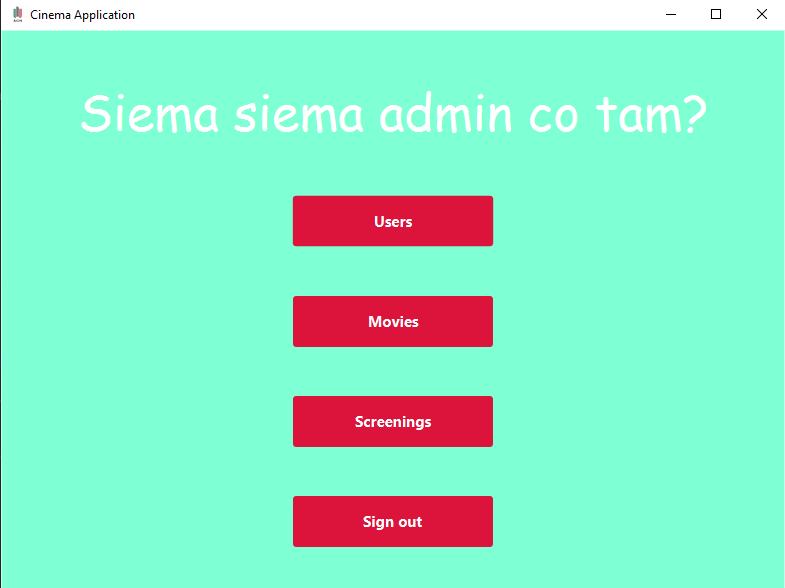
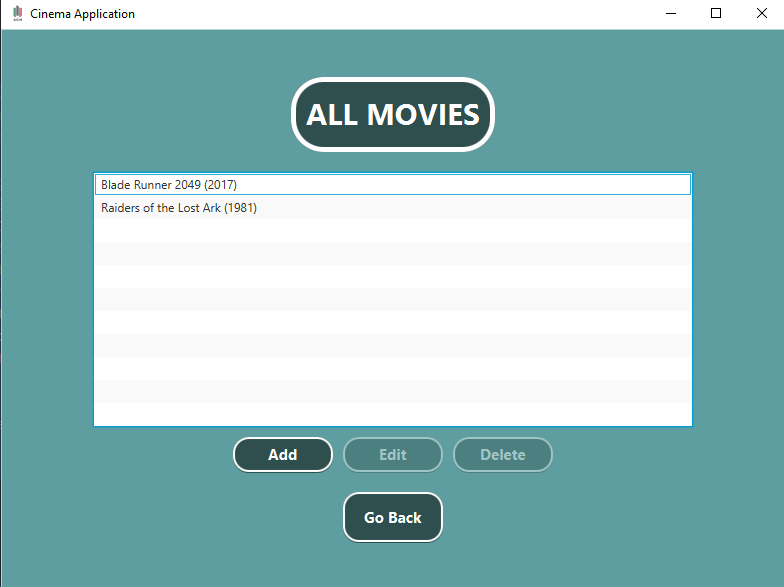
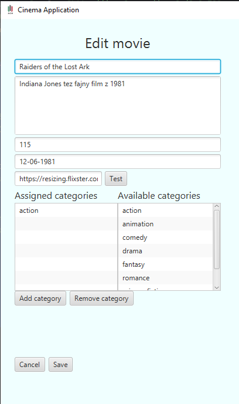
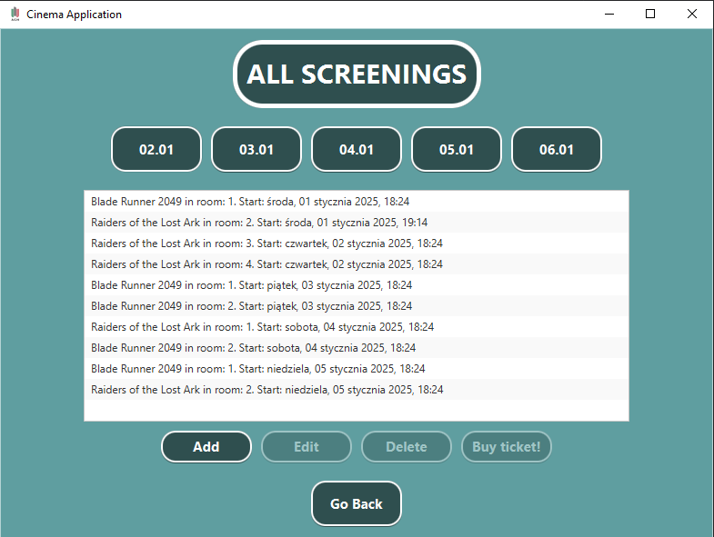
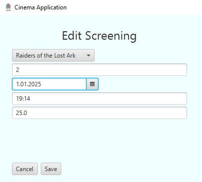

# Temat projektu
## *System do obsługi "Multipleksu kinowego"*

# Skład zespołu

- Krystian Sienkiewicz
- Krzysztof Gołuchowski
- Ernest Szlamczyk
- Mateusz Ścianek

# Wykorzystane technologie

Projekt został zaimplementowany jako aplikacja **Spring Boot** w języku *Java*. Wykorzystaliśmy bazę danych **H2**


# Uruchomienie:

```txt
Plik CinemaProjectApplication.java

./gradlew bootRun
```

# Schemat bazy danych


# Model obiektowy

## Category

Tabela *categories* przechowuje kategorie, które mogą być przypisane do filmów w systemie.

#### Model bazodanowy

Klasa Category zawiera pola:
- id - ID kategorii
- categoryName - nazwa kategorii
- movies - zestaw filmów przypisanych do kategorii

Relacje:
- Relacja wiele-do-wielu z tabelą movies przez pole movies, z mapowaniem pośrednim w tabeli łączącej. Film może należeć do wielu kategorii, a każda kategoria może być przypisana do wielu filmów. Relacja jest realizowana przez tabelę pośrednią movie_category. 

```java
@Entity
@Table(name = Category.TABLE_NAME)
public class Category {

    public static final String TABLE_NAME = "categories";

    @Id
    @GeneratedValue(strategy = GenerationType.IDENTITY)
    @Column(name = "category_id")
    private Long id;

    @Column(name = "category_name", nullable = false)
    private String categoryName;

    @ManyToMany(mappedBy = "categories")
    private Set<Movie> movies = new HashSet<>();

    public Category() {}

    public Category(String categoryName) {
        this.categoryName = categoryName;
    }

    public Long getCategoryId() {
        return id;
    }

    public String getCategoryName() {
        return categoryName;
    }

    public void setCategoryName(String categoryName) {
        this.categoryName = categoryName;
    }

    public Set<Movie> getMovies() {
        return movies;
    }

    public void setMovies(Set<Movie> movies) {
        this.movies = movies;
    }

    public void addMovie(Movie movie) {
        movies.add(movie);
    }
}
```
#### Klasy pomocnicze

Dodatkowa klasa typu DTO
```java
public record CategoryDto (
    Long id,
    String categoryName
) {
    public CategoryDto(String categoryName) {
        this(null, categoryName);
    }

    public static CategoryDto categoryToCategoryDto(Category category) {
        if (category == null) {
            return null;
        }

        return new CategoryDto(
                category.getCategoryId(),
                category.getCategoryName()
        );
    }
}
```

#### Warstwa serwisowa

Warstwa serwisowa implementuje następujące podstawowe funkcjonalności

- `createCategory` przyjmuje obiekt DTO i jeżeli nie ma już kategorii z taką 
nazwą to dodaje ją do bazy danych
- `getCategoryByName` wyszukuje kategorie po jej nazwie,
a następnie to co zostało znalezione konwertuje na obiekt DTO
- `getCategoryIdsByName` robi to samo tylko zwraca ich ID zamiast całego obiektu
- `editCategory` edytuje kategorie
- `deleteCategory` i `deleteCategories` usuwa kategorie po id (lub liście je zawierających)

```java
@Service
@Transactional
public class CategoryService {

    private final CategoryRepository categoryRepository;

    @Autowired
    public CategoryService(CategoryRepository categoryRepository) {
        this.categoryRepository = categoryRepository;
    }

    public List<CategoryDto> getCategories() {
        return categoryRepository.findAll().stream()
                .map(CategoryDto::categoryToCategoryDto)
                .toList();
    }

    public boolean createCategory(CategoryDto categoryDto) {
        if (categoryRepository.findByCategoryName(categoryDto.categoryName()).isPresent()) {
            return false;
        }
        Category category = new Category(categoryDto.categoryName());
        categoryRepository.save(category);
        return true;
    }

    public Optional<CategoryDto> getCategoryByName(String categoryName) {
        return categoryRepository.findByCategoryName(categoryName)
                .map(CategoryDto::categoryToCategoryDto);
    }

    public List<Long> getCategoryIdsByName(List<String> categoryNames) {
        return categoryNames.stream()
                .map(this::getCategoryByName)
                .filter(Optional::isPresent)
                .map(Optional::get)
                .map(CategoryDto::id)
                .toList();
    }

    public boolean editCategory(Long id, CategoryDto categoryDto) {

        Optional<Category> categoryWithName = categoryRepository.findByCategoryName(categoryDto.categoryName());

        if (categoryWithName.isPresent() &&
                categoryDto.categoryName().equals(categoryWithName.get().getCategoryName()) &&
                !Objects.equals(categoryWithName.get().getCategoryId(), id)) {
            return false;
        }

        Optional<Category> optionalCategory = categoryRepository.findById(id);
        if (optionalCategory.isPresent()) {
            Category category = optionalCategory.get();
            category.setCategoryName(categoryDto.categoryName());
            categoryRepository.save(category);
            return true;
        }
        return false;
    }

    public boolean deleteCategory(Long id) {
        Optional<Category> optionalCategory = categoryRepository.findById(id);
        if (optionalCategory.isPresent()) {
            Category category = optionalCategory.get();
            categoryRepository.delete(category);
            return true;
        }
        return false;
    }

    public List<String> deleteCategories(List<Long> ids) {
        List<String> deletedCategories = new ArrayList<>();
        for (Long id : ids) {
            Optional<Category> optionalCategory = categoryRepository.findById(id);
            if (optionalCategory.isPresent()) {
                Category category = optionalCategory.get();
                categoryRepository.delete(category);
                deletedCategories.add(category.getCategoryName());
            }
        }
        return deletedCategories;
    }
}
```

#### Warstwa repozytorium

Warstwa repozytorium implementuje dodatkowo:
- wyszukiwanie po nazwie kategorii

```java
public interface CategoryRepository extends JpaRepository<Category, Long> {

    Optional<Category> findByCategoryName(String categoryName);
}
```

## Movie

Tabela *movies* przechowuje filmy jakie oferuje kino.

#### Model bazodanowy

Klasa Movie zawiera pola:
- id - ID filmu.
- title - tytuł filmu.
- description - opis filmu.
- duration - długość filmu w minutach.
- screenings - zestaw seansów powiązanych z filmem.
- categories - zestaw kategorii przypisanych do filmu.
- opinions - zestaw opinii użytkowników na temat filmu.

Relacje:
- Relacja jeden-do-wielu z tabelą screenings przez pole screenings: Film może mieć wiele seansów, ale każdy seans jest przypisany do jednego filmu.
- Relacja wiele-do-wielu z tabelą categories przez pole categories: Film może należeć do wielu kategorii, a każda kategoria może być przypisana do wielu filmów. Relacja jest realizowana przez tabelę pośrednią movie_category.
- Relacja jeden-do-wielu z tabelą opinions przez pole opinions: Film może mieć wiele opinii, ale każda opinia jest przypisana do jednego filmu.

```java
@Entity
@Table(name = Movie.TABLE_NAME)
public class Movie {

    public static final String TABLE_NAME = "movies";

    @Id
    @GeneratedValue(strategy = GenerationType.IDENTITY)
    @Column(name = "movie_id")
    private Long id;

    @Column(nullable = false)
    private String title;

    @Column(nullable = false, length = 511)
    private String description;

    @Column(nullable = false)
    private int duration;

    @Column(nullable = false)
    private String posterUrl;

    @Column(nullable = false)
    private LocalDate releaseDate;

    @OneToMany(mappedBy = "movie", cascade = CascadeType.ALL)
    @JsonIgnore
    private Set<Screening> screenings = new HashSet<>();

    @ManyToMany
    @JoinTable(
            name = "movie_category",
            joinColumns = @JoinColumn(name = "movie_id"),
            inverseJoinColumns = @JoinColumn(name = "category_id")
    )
    private Set<Category> categories = new HashSet<>();

    @OneToMany(mappedBy = "movie", cascade = CascadeType.ALL)
    private Set<Opinion> opinions = new HashSet<>();

    public Movie() {}

    public Movie(String title, String description, int duration, String posterUrl, LocalDate releaseDate) {
        this.title = title;
        this.description = description;
        this.duration = duration;
        this.posterUrl = posterUrl;
        this.releaseDate = releaseDate;
    }

    public Long getId() {
        return id;
    }

    public String getTitle() {
        return title;
    }

    public void setTitle(String title) {
        this.title = title;
    }

    public String getPosterUrl() {
        return posterUrl;
    }

    public void setPosterUrl(String posterUrl) {
        this.posterUrl = posterUrl;
    }

    public String getDescription() {
        return description;
    }

    public void setDescription(String description) {
        this.description = description;
    }

    public int getDuration() {
        return duration;
    }

    public void setDuration(int duration) {
        this.duration = duration;
    }

    public Set<Screening> getScreenings() {
        return screenings;
    }

    public void setScreenings(Set<Screening> screenings) {
        this.screenings = screenings;
    }

    public Set<Category> getCategories() {
        return categories;
    }

    public void setCategories(Set<Category> categories) {
        this.categories = categories;
    }

    public Set<Opinion> getOpinions() {
        return opinions;
    }

    public void setOpinions(Set<Opinion> opinions) {
        this.opinions = opinions;
    }

    public void addScreening(Screening screening) {
        screenings.add(screening);
        screening.setMovie(this);
    }

    public LocalDate getReleaseDate() {
        return releaseDate;
    }

    public void setReleaseDate(LocalDate releaseDate) {
        this.releaseDate = releaseDate;
    }

    public void addCategory(Category category) {
        categories.add(category);
    }

    public void addOpinion(Opinion opinion) {
        opinions.add(opinion);
    }

    public void clearCategories() {
        categories.clear();
    }
}
```

#### Klasy pomocnicze

`Klasa DTO`

```java
public record MovieDto(
        Long id,
        String title,
        String description,
        int duration,
        String posterUrl,
        LocalDate releaseDate
) {
    public MovieDto(String title, String description, int duration, String posterUrl, LocalDate releaseDate) {
        this(null, title, description, duration, posterUrl, releaseDate);
    }

    public static MovieDto movieToMovieDto(Movie movie) {
        if (movie == null) {
            return null;
        }

        return new MovieDto(
                movie.getId(),
                movie.getTitle(),
                movie.getDescription(),
                movie.getDuration(),
                movie.getPosterUrl(),
                movie.getReleaseDate()
        );
    }
}
```

`MovieWithCategoriesDto` - do przesłania danych do stworzenia filmu razem z kategoriami

```java
public record MovieWithCategoriesDto(
        MovieDto movieDto,
        List<CategoryDto> categories
) {}
```

`CreateMovieStatus`

```java
public enum CreateMovieStatus implements Status {

    SUCCESS,
    INVALID_URL,
    MOVIE_DOESNT_EXIST,
    CATEGORY_DOESNT_EXIST,
    MISSING_DATA,
    DATABASE_ERROR;

    @Override
    public String message() {
        return switch(this) {
            case SUCCESS -> "Successfully created the movie";
            case INVALID_URL -> "Given image url is invalid";
            case MOVIE_DOESNT_EXIST -> "No such movie";
            case CATEGORY_DOESNT_EXIST -> "No such category";
            case MISSING_DATA -> "Please fill up the data correctly";
            case DATABASE_ERROR -> "Something went wrong in our database";
        };
    }

    @Override
    public boolean isSuccess() {
        return this.equals(SUCCESS);
    }
}
```


`MovieValidator`

```java
@Component
public class MovieValidator {

    public CreateMovieStatus validateMovieDto(MovieDto movieDto) {
        if (!validateString(movieDto.title()) ||
                !validateString(movieDto.description()) ||
                movieDto.duration() < 1) {
            return CreateMovieStatus.MISSING_DATA;
        }

        if (!validateImageUrl(movieDto.posterUrl())) {
            return CreateMovieStatus.INVALID_URL;
        }

        return CreateMovieStatus.SUCCESS;
    }

    private boolean validateImageUrl(String url) {
        try {
            URL imageUrl = new URL(url);
            HttpURLConnection connection = (HttpURLConnection) imageUrl.openConnection();
            connection.setRequestMethod("HEAD");
            connection.setConnectTimeout(5000);
            connection.setReadTimeout(5000);
            connection.connect();

            int responseCode = connection.getResponseCode();
            String contentType = connection.getContentType();

            return responseCode == HttpURLConnection.HTTP_OK &&
                    contentType.startsWith("image/");
        } catch (Exception e) {
            return false;
        }
    }

    private boolean validateString(String string) {
        return string != null &&
                !string.isEmpty() &&
                !string.startsWith(" ") &&
                !string.endsWith(" ");
    }
}
```

#### Warstwa serwisowa

`MovieService`

```java
@Service
@Transactional
public class MovieService {

    private final MovieRepository movieRepository;

    private final CategoryRepository categoryRepository;

    private final CategoryService categoryService;

    private final MovieValidator movieValidator;

    @Autowired
    public MovieService(MovieRepository movieRepository,
                        CategoryRepository categoryRepository,
                        MovieValidator movieValidator,
                        CategoryService categoryService) {
        this.movieRepository = movieRepository;
        this.categoryRepository = categoryRepository;
        this.movieValidator = movieValidator;
        this.categoryService = categoryService;
    }

    public List<MovieDto> getMovies() {
        return movieRepository.findAll().stream()
                .map(MovieDto::movieToMovieDto)
                .toList();
    }

    public Optional<MovieDto> getMovieById(Long id) {
        return movieRepository.findById(id)
                .map(MovieDto::movieToMovieDto);
    }

    public List<CategoryDto> getMovieCategories(Long id) {
        return movieRepository.findById(id)
                .map(Movie::getCategories)
                .map(categories -> categories.stream()
                        .map(CategoryDto::categoryToCategoryDto)
                        .toList()
                )
                .orElseGet(List::of);
    }

    public CreateMovieStatus createMovie(MovieDto movieDto) {
        return createMovie(movieDto, List.of());
    }

    public CreateMovieStatus createMovie(MovieDto movieDto, List<CategoryDto> categories) {
        CreateMovieStatus movieStatus = movieValidator.validateMovieDto(movieDto);
        if (movieStatus != CreateMovieStatus.SUCCESS) {
            return movieStatus;
        }

        Movie movie = createMovieFromMovieDto(movieDto);
        movieRepository.save(movie);

        List<Long> categoryIds = getCategoriesIds(categories);

        return setCategories(movie.getId(), categoryIds);
    }

    public CreateMovieStatus createMovieByNames(MovieDto movieDto, List<String> categoryNames) {
        CreateMovieStatus movieStatus = movieValidator.validateMovieDto(movieDto);
        if (movieStatus != CreateMovieStatus.SUCCESS) {
            return movieStatus;
        }

        Movie movie = createMovieFromMovieDto(movieDto);
        movieRepository.save(movie);

        List<Long> categoryIds = categoryService.getCategoryIdsByName(categoryNames);

        return setCategories(movie.getId(), categoryIds);
    }

    public CreateMovieStatus editMovie(Long movieId, MovieDto newMovieDto, List<CategoryDto> categories) {
        CreateMovieStatus movieStatus = movieValidator.validateMovieDto(newMovieDto);
        if (movieStatus != CreateMovieStatus.SUCCESS) {
            return movieStatus;
        }

        Optional<Movie> optionalMovie = movieRepository.findById(movieId);
        if (optionalMovie.isEmpty()) {
            return CreateMovieStatus.MOVIE_DOESNT_EXIST;
        }
        Movie movie = optionalMovie.get();

        updateMovie(movie, newMovieDto);

        List<Long> categoriesIds = getCategoriesIds(categories);
        CreateMovieStatus setCategoriesStatus = setCategories(movie.getId(), categoriesIds);
        if (!setCategoriesStatus.isSuccess()) {
            return setCategoriesStatus;
        }

        movieRepository.save(movie);
        return CreateMovieStatus.SUCCESS;
    }

    public boolean deleteMovie(Long id) {
        Optional<Movie> movie = movieRepository.findById(id);
        if (movie.isEmpty()) {
            return false;
        }

        movieRepository.delete(movie.get());
        return true;
    }

    public CreateMovieStatus setCategories(Long movieId, List<Long> categoryIds) {
        Movie movie = movieRepository.findById(movieId)
                .orElse(null);
        if (movie == null) {
            return CreateMovieStatus.MOVIE_DOESNT_EXIST;
        }

        List<Category> categories = new ArrayList<>();
        for (Long categoryId : categoryIds) {
            Category category = categoryRepository.findById(categoryId)
                    .orElse(null);
            if (category == null) {
                return CreateMovieStatus.CATEGORY_DOESNT_EXIST;
            }
            categories.add(category);
        }

        movie.clearCategories();
        categories.forEach(movie::addCategory);
        movieRepository.save(movie);

        return CreateMovieStatus.SUCCESS;
    }

    private void updateMovie(Movie movie, MovieDto movieDto) {
        movie.setTitle(movieDto.title());
        movie.setDescription(movieDto.description());
        movie.setDuration(movieDto.duration());
        movie.setPosterUrl(movieDto.posterUrl());
        movie.setReleaseDate(movieDto.releaseDate());
    }

    private List<Long> getCategoriesIds(List<CategoryDto> categories) {
        return categories.stream()
                .map(CategoryDto::id)
                .toList();
    }

    private Movie createMovieFromMovieDto(MovieDto movieDto) {
        return new Movie(
                movieDto.title(),
                movieDto.description(),
                movieDto.duration(),
                movieDto.posterUrl(),
                movieDto.releaseDate()
        );
    }
}
```

#### Warstwa repozytorium

```java
public interface MovieRepository extends JpaRepository<Movie,Long> {
}
```


## MovieRoom

Tabela *movie_rooms* przechowuje sale kinowe, w których wyświetlane są filmy.

#### Model bazodanowy

Klasa MovieRoom zawiera pola:
- id - ID sali kinowej.
- movieRoomName - nazwa sali kinowej.
- maxSeats - maksymalna liczba miejsc w sali.
- screenings - zestaw seansów powiązanych z tą salą.

Relacje:
- Relacja jeden-do-wielu z tabelą screenings przez pole screenings: Sala kinowa może być przypisana do wielu seansów, ale każdy seans jest związany z jedną salą kinową.

```java
@Entity
@Table(name = MovieRoom.TABLE_NAME)
public class MovieRoom {

    public static final String TABLE_NAME = "movie_rooms";

    @Id
    @GeneratedValue(strategy = GenerationType.IDENTITY)
    @Column(name = "movie_room_id")
    private Long id;

    @Column(name = "movie_room_name", nullable = false, unique = true)
    private String movieRoomName;

    @Column(name = "max_seats", nullable = false)
    private int maxSeats;

    @OneToMany(mappedBy = "room", cascade = CascadeType.ALL)
    private Set<Screening> screenings = new HashSet<>();

    public MovieRoom() {}

    public MovieRoom(String movieRoomName, int maxSeats) {
        this.movieRoomName = movieRoomName;
        this.maxSeats = maxSeats;
    }

    public Long getMovieRoomId() {
        return id;
    }

    public String getMovieRoomName() {
        return movieRoomName;
    }

    public void setMovieRoomName(String movieRoomName) {
        this.movieRoomName = movieRoomName;
    }

    public int getMaxSeats() {
        return maxSeats;
    }

    public void setMaxSeats(int maxSeats) {
        this.maxSeats = maxSeats;
    }

    public Set<Screening> getScreenings() {
        return screenings;
    }

    public void setScreenings(Set<Screening> screenings) {
        this.screenings = screenings;
    }

    public void addScreening(Screening screening) {
        screenings.add(screening);
        screening.setRoom(this);
    }
}
```

#### Klasy pomocnicze

Została zaimplementowana dodatkowa klasa typu DTO `MovieRoomDTO`

```java
public record MovieRoomDto(
        Long id,
        String movieRoomName,
        int maxSeats
) {

    public MovieRoomDto(String movieRoomName, int maxSeats) {
        this(null,movieRoomName, maxSeats);
    }

    public static MovieRoomDto movieRoomtoMovieRoomDto(MovieRoom movieRoom) {
        if (movieRoom == null) {
            return null;
        }

        return new MovieRoomDto(
                movieRoom.getMovieRoomId(),
                movieRoom.getMovieRoomName(),
                movieRoom.getMaxSeats()
        );
    }

}
```

#### Warstwa serwisowa

Warstwa Serwisowa zawiera podstawowe operacje potrzebne do obsługi poszczególnych
operacji dotyczących sal w kompleksie kinowym.

- `createMovieRoom` przyjmuje pomocniczą klase `movieRoomDto`, poczym przekształca ją 
na klase typu entity, a następnie przy użyciu repozytorium dodaje ją do bazy danych
- `getMovieRoom` przyjmuje nazwe sali poczym poszukuje sali wg tej nazwy, a następnie mapuje ją na klase DTO
- `getAllMovieRooms` zwraca liste wszystkich sal w formacie DTO
- `editMovieRoom` przy użyciu id oraz klasy DTO determinuje czy została wykonana jakaś zmiana i jak tak to 
zapisuje ją w bazie danych
- `deleteMovieRoom` i `deleteMovieRooms` przyjmują odpowiednio id oraz liste id, poczym próbują usunąć 
wszystkie odpowiadające im recordy z bazy

```java
@Service
public class MovieRoomService {

    private final MovieRoomRepository movieRoomRepository;

    @Autowired
    public MovieRoomService(MovieRoomRepository movieRoomRepository) {
        this.movieRoomRepository = movieRoomRepository;
    }

    public MovieRoom save(MovieRoomDto movieRoomDto) {
        MovieRoom movieRoom = new MovieRoom(movieRoomDto.movieRoomName(), movieRoomDto.maxSeats());
        return movieRoomRepository.save(movieRoom);
    }

    public boolean createMovieRoom(MovieRoomDto movieRoomDto) {
        if (movieRoomRepository.findByMovieRoomName(movieRoomDto.movieRoomName()).isPresent()) {
            return false;
        }
        MovieRoom movieRoom =  new MovieRoom(
                movieRoomDto.movieRoomName(),
                movieRoomDto.maxSeats());

        movieRoomRepository.save(movieRoom);
        return true;
    }

    public Optional<MovieRoomDto> getMovieRoom(String movieRoomName) {
        return movieRoomRepository.findByMovieRoomName(movieRoomName)
                .map(MovieRoomDto::movieRoomtoMovieRoomDto);
    }

    public List<MovieRoomDto> getAllMovieRooms() {
        return movieRoomRepository.findAll()
                .stream().map(MovieRoomDto::movieRoomtoMovieRoomDto).collect(Collectors.toList());
    }

    public boolean editMovieRoom(Long id, MovieRoomDto movieRoomDto) {
        Optional<MovieRoom> movieRoomWithTheName =
                movieRoomRepository.findByMovieRoomName(movieRoomDto.movieRoomName());

        if (movieRoomWithTheName.isPresent() &&
                (movieRoomWithTheName.get().getMovieRoomName().equals(movieRoomDto.movieRoomName()) &&
                    !Objects.equals(movieRoomWithTheName.get().getMovieRoomId(), id))) {
            return false;
        }

        Optional<MovieRoom> optionalMovieRoom = movieRoomRepository.findById(id);
        if(optionalMovieRoom.isPresent()) {

            MovieRoom movieRoom = optionalMovieRoom.get();
            movieRoom.setMovieRoomName(movieRoomDto.movieRoomName());
            movieRoom.setMaxSeats(movieRoomDto.maxSeats());
            return true;
        }
        return false;
    }

    public boolean deleteMovieRoom(Long id) {
        Optional<MovieRoom> optionalMovieRoom = movieRoomRepository.findById(id);
        if(optionalMovieRoom.isPresent()) {
            MovieRoom movieRoom = optionalMovieRoom.get();
            movieRoomRepository.delete(movieRoom);
            return true;
        }
        return false;
    }

    public List<String> deleteMovieRooms(List<Long> ids) {
        List<String> successfullyDeletedMovieRooms = new ArrayList<>();
        for (Long id : ids) {
            Optional<MovieRoom> optionalMovieRoom = movieRoomRepository.findById(id);
            if (optionalMovieRoom.isPresent()) {
                MovieRoom movieRoom = optionalMovieRoom.get();
                movieRoomRepository.delete(movieRoom);
                successfullyDeletedMovieRooms.add(movieRoom.getMovieRoomName());
            }
        }
        return successfullyDeletedMovieRooms;
    }
}
```

#### Warstwa repozytorium

Repozytorium zawiera dodatkową metode mającą na celu znajdowanie recordów
(zawsze będzie maksymalnie jeden ze względu na unikalność kolumny `movieRoomName`)
poprzez ich nazwę

```java
@Repository
public interface MovieRoomRepository extends JpaRepository<MovieRoom, Long> {

    Optional<MovieRoom> findByMovieRoomName(String movieRoomName);

}
```


## Opinion

Tabela *opinions* przechowuje opinie użytkoników na temat filmów.

#### Model bazodanowy

Klasa Opinion zawiera pola:
- user - użytkownik, który wystawił opinię.
- movie - film, którego dotyczy opinia.
- rating - ocena filmu w postaci liczby (np. od 1 do 10).
- comment - treść komentarza użytkownika.

Relacje:
- Relacja wiele-do-jednego z tabelą users przez pole user: Każda opinia jest przypisana do jednego użytkownika, ale użytkownik może wystawić wiele opinii.
- Relacja wiele-do-jednego z tabelą movies przez pole movie: Każda opinia dotyczy jednego filmu, ale film może mieć wiele opinii.

##### Klucz główny OpinionId

Klucz główny jest złożony, tworzony na podstawie kombinacji pól user i movie, co zapewnia, że użytkownik może wystawić tylko jedną opinię na dany film.

```java
public class OpinionId implements Serializable {

    private User user;

    private Movie movie;

    public OpinionId(User user, Movie movie) {
        this.user = user;
        this.movie = movie;
    }

    @Override
    public boolean equals(Object o) {
        if (this == o) return true;
        if (o == null || getClass() != o.getClass()) return false;
        OpinionId that = (OpinionId) o;
        return Objects.equals(user, that.user) && Objects.equals(movie, that.movie);
    }

    @Override
    public int hashCode() {
        return Objects.hash(user, movie);
    }
}
```


```java
@Entity
@Table(name = Opinion.TABLE_NAME)
@IdClass(OpinionId.class)
public class Opinion {

    public static final String TABLE_NAME = "opinions";

    @Id
    @ManyToOne
    @JoinColumn(name = "user_id", nullable = false)
    private User user;

    @Id
    @ManyToOne
    @JoinColumn(name = "movie_id", nullable = false)
    private Movie movie;

    @Column(nullable = false)
    private Double rating;

    @Column(nullable = false)
    private String comment;

    public Opinion() {}

    public Opinion(User user, Movie movie, Double rating, String comment) {
        this.user = user;
        this.movie = movie;
        this.rating = rating;
        this.comment = comment;
    }

    public User getUser() {
        return user;
    }

    public void setUser(User user) {
        this.user = user;
    }

    public Movie getMovie() {
        return movie;
    }

    public void setMovie(Movie movie) {
        this.movie = movie;
    }

    public Double getRating() {
        return rating;
    }

    public void setRating(Double rating) {
        this.rating = rating;
    }

    public String getComment() {
        return comment;
    }

    public void setComment(String comment) {
        this.comment = comment;
    }
}
```


#### Klasy pomocnicze

#### Warstwa serwisowa

#### Warstwa repozytorium

```java
public interface OpinionRepository extends JpaRepository<Opinion, OpinionId> {
}
```

## Purchase

Tabela *purchases* przechowuje informacje na temat zakupów dokonanych przez użytkowników.

#### Model bazodanowy

Klasa Purchase zawiera pola:
- id - ID zakupu.
- user - użytkownik, który dokonał zakupu.
- screening - seans, na który dokonano zakupu.
- boughtSeats - liczba miejsc zakupionych przez użytkownika.
- reservationStatus - status rezerwacji

Relacje:
- Relacja wiele-do-jednego z tabelą users przez pole user: Każdy zakup jest przypisany do jednego użytkownika, ale użytkownik może mieć wiele zakupów.
- Relacja wiele-do-jednego z tabelą screenings przez pole screening: Każdy zakup dotyczy jednego seansu, ale seans może mieć wiele zakupów przypisanych do różnych użytkowników.

```java
@Entity
@Table(name = Purchase.TABLE_NAME)
public class Purchase {

    public static final String TABLE_NAME = "purchases";

    @Id
    @GeneratedValue(strategy = GenerationType.IDENTITY)
    @Column(name = "purchase_id")
    private Long id;

    @ManyToOne
    @JoinColumn(name = "user_id", nullable = false)
    private User user;

    @ManyToOne
    @JoinColumn(name = "screening_id", nullable = false)
    private Screening screening;

    @Column(name = "bought_seats", nullable = false)
    private int boughtSeats;

    @Enumerated(EnumType.STRING)
    @Column(name = "reservation_status", nullable = false)
    private ReservationStatus reservationStatus;

    public Purchase() {}

    public Purchase(User user, Screening screening, int boughtSeats, ReservationStatus reservationStatus) {
        this.user = user;
        this.screening = screening;
        this.boughtSeats = boughtSeats;
        this.reservationStatus = reservationStatus;
    }

    public void setUser(User user) {
        this.user = user;
    }

    public User getUser() {
        return user;
    }

    public void setScreening(Screening screening) {
        this.screening = screening;
    }

    public Screening getScreening() {
        return screening;
    }

    public void setBoughtSeats(int boughtSeats) {
        this.boughtSeats = boughtSeats;
    }

    public int getBoughtSeats() {
        return boughtSeats;
    }

    public void setReservationStatus(ReservationStatus reservationStatus) {
        this.reservationStatus = reservationStatus;
    }

    public ReservationStatus getReservationStatus() {
        return reservationStatus;
    }

    public Long getId() {
        return id;
    }
}
```

#### Klasy pomocnicze
Enumeracja `ReservationStatus` modeluje możliwe statusy rezerwacji.
```java
public enum ReservationStatus {
    UNPAID,
    PAID,
    CANCELLED,
    EXPIRED;
}
```

#### Warstwa serwisowa
```java
@Service
@Transactional
public class PurchaseService {

    @Autowired
    private PurchaseRepository purchaseRepository;

    @Autowired
    private UserRepository userRepository;

    @Autowired
    private ScreeningRepository screeningRepository;

    public List<Purchase> findAll() {
        return purchaseRepository.findAll();
    }

    public Purchase findById(Long id) {
        return purchaseRepository.findById(id).orElse(null);
    }

    public List<Purchase> findByUser(Long userId) {
        return purchaseRepository.findByUserId(userId);
    }

    public List<Purchase> findByScreening(Long screeningId) {
        return purchaseRepository.findByScreeningId(screeningId);
    }

    public List<Purchase> findByStatus(ReservationStatus status) {
        return purchaseRepository.findByReservationStatus(status);
    }

    public Purchase create(PurchaseDto purchaseDto) {
        var user = userRepository.findById(purchaseDto.userId());
        if(user.isEmpty()) {
            throw new IllegalArgumentException("User not found");
        }

        var screening = screeningRepository.findById(purchaseDto.screeningId());
        if(screening.isEmpty()) {
            throw new IllegalArgumentException("Screening not found");
        }

        if(purchaseDto.boughtSeats() <= 0) {
            throw new IllegalArgumentException("Bought seats must be greater than 0");
        }

        validateSeatAvailability(screening.get(), purchaseDto.boughtSeats());
        validatePurchaseTimeWindow(screening.get());

        var purchase = new Purchase(user.get(), screening.get(), purchaseDto.boughtSeats(), ReservationStatus.UNPAID);
        purchaseRepository.save(purchase);
        return purchase;
    }

    public void deletePurchase(Long purchaseId) {
        var purchaseResult = purchaseRepository.findById(purchaseId);
        if(purchaseResult.isEmpty()) {
            throw new IllegalArgumentException("Purchase not found");
        }

        var purchase = purchaseResult.get();
        purchaseRepository.delete(purchase);
    }

    public void confirmPayment(Long purchaseId) {
        updateStatusIfValid(
                purchaseId,
                ReservationStatus.PAID,
                status -> status == ReservationStatus.PAID,
                "Purchase is already paid"
        );
    }

    public void cancelPurchase(Long purchaseId) {
        updateStatusIfValid(
                purchaseId,
                ReservationStatus.CANCELLED,
                status -> status == ReservationStatus.CANCELLED,
                "Purchase is already cancelled"
        );
    }

    private void updateStatusIfValid(
            Long purchaseId,
            ReservationStatus newStatus,
            Predicate<ReservationStatus> invalidCondition,
            String errorMessage
    ) {
        var purchase = findById(purchaseId);
        if (purchase == null) {
            throw new IllegalArgumentException("Purchase not found");
        }
        if (invalidCondition.test(purchase.getReservationStatus())) {
            throw new IllegalStateException(errorMessage);
        }
        purchase.setReservationStatus(newStatus);
        purchaseRepository.save(purchase);
    }

    private void validateSeatAvailability(Screening screening, int requestedSeats) {
        int availableSeats = screening.getRoom().getMaxSeats() - purchaseRepository
                .findByScreeningId(screening.getScreeningId())
                .stream()
                .mapToInt(Purchase::getBoughtSeats)
                .sum();

        if (requestedSeats > availableSeats) {
            throw new IllegalStateException("Not enough seats available");
        }
    }

    private void validatePurchaseTimeWindow(Screening screening) {
        LocalDateTime now = LocalDateTime.now();
        LocalDateTime screeningTime = screening.getStart();

        if (now.isAfter(screeningTime)) {
            throw new IllegalStateException("Cannot purchase tickets for past screenings");
        }
    }
}
```

#### Warstwa repozytorium

```java
public interface PurchaseRepository extends JpaRepository<Purchase, Long> {
    List<Purchase> findByUserId(Long userId);
    List<Purchase> findByScreeningId(Long screeningId);
    List<Purchase> findByReservationStatus(ReservationStatus status);
}
```


## Role

Tabela *roles* przechowuje role jakie mogą mieć użytkownicy (np. administrator, zwykły użytkownik).

#### Model bazodanowy

Klasa Role zawiera pola:
- id - ID roli.
- name - nazwa roli (np. "admin", "user").
- users - zestaw użytkowników przypisanych do tej roli.

Relacje:
- Relacja wiele-do-wielu z tabelą users przez pole users: Rola może być przypisana do wielu użytkowników, a każdy użytkownik może mieć przypisane wiele ról. Relacja jest realizowana przez tabelę pośrednią w encji User.

```java
@Entity
@Table(name = Role.TABLE_NAME)
public class Role {

    public static final String TABLE_NAME = "roles";

    @Id
    @GeneratedValue(strategy = GenerationType.IDENTITY)
    @Column(name = "role_id")
    private Long id;

    @Column(nullable = false)
    private String name;

    @ManyToMany(mappedBy = "roles")
    private Set<User> users = new HashSet<>();

    public Role() {}

    public Role(String name) {
        this.name = name;
    }

    public Long getId() {
        return id;
    }

    public String getName() {
        return name;
    }

    public void setName(String name) {
        this.name = name;
    }

    public Set<User> getUsers() {
        return users;
    }

    public void setUsers(Set<User> users) {
        this.users = users;
    }

    public void addUser(User user) {
        users.add(user);
    }
}
```


#### Klasy pomocnicze

#### Warstwa serwisowa

- `RoleService`

> Serwis obsługujący role - zarządzanie tabelą `ROLES`

Funkcjonalności:
- zwracanie wszystkich rekordów w tabeli
- tworzenie nowej roli
- dodawanie roli użytkownikowi
- usuwanie roli użytkownikowi

```java
@Service
public class RoleService {
    private final RoleRepository roleRepository;

    private final UserRepository userRepository;

    @Autowired
    public RoleService(RoleRepository roleRepository, UserRepository userRepository) {
        this.roleRepository = roleRepository;
        this.userRepository = userRepository;
    }

    public List<Role> getAllRoles() {
        return roleRepository.findAll();
    }

    public Role createRole(String roleName) {
        var role = new Role(roleName);
        roleRepository.save(role);
        return role;
    }

    public void updateRoles(User user, Set<Role> roles) {
       user.setRoles(roles);
       userRepository.save(user);
    }

    public void addRoleToUser(User user, Role role) {
        if (!user.getRoles().contains(role)) {
            Set<Role> newRoles = new HashSet<>(user.getRoles());
            newRoles.add(role);
            user.setRoles(newRoles);
            userRepository.save(user);
        }
    }

    public void removeRoleFromUser(User user, Role role) {
        if (user.getRoles().contains(role)) {
            Set<Role> newRoles = new HashSet<>(user.getRoles());
            newRoles.remove(role);
            user.setRoles(newRoles);
            userRepository.save(user);
        }
    }
}
```

#### Warstwa repozytorium

```java
public interface RoleRepository extends JpaRepository<Role, Long> {
}
```

## Screening

Tabela *screenings* przechowuje informacje na temat konkretnego seansu.

#### Model bazodanowy

Klasa Screening zawiera pola:
- id - ID seansu.
- movie - film, który jest wyświetlany w seansie.
- room - sala kinowa, w której odbywa się seans.
- start - data i godzina rozpoczęcia seansu.
- price - cena biletu na seans.

Relacje:
- Relacja wiele-do-jednego z tabelą movies przez pole movie: Każdy seans jest związany z jednym filmem, ale film może mieć wiele seansów.
- Relacja wiele-do-jednego z tabelą movie_rooms przez pole room: Każdy seans odbywa się w jednej sali kinowej, ale sala może mieć wiele seansów.

```java
@Entity
@Table(name = Screening.TABLE_NAME)
public class Screening {

    public static final String TABLE_NAME = "screenings";

    @Id
    @GeneratedValue(strategy = GenerationType.IDENTITY)
    @Column(name = "screening_id")
    private Long id;

    @ManyToOne
    @JoinColumn(name = "movie_id", nullable = false)
    private Movie movie;

    @ManyToOne
    @JoinColumn(name = "room_id", nullable = false)
    private MovieRoom room;

    @Column(nullable = false)
    private LocalDateTime start;

    @Column(nullable = false)
    private Double price;

    public Screening() {}

    public Screening(Movie movie, MovieRoom room, LocalDateTime start, Double price) {
        this.movie = movie;
        this.room = room;
        this.start = start;
        this.price = price;
    }

    public Long getScreeningId() {
        return id;
    }

    public Movie getMovie() {
        return movie;
    }

    public void setMovie(Movie movie) {
        this.movie = movie;
    }

    public MovieRoom getRoom() {
        return room;
    }

    public void setRoom(MovieRoom room) {
        this.room = room;
    }

    public LocalDateTime getStart() {
        return start;
    }

    public void setStart(LocalDateTime start) {
        this.start = start;
    }

    public Double getPrice() {
        return price;
    }

    public void setPrice(Double price) {
        this.price = price;
    }

}
```

#### Klasy pomocnicze

Dodatkowa klasa DTO

```java
public record ScreeningDto(
        Long id,
        Long movieId,
        Long movieRoomId,
        LocalDateTime start,
        Double price
) {
        public static ScreeningDto screeningToScreeningDto(Screening screening) {
                if (screening == null) {
                        return null;
                }

                return new ScreeningDto(
                        screening.getScreeningId(),
                        screening.getMovie().getId(),
                        screening.getRoom().getMovieRoomId(),
                        screening.getStart(),
                        screening.getPrice()
                );
        }
}
```

#### Warstwa serwisowa

Warstwa serwisowa implementuje następujące funkcjonalności:
- `saveScreening` zapisuje seans w bazie danych, sprawdzając, czy istnieje konflikt w harmonogramie (w razie konfliktu rzuca wyjątek i nie zapisuje seansu).
- `getAllScreenings` zwraca listę wszystkich seansów w formacie DTO.
- `getScreeningById` wyszukuje seans po identyfikatorze i zwraca go w formacie DTO, jeśli istnieje.
- `deleteScreening` usuwa seans z bazy danych, jeśli istnieje, i zwraca informację o powodzeniu operacji.
- `getScreeningsByDate` zwraca listę seansów odbywających się w określonym dniu w formacie DTO.
- `getUpcomingScreeningsAfter` zwraca listę przyszłych seansów zaczynających się po określonej dacie i godzinie w formacie DTO.
- `updateScreening` aktualizuje dane istniejącego seansu na podstawie przekazanych informacji w formacie DTO, nadpisując jego dane w bazie.
```java
@Service
@Transactional
public class ScreeningService {

    @Autowired
    private ScreeningRepository screeningRepository;

    @Autowired
    private MovieRepository movieRepository;

    @Autowired
    private MovieRoomRepository movieRoomRepository;

    private boolean isConflict(Movie movie, MovieRoom movieRoom, LocalDateTime start) {
        int duration = movie.getDuration();
        LocalDateTime end = start.plusMinutes(duration);
        Long movieRoomId = movieRoom.getMovieRoomId();

        List<Screening> conflictScreenings = screeningRepository.findConflictingScreenings(
                movieRoomId,
                start,
                end
        );

        return !conflictScreenings.isEmpty();
    }

    private Movie getMovie(Long id) {
        return movieRepository.findById(id)
                .orElseThrow(() -> new IllegalArgumentException("Movie not found with id: " + id));

    }

    private MovieRoom getMovieRoom(Long id) {
        return movieRoomRepository.findById(id)
                .orElseThrow(() -> new IllegalArgumentException("Movie room not found with id: " + id));
    }

    public ScreeningDto saveScreening(ScreeningDto screeningDto) {
        Movie movie = getMovie(screeningDto.movieId());
        MovieRoom movieRoom = getMovieRoom(screeningDto.movieRoomId());

        if (isConflict(movie, movieRoom, screeningDto.start())) {
            throw new RuntimeException();
        }

        Screening newScreening = new Screening(movie, movieRoom, screeningDto.start(), screeningDto.price());

        movie.addScreening(newScreening);
        movieRoom.addScreening(newScreening);

        screeningRepository.save(newScreening);

        return ScreeningDto.screeningToScreeningDto(newScreening);
    }

    public List<ScreeningDto> getAllScreenings() {
        return screeningRepository.findAll().stream()
                .map(ScreeningDto::screeningToScreeningDto)
                .toList();
    }

    public Optional<ScreeningDto> getScreeningById(Long id) {
        return screeningRepository.findById(id)
                .map(ScreeningDto::screeningToScreeningDto);
    }

    public boolean deleteScreening(Long id) {
        if (screeningRepository.existsById(id)) {
            screeningRepository.deleteById(id);
            return true;
        }
        return false;
    }

    public List<ScreeningDto> getScreeningsByDate(LocalDate date) {
        return screeningRepository
                .findByStartBetween(date.atStartOfDay(), date.atTime(23, 59, 59)).stream()
                .map(ScreeningDto::screeningToScreeningDto)
                .toList();
    }

    public List<ScreeningDto> getUpcomingScreeningsAfter(LocalDateTime dateTime) {
        return screeningRepository.findByStartAfter(dateTime).stream()
                .map(ScreeningDto::screeningToScreeningDto)
                .toList();
    }

    public ScreeningDto updateScreening(Long id, ScreeningDto screeningDto) {
        Screening screening = screeningRepository.findById(id)
                .orElseThrow(() -> new RuntimeException("Screening not found with id: " + id));

        Movie movie = getMovie(screeningDto.movieId());
        MovieRoom movieRoom = getMovieRoom(screeningDto.movieRoomId());

        screening.setMovie(movie);
        screening.setRoom(movieRoom);
        screening.setPrice(screeningDto.price());
        screening.setStart(screeningDto.start());

        screeningRepository.save(screening);

        return ScreeningDto.screeningToScreeningDto(screening);
    }
}
```

#### Warstwa repozytorium

Warstwa repozytorium implementuje dodatkowo:
- `findByStartBetween` Zwraca listę seansów, których czas rozpoczęcia mieści się w określonym przedziale czasowym.
- `findByStartAfter` Zwraca listę seansów rozpoczynających się po określonej dacie i godzinie.
- `findConflictingScreenings` Zwraca listę seansów, które kolidują z innym seansem w tym samym pokoju, na podstawie czasu rozpoczęcia i zakończenia oraz czasu trwania filmu.

```java
public interface ScreeningRepository extends JpaRepository<Screening, Long> {

    public List<Screening> findByStartBetween(LocalDateTime dateFrom, LocalDateTime dateTo);

    public List<Screening> findByStartAfter(LocalDateTime date);

    @Query("""
        SELECT s FROM Screening s
        WHERE s.room.id = :roomId
        AND s.start < :end
        AND s.start + s.movie.duration MINUTE > :start
    """)
    List<Screening> findConflictingScreenings(
            @Param("roomId") Long roomId,
            @Param("start") LocalDateTime start,
            @Param("end") LocalDateTime end
    );
}
```


## User

Tabela *users* przechowuje informacje na temat użytkowników.

#### Model bazodanowy

Klasa User zawiera pola:
- id - ID użytkownika.
- email - adres email użytkownika, unikalny.
- firstName - imię użytkownika.
- lastName - nazwisko użytkownika.
- password - hasło użytkownika.
- roles - zestaw ról przypisanych do użytkownika.
- purchases - zestaw zakupów dokonanych przez użytkownika.
- opinions - zestaw opinii użytkownika o filmach.

Relacje:
- Relacja wiele-do-wielu z tabelą roles przez pole roles: Użytkownik może mieć przypisane wiele ról, a rola może być przypisana wielu użytkownikom. Relacja jest realizowana przez tabelę pośrednią user_role.
- Relacja jeden-do-wielu z tabelą purchases przez pole purchases: Użytkownik może mieć wiele zakupów, ale każdy zakup należy do jednego użytkownika.
- Relacja jeden-do-wielu z tabelą opinions przez pole opinions: Użytkownik może napisać wiele opinii o filmach, ale każda opinia należy do jednego użytkownika.

```java
@Entity
@Table(name = User.TABLE_NAME)
public class User {

    public static final String TABLE_NAME = "users";

    @Id
    @GeneratedValue(strategy = GenerationType.IDENTITY)
    @Column(name = "user_id")
    private Long id;

    @Column(nullable = false, unique = true)
    private String email;

    @Column(name = "first_name", nullable = false)
    private String firstName;

    @Column(name = "last_name", nullable = false)
    private String lastName;

    @Column(nullable = false)
    private String password;

    @ManyToMany(fetch = FetchType.EAGER)
    @JoinTable(
            name = "user_role",
            joinColumns = @JoinColumn(name = "user_id"),
            inverseJoinColumns = @JoinColumn(name = "role_id")
    )
    private Set<Role> roles = new HashSet<>();

    @OneToMany(mappedBy = "user", cascade = CascadeType.ALL)
    private Set<Purchase> purchases = new HashSet<>();

    @OneToMany(mappedBy = "user", cascade = CascadeType.ALL)
    private Set<Opinion> opinions = new HashSet<>();

    public User() {}

    public User(String firstName, String lastName, String email, String password) {
        this.firstName = firstName;
        this.lastName =lastName;
        this.email = email;
        this.password = password;
    }

    public void setEmail(String email) {
        this.email = email;
    }

    public String getEmail() {
        return email;
    }

    public void setFirstName(String firstName) {
        this.firstName = firstName;
    }

    public String getFirstName() {
        return firstName;
    }

    public void setLastName(String lastName) {
        this.lastName = lastName;
    }

    public String getLastName() {
        return lastName;
    }

    public void setPassword(String password) {
        this.password = password;
    }

    public String getPassword() {
        return password;
    }

    public Long getId() {
        return id;
    }

    public Set<Role> getRoles() {
        return roles;
    }

    public void setRoles(Set<Role> roles) {
        this.roles = roles;
    }
}
```

#### Klasy pomocnicze

- `UserValidator`

> Walidacja wprowadzanych danych użytkownika

Funkcjonalności:
- walidacja poprawności adresu email
- walidacja poprawności hasła
  - minimalna długość
  - duże i małe litery
  - cyfry
  - znak specjalny
  
```java
@Component
public class UserValidator {

    public boolean validatePassword(String password) {
        if (password.length() < 8) {
            return false;
        }

        boolean hasUpperCase = false;
        boolean hasLowerCase = false;
        boolean hasDigit = false;
        boolean hasSpecialChar = false;

        String specialCharacters = "!@#$%^&*()-_+=<>?/|.,";

        for (char c : password.toCharArray()) {
            if (Character.isUpperCase(c)) {
                hasUpperCase = true;
            }
            if (Character.isLowerCase(c)) {
                hasLowerCase = true;
            }
            if (Character.isDigit(c)) {
                hasDigit = true;
            }
            if (specialCharacters.contains(String.valueOf(c))) {
                hasSpecialChar = true;
            }
        }

        return hasUpperCase && hasLowerCase && hasDigit && hasSpecialChar;
    }

    public boolean validateEmail(String email) {
        try {
            InternetAddress emailAddr = new InternetAddress(email);
            emailAddr.validate();
            return true;
        } catch (AddressException ex) {
            return false;
        }
    }

    public boolean validateString(String string) {
        if (string == null || string.isEmpty()) {
            return false;
        }
        return !string.contains(" ");
    }
}
```

- `CreateUserStatus`

> Wynik operacji dodania użytkownika

Funkcjonalności:
- Zwracane wartości:
  - operacja zakończona sukcesem
  - operacja zakończona błędem
    - użytkownik o danym adresie email już istnieje
    - email jest niepoprawny
    - hasło nie spełnia wymagań
    - dane nie zostały w pełni wypełnione lub wypełnione błędnie
    - błąd po stronie bazy danych

```java
public enum CreateUserStatus {
    SUCCESS,
    USER_ALREADY_EXISTS,
    INVALID_EMAIL,
    INVALID_PASSWORD,
    MISSING_DATA,
    DATABASE_ERROR;

    public String message() {
        return switch(this) {
            case SUCCESS -> "Successfully registered";
            case USER_ALREADY_EXISTS -> "User with given email already exists";
            case INVALID_EMAIL -> "Incorrect email";
            case INVALID_PASSWORD -> "Incorrect password: use lowercase and uppercase letters, a number and a special character";
            case MISSING_DATA -> "Please fill up the data correctly";
            case DATABASE_ERROR -> "Something went wrong in our database";
        };
    }
}
```

#### Warstwa serwisowa

- `UserService`

> Serwis obsługujący użytkowników - zarządzanie tabelą `USERS`

Funkcjonalności:
- zwracanie wszystkich użytkowników
- tworzenie nowego użytkownika (weryfikacja poprawności danych)
- operacja logowania użytkownika do systemu
- edycja użytkownika
- usuwanie użytkownika

`Record UserDto` - do komunikacji między serwisem a kontrolerem

```java
@Service
public class UserService {

    private final UserRepository userRepository;

    private final PasswordHasher passwordHasher;

    private final UserValidator userValidator;

    @Autowired
    public UserService(
            UserRepository userRepository,
            PasswordHasher passwordHasher,
            UserValidator userValidator) {

        this.userRepository = userRepository;
        this.passwordHasher = passwordHasher;
        this.userValidator = userValidator;
    }

    public User findByEmail(String email){
        return userRepository.findByEmail(email);
    }

    public User save(User entity){
        return userRepository.save(entity);
    }

    public boolean authenticate(String email, String password){
        User user = this.findByEmail(email);
        if (user == null){
            return false;
        }else{
            String hashedPassword = passwordHasher.hashPassword(password);
            return hashedPassword.equals(user.getPassword());
        }
    }

    public List<User> getUsers() {
        return userRepository.findAll();
    }

    public boolean editUser(UserDto oldUser, UserDto newUser) {
        User existingUser = userRepository.findByEmail(oldUser.email());
        if (existingUser == null) {
            return false;
        }

        existingUser.setFirstName(newUser.firstName());
        existingUser.setLastName(newUser.lastName());

        if (!userValidator.validateEmail(newUser.email)) {
            return false;
        }
        existingUser.setEmail(newUser.email());

        if (newUser.password() != null) {
            if (!userValidator.validatePassword(newUser.password())) {
                return false;
            }
            String hashedPassword = passwordHasher.hashPassword(newUser.password());
            existingUser.setPassword(hashedPassword);
        } else {
            existingUser.setPassword(oldUser.password());
        }

        userRepository.save(existingUser);
        return true;
    }

    public CreateUserStatus createUser(UserDto userDto) {
        if (!userValidator.validateString(userDto.firstName)
                || !userValidator.validateString(userDto.lastName)
                || !userValidator.validateString(userDto.email)
                || !userValidator.validateString(userDto.password)
        ) {
            return CreateUserStatus.MISSING_DATA;
        }

        System.out.println("to jest email: (" + userDto.email + ")");

        User presentUser = userRepository.findByEmail(userDto.email);
        if (presentUser != null) {
            return CreateUserStatus.USER_ALREADY_EXISTS;
        }

        if (!userValidator.validateEmail(userDto.email)) {
            return CreateUserStatus.INVALID_EMAIL;
        }
        if (!userValidator.validatePassword(userDto.password)) {
            return CreateUserStatus.INVALID_PASSWORD;
        }

        String hashedPassword = passwordHasher.hashPassword(userDto.password);
        User user = new User(
                userDto.firstName,
                userDto.lastName,
                userDto.email,
                hashedPassword);
        try {
            save(user);
            return CreateUserStatus.SUCCESS;
        } catch (Exception e) {
            return CreateUserStatus.DATABASE_ERROR;
        }
    }

    public void deleteUser(User user) {
        userRepository.delete(user);
    }

    public record UserDto(
            String email,
            String firstName,
            String lastName,
            String password
    ) {}
}
```

#### Warstwa repozytorium

```java
@Repository
public interface UserRepository extends JpaRepository<User, Long> {

    User findByEmail(String email);
}
```

# KontroleryREST

Kontrolery REST używają technologii webowych aby wysyłać i obsługiwać requesty, które
gui wysyła

## Dodatkowe klasy DTO

### AuthResponse

```java
public class AuthResponse {
    private List<RoleDto> roles;

    public AuthResponse(List<RoleDto> roles) {
        this.roles = roles;
    }

    public List<RoleDto> getRoles() {
        return roles;
    }

    public void setRoles(List<RoleDto> roles) {
        this.roles = roles;
    }
}
```

### LoginRequest

```java
public class LoginRequest {
    private String email;
    private String password;

    public LoginRequest(String email, String password) {
        this.email = email;
        this.password = password;
    }

    public void setEmail(String email) {
        this.email = email;
    }

    public void setPassword(String password) {
        this.password = password;
    }

    public String getEmail() {
        return email;
    }

    public String getPassword() {
        return password;
    }
}
```

## AdminPanelController

```java
@RestController
@RequestMapping("/api/admin-panel")
public class AdminPanelController {

    private final UserService userService;

    public AdminPanelController(UserService userService) {
        this.userService = userService;
    }

    @GetMapping("/users")
    public List<UserDto> getAllUsers() {
        return userService.getUsers();
    }

    @DeleteMapping("/users/{id}")
    public void deleteUser(@PathVariable Long id) {
        userService.deleteUserById(id);
    }
}
```

## AuthController

```java
@RestController
@RequestMapping("/api/auth")
public class AuthController {

    private final UserService userService;

    private final RoleService roleService;

    @Autowired
    public AuthController(UserService userService, RoleService roleService) {
        this.userService = userService;
        this.roleService = roleService;
    }

    @PostMapping("/login")
    public ResponseEntity<?> login(@RequestBody LoginRequest loginRequest) {
        boolean isAuthenticated = userService.authenticate(loginRequest.getEmail(), loginRequest.getPassword());
        UserDto userDto = userService.findByEmail(loginRequest.getEmail()).get();

        if (isAuthenticated) {
            AuthResponse authResponse = new AuthResponse(roleService.getUserRoles(userDto.id()).stream().toList());
            return ResponseEntity.ok(authResponse);
        } else {
            return ResponseEntity.status(HttpStatus.UNAUTHORIZED).body("Invalid email or password");
        }
    }
}
```

## CategoryController

```java
@RestController
@RequestMapping("api/categories")
public class CategoryController {

    private final CategoryService categoryService;

    @Autowired
    public CategoryController(CategoryService categoryService) {
        this.categoryService = categoryService;
    }

    @GetMapping()
    public ResponseEntity<List<CategoryDto>> getCategories() {
        return ResponseEntity.ok().body(categoryService.getCategories());
    }
}
```

## MovieController

```java
@RestController
@RequestMapping("api/movies")
public class MovieController {

    private final MovieService movieService;

    @Autowired
    public MovieController(MovieService movieService) {
        this.movieService = movieService;
    }

    @GetMapping()
    public ResponseEntity<List<MovieDto>> getMovies() {
        return ResponseEntity.ok().body(movieService.getMovies());
    }

    @DeleteMapping("delete/{id}")
    public ResponseEntity<String> deleteMovie(@PathVariable Long id) {
        if (movieService.deleteMovie(id)) {
            return ResponseEntity.ok().body("Successfully deleted the movie");
        }
        String message = String.format("Movie with given id (id = %d) doesn't exist", id);
        return ResponseEntity.status(HttpStatus.NOT_FOUND).body(message);
    }

    @PutMapping("/create")
    public ResponseEntity<String> createMovie(@RequestBody MovieWithCategoriesDto wrapperDto) {
        Status createMovieStatus = movieService.createMovie(wrapperDto.movieDto(), wrapperDto.categories());

        if (createMovieStatus.isSuccess()) {
            return ResponseEntity.ok(createMovieStatus.message());
        }

        return ResponseEntity.status(HttpStatus.BAD_REQUEST).body(createMovieStatus.message());
    }

    @PutMapping("/edit/{id}")
    public ResponseEntity<String> editMovie(@PathVariable Long id, @RequestBody MovieWithCategoriesDto wrapperDto) {
        Status editMovieStatus = movieService.editMovie(id, wrapperDto.movieDto(), wrapperDto.categories());

        if (editMovieStatus.isSuccess()) {
            return ResponseEntity.ok(editMovieStatus.message());
        }

        return ResponseEntity.status(HttpStatus.BAD_REQUEST).body(editMovieStatus.message());
    }

    @GetMapping("/categories/{id}")
    public ResponseEntity<List<CategoryDto>> editMovie(@PathVariable Long id) {
        List<CategoryDto> categories = movieService.getMovieCategories(id);

        return ResponseEntity.ok().body(categories);
    }
}
```

## MovieRoomController

```java
@RestController
@RequestMapping("/api/movieRooms")
public class MovieRoomController {

    private final MovieRoomService movieRoomService;

    @Autowired
    public MovieRoomController(MovieRoomService movieRoomService) {
        this.movieRoomService = movieRoomService;
    }

    @GetMapping
    public List<MovieRoomDto> getAllMovieRooms() {
        return movieRoomService.getAllMovieRooms();
    }

    @GetMapping("/movieRoom/{movieRoomName}")
    public Optional<MovieRoomDto> getMovieRoom(@PathVariable String movieRoomName) {
        return movieRoomService.getMovieRoom(movieRoomName);
    }

    @PutMapping("/{movieRoomID}")
    public boolean updateMovieRoom(@PathVariable Long movieRoomID,
                                   @RequestBody MovieRoomDto movieRoomDto) {
        return movieRoomService.editMovieRoom(movieRoomID,movieRoomDto);
    }

    @PostMapping
    public boolean addMovieRoom(@RequestBody MovieRoomDto movieRoomDto) {
        return movieRoomService.createMovieRoom(movieRoomDto);
    }

    @DeleteMapping("delete/{movieRoomID}")
    public boolean deleteMovieRoom(@PathVariable Long movieRoomID) {
        return movieRoomService.deleteMovieRoom(movieRoomID);
    }

    @DeleteMapping
    public List<String> deleteMovieRooms(@RequestBody List<Long> movieRoomIDs) {
        return movieRoomService.deleteMovieRooms(movieRoomIDs);
    }

}
```

## RegistrationController

```java
@RestController
@RequestMapping("/api/registration")
public class RegistrationController {

    private final UserService userService;

    @Autowired
    public RegistrationController(UserService userService){
        this.userService = userService;
    }


    @PostMapping
    public String register(@RequestBody UserDto userDto){
        return userService.createUser(userDto).message();
    }

}
```

## RoleController

```java
@RestController
@RequestMapping("/api/roles")
public class RoleController {
    UserService userService;
    RoleService roleService;

    @Autowired
    public RoleController(UserService userService, RoleService roleService){
        this.userService = userService;
        this.roleService = roleService;
    }

    @GetMapping("/assigned/{userId}")
    List<RoleDto> getUserRoles(@PathVariable Long userId){
        Optional<UserDto> optionalUser = userService.findById(userId);
        if (optionalUser.isEmpty()){
            return List.of();
        }
        UserDto userDto = optionalUser.get();
        return roleService.getUserRoles(userDto.id());
    }

    @GetMapping("/available/{userId}")
    List<RoleDto> getAvailableRolesForUser(@PathVariable Long userId){
        Optional<UserDto> optionalUser = userService.findById(userId);
        if (optionalUser.isEmpty()){
            return List.of();
        }
        UserDto userDto = optionalUser.get();
        return roleService.getAvailableRoles(userDto.id());
    }

    @PostMapping("/update/{userId}")
    public ResponseEntity<Void> updateRoles(
            @PathVariable Long userId,
            @RequestBody List<Long> roleIds
    ) {
        Optional<UserDto> optionalUser = userService.findById(userId);
        if (optionalUser.isEmpty()) {
            return ResponseEntity.notFound().build();
        }

        UserDto userDto = optionalUser.get();
        Set<Long> roleIdsSet = new HashSet<>(roleIds);
        roleService.updateRoles(userDto.id(), roleIdsSet);
        return ResponseEntity.ok().build();
    }
}
```

## ScreeningController

```java
@RestController
@RequestMapping("/api/screenings")
public class ScreeningController {

    @Autowired
    private ScreeningService screeningService;

    @GetMapping
    public ResponseEntity<List<ScreeningDto>> getAllScreenings() {
        List<ScreeningDto> screenings = screeningService.getAllScreenings();
        return ResponseEntity.ok(screenings);
    }

    @PutMapping
    public ResponseEntity<ScreeningDto> createScreening(@RequestBody ScreeningDto screeningDto) {
        ScreeningDto createdScreening = screeningService.saveScreening(screeningDto);
        return ResponseEntity.ok(createdScreening);
    }

    @GetMapping("/{id}")
    public ResponseEntity<ScreeningDto> getScreeningById(@PathVariable Long id) {
        Optional<ScreeningDto> screening = screeningService.getScreeningById(id);
        return screening.map(ResponseEntity::ok).orElseGet(() -> ResponseEntity.notFound().build());
    }

    @PutMapping("/{id}")
    public ResponseEntity<ScreeningDto> updateScreening(@PathVariable Long id, @RequestBody ScreeningDto screeningDto) {
        return ResponseEntity.ok(screeningService.updateScreening(id, screeningDto));
    }

    @DeleteMapping("/{id}")
    public ResponseEntity<String> deleteScreening(@PathVariable Long id) {
        if (screeningService.deleteScreening(id)) {
            return ResponseEntity.ok().body("Successfully deleted the screening");
        } else {
            return ResponseEntity.notFound().build();
        }
    }

    @GetMapping("/by-date")
    public ResponseEntity<List<ScreeningDto>> getScreeningsByDate(@RequestParam LocalDate date) {
        List<ScreeningDto> screenings = screeningService.getScreeningsByDate(date);
        return ResponseEntity.ok(screenings);
    }

    @GetMapping("/upcoming")
    public ResponseEntity<List<ScreeningDto>> getUpcomingScreenings(@RequestParam LocalDateTime dateTime) {
        List<ScreeningDto> screenings = screeningService.getUpcomingScreeningsAfter(dateTime);
        return ResponseEntity.ok(screenings);
    }
}
```

## PurchaseController
```java
@RestController
@RequestMapping("/api/purchases")
public class PurchaseController {

    @Autowired
    private PurchaseService purchaseService;

    @GetMapping
    public ResponseEntity<List<PurchaseResponseDto>> getAllPurchases() {
        List<PurchaseResponseDto> purchases = purchaseService.findAll()
                .stream()
                .map(PurchaseResponseDto::fromEntity)
                .toList();
        return ResponseEntity.ok(purchases);
    }

    @GetMapping("/{id}")
    public ResponseEntity<PurchaseResponseDto> getPurchaseById(@PathVariable Long id) {
        Purchase purchase = purchaseService.findById(id);
        return purchase != null ? ResponseEntity.ok(PurchaseResponseDto.fromEntity(purchase))
                : ResponseEntity.notFound().build();
    }

    @PostMapping
    public ResponseEntity<PurchaseResponseDto> createPurchase(@RequestBody PurchaseDto purchaseDto) {
        try {
            Purchase purchase = purchaseService.create(purchaseDto);
            return ResponseEntity.ok(PurchaseResponseDto.fromEntity(purchase));
        } catch (IllegalArgumentException e) {
            return ResponseEntity.badRequest().build();
        } catch (IllegalStateException e) {
            return ResponseEntity.status(HttpStatus.CONFLICT)
                    .build();
        }
    }

    @DeleteMapping("/{id}")
    public ResponseEntity<Void> deletePurchase(@PathVariable Long id) {
        try {
            purchaseService.deletePurchase(id);
            return ResponseEntity.ok().build();
        } catch (IllegalArgumentException e) {
            return ResponseEntity.notFound().build();
        }
    }

    @GetMapping("/user/{userId}")
    public ResponseEntity<List<PurchaseResponseDto>> getPurchasesByUser(@PathVariable Long userId) {
        List<PurchaseResponseDto> purchases = purchaseService.findByUser(userId)
                .stream()
                .map(PurchaseResponseDto::fromEntity)
                .toList();
        return ResponseEntity.ok(purchases);
    }

    @GetMapping("/screening/{screeningId}")
    public ResponseEntity<List<PurchaseResponseDto>> getPurchasesByScreening(@PathVariable Long screeningId) {
        List<PurchaseResponseDto> purchases = purchaseService.findByScreening(screeningId)
                .stream()
                .map(PurchaseResponseDto::fromEntity)
                .toList();
        return ResponseEntity.ok(purchases);
    }

    @GetMapping("/status/{status}")
    public ResponseEntity<List<PurchaseResponseDto>> getPurchasesByStatus(
            @PathVariable ReservationStatus status) {
        List<PurchaseResponseDto> purchases = purchaseService.findByStatus(status)
                .stream()
                .map(PurchaseResponseDto::fromEntity)
                .toList();
        return ResponseEntity.ok(purchases);
    }

    @PostMapping("/{id}/confirm")
    public ResponseEntity<PurchaseResponseDto> confirmPurchase(@PathVariable Long id) {
        try {
            purchaseService.confirmPayment(id);
            Purchase purchase = purchaseService.findById(id);
            return ResponseEntity.ok(PurchaseResponseDto.fromEntity(purchase));
        } catch (IllegalArgumentException e) {
            return ResponseEntity.notFound().build();
        } catch (IllegalStateException e) {
            return ResponseEntity.status(HttpStatus.CONFLICT)
                    .build();
        }
    }

    @PostMapping("/{id}/cancel")
    public ResponseEntity<PurchaseResponseDto> cancelPurchase(@PathVariable Long id) {
        try {
            purchaseService.cancelPurchase(id);
            Purchase purchase = purchaseService.findById(id);
            return ResponseEntity.ok(PurchaseResponseDto.fromEntity(purchase));
        } catch (IllegalArgumentException e) {
            return ResponseEntity.notFound().build();
        } catch (IllegalStateException e) {
            return ResponseEntity.status(HttpStatus.CONFLICT)
                    .build();
        }
    }

    @ExceptionHandler(MethodArgumentNotValidException.class)
    public ResponseEntity<Map<String, String>> handleValidationExceptions(
            MethodArgumentNotValidException ex) {
        Map<String, String> errors = new HashMap<>();
        ex.getBindingResult().getAllErrors().forEach((error) -> {
            String fieldName = ((FieldError) error).getField();
            String errorMessage = error.getDefaultMessage();
            errors.put(fieldName, errorMessage);
        });
        return ResponseEntity.badRequest().body(errors);
    }
}
```

## UserController

```java
@RestController
@RequestMapping("/api/users")
public class UserController {

    private final UserService userService;

    public UserController(UserService userService, RoleService roleService) {
        this.userService = userService;
    }

    @PutMapping("/{userId}")
    public ResponseEntity<String> updateUser(
            @PathVariable Long userId,
            @RequestBody UserDto userDto
    ) {

        Status editStatus = userService.editUser(userId, userDto);

        if (editStatus.isSuccess()) {
            return ResponseEntity.ok(editStatus.message());
        }
        return ResponseEntity.status(HttpStatus.BAD_REQUEST).body(editStatus.message());
    }

}
```

# GUI

## Style CSS

`Styles.css`

```css
.btnGreen{
    -fx-background-color:  #3cbc53;
}

.background{
    -fx-background-color: DODGERBLUE;
}

.adminPanelLabel {
    -fx-font-size: 50;
    -fx-font-family: 'Comic Sans MS', 'Chalkboard SE', 'Comic Neue', sans-serif;
    -fx-text-fill: white;
}

.adminPanelButton {
    -fx-padding: 5;
    -fx-border-radius: 20;
    -fx-min-width: 200;
    -fx-min-height: 50;
    -fx-font-size: 15;
    -fx-background-color: crimson;
    -fx-text-fill: white;
    -fx-font-weight: bold;
}

.adminPanelButton:hover {
    -fx-text-fill: aquamarine;
}

.moviesLabel {
    -fx-background-color: darkslategray;
    -fx-background-radius: 32;
    -fx-padding: 10;
    -fx-border-radius: 30;
    -fx-border-style: solid;
    -fx-border-width: 5;
    -fx-border-color: white;
    -fx-font-size: 30;
    -fx-font-weight: bold;
    -fx-text-fill: white;
}

.moviesButton {
    -fx-background-color: darkslategray;
    -fx-padding: 5;
    -fx-background-radius: 16;
    -fx-border-radius: 15;
    -fx-border-width: 2;
    -fx-border-color: white;
    -fx-font-size: 15;
    -fx-font-weight: bold;
    -fx-text-fill: white;
    -fx-pref-width: 100;
    -fx-pref-height: 50;
}
```

## Komponenty pomocnicze

`EquestBuilder` - buduje requesty o danym adresie url

```java
public class RequestBuilder {

    public static HttpRequest buildRequestGET(String url) {
        return HttpRequest.newBuilder()
                .uri(URI.create(url))
                .header("Content-Type", "application/json")
                .GET()
                .build();
    }

    public static HttpRequest buildRequestPUT(String url, String jsonBody) {
        return HttpRequest.newBuilder()
                .uri(URI.create(url))
                .header("Content-Type", "application/json")
                .PUT(HttpRequest.BodyPublishers.ofString(jsonBody))
                .build();
    }

    public static HttpRequest buildRequestDELETE(String url) {
        return HttpRequest.newBuilder()
                .uri(URI.create(url))
                .header("Content-Type", "application/json")
                .DELETE()
                .build();
    }
}
```

`ControllerResource`

```java
public enum ControllerResource {
    LOGIN,
    REGISTRATION,
    ADMIN_PANEL,
    ADMIN_USER,
    ADMIN_EDIT_USER,
    ADMIN_MOVIE,
    ADMIN_EDIT_MOVIE,
    ADMIN_SCREENINGS,
    ADMIN_EDIT_SCREENING,
    USER_PANEL,
    USER_MOVIE,
    USER_SCREENINGS;

    public Resource getResource() {
        String resourceUrl = switch(this) {
            case LOGIN -> "fxml/Login.fxml";
            case REGISTRATION -> "fxml/Registration.fxml";
            case ADMIN_PANEL -> "fxml/AdminPanel.fxml";
            case ADMIN_USER -> "fxml/AdminUser.fxml";
            case ADMIN_EDIT_USER -> "fxml/EditUser.fxml";
            case ADMIN_MOVIE -> "fxml/AdminMovie.fxml";
            case ADMIN_EDIT_MOVIE -> "fxml/EditMovie.fxml";
            case ADMIN_SCREENINGS -> "fxml/AdminScreenings.fxml";
            case ADMIN_EDIT_SCREENING -> "fxml/EditScreening.fxml";
            case USER_PANEL -> "fxml/UserPanel.fxml";
            case USER_MOVIE -> "fxml/UserMovie.fxml";
            case USER_SCREENINGS -> "fxml/UserScreenings.fxml";
        };

        return new ClassPathResource(resourceUrl);
    }
}
```

`PosterDownloader`

```java
@Component
public class PosterDownloader {

    private Image poster = null;

    public boolean isPosterUrlValid(String stringUrl) {
        try {
            URL imageUrl = new URL(stringUrl);
            HttpURLConnection connection = getHttpURLConnection(imageUrl);

            int responseCode = connection.getResponseCode();
            String contentType = connection.getContentType();

            if (responseCode == HttpURLConnection.HTTP_OK && contentType.startsWith("image/")) {
                poster = new Image(imageUrl.toString());
                return true;
            } else {
                throw new Exception();
            }
        } catch (Exception e) {
            return false;
        }
    }

    public Image getPoster() {
        return poster;
    }

    private HttpURLConnection getHttpURLConnection(URL imageUrl) throws IOException {
        HttpURLConnection connection = (HttpURLConnection) imageUrl.openConnection();
        connection.setRequestMethod("GET");
        connection.setConnectTimeout(5000);
        connection.setReadTimeout(5000);
        connection.connect();
        return connection;
    }
}
```

`ResponseResult` - rekord zwracający *body* oraz *statusCode* z odpowiedzi

```java
public record ResponseResult(
   int statusCode,
   String body
) {}
```

## Rejestracja użytkownika

`Registration.fxml`

> interfejs okna rejestracji


```xml
<AnchorPane fx:id="rootPane" stylesheets="@../styles/Styles.css" xmlns="http://javafx.com/javafx/8.0.72"
            xmlns:fx="http://javafx.com/fxml/1" fx:controller="monaditto.cinemafront.controller.RegistrationController"
            prefHeight="500" prefWidth="400">

    <StackPane>
    <Rectangle fx:id="backgroundRectangle" fill="CRIMSON" height="550.0" stroke="#ffffff8b" strokeType="INSIDE" width="600.0"/>
    <VBox alignment="CENTER" spacing="20" style="-fx-padding: 20;">
        <TextField fx:id="emailField" promptText="Email" prefWidth="250" maxWidth="250"/>
        <PasswordField fx:id="passwordField" promptText="Password" prefWidth="250" maxWidth="250"/>
        <TextField fx:id="firstNameField" promptText="First Name" prefWidth="250" maxWidth="250"/>
        <TextField fx:id="lastNameField" promptText="Last Name" prefWidth="250" maxWidth="250"/>

        <Label fx:id="statusLabel" wrapText="true" textAlignment="CENTER"
               maxWidth="280" prefHeight="70" textFill="white"/>

        <Button fx:id="registerButton" onAction="#register"
                prefHeight="40" prefWidth="150" text="Register"/>


        <Button fx:id="loginPageButton" onAction="#loadLoginPage"
                prefHeight="40" prefWidth="300" text="Go back to the login page"/>
    </VBox>
    </StackPane>
</AnchorPane>
```

`RegistrationController`

> Kontroler okna rejestracji

Funkcjonalności:
- wysłanie danych potrzebnych do rejestracji do `UserService`
- przejście na stronę logowania

```java
@Controller
public class RegistrationController {

    @FXML
    private TextField emailField;

    @FXML
    private PasswordField passwordField;

    @FXML
    private TextField firstNameField;

    @FXML
    private TextField lastNameField;

    @FXML
    private Button registerButton;

    @FXML
    private Button loginPageButton;

    @FXML
    private Rectangle backgroundRectangle;

    @FXML
    private AnchorPane rootPane;

    @FXML
    private Label statusLabel;

    private final StageInitializer stageInitializer;
    private final BackendConfig backendConfig;

    public RegistrationController(StageInitializer stageInitializer, BackendConfig backendConfig) {
        this.stageInitializer = stageInitializer;
        this.backendConfig = backendConfig;
    }

    @FXML
    public void register() {
        String email = emailField.getText();
        String firstName = firstNameField.getText();
        String lastName = lastNameField.getText();
        String password = passwordField.getText();

        String jsonRequest = String.format(
                "{\"email\":\"%s\", \"firstName\":\"%s\", \"lastName\":\"%s\", \"password\":\"%s\"}",
                email, firstName, lastName, password
        );

        String registrationUrl = backendConfig.getBaseUrl() + "/api/registration";

        HttpClient client = HttpClient.newHttpClient();
        HttpRequest request = HttpRequest.newBuilder()
                .uri(URI.create(registrationUrl))
                .header("Content-Type", "application/json")
                .POST(HttpRequest.BodyPublishers.ofString(jsonRequest, StandardCharsets.UTF_8))
                .build();

        client.sendAsync(request, HttpResponse.BodyHandlers.ofString())
                .thenApply(HttpResponse::body)
                .thenAccept(response -> {
                    Platform.runLater(() -> statusLabel.setText(response));
                })
                .exceptionally(e -> {
                    Platform.runLater(() -> statusLabel.setText("Error: " + e.getMessage()));
                    return null;
                });
    }


    @FXML
    public void loadLoginPage() {
        try {
            stageInitializer.loadStage(ControllerResource.LOGIN);
        } catch (IOException e) {
            throw new RuntimeException(e);
        }
    }

    @FXML
    public void initialize() {
        backgroundRectangle.widthProperty().bind(rootPane.widthProperty());
        backgroundRectangle.heightProperty().bind(rootPane.heightProperty());
        Platform.runLater(() -> statusLabel.requestFocus());
    }
}
```

## Logowanie użytkownika

`Login.fxml`

> Interfejs okna logowania


```xml
<AnchorPane fx:id="rootPane" stylesheets="@../styles/Styles.css" xmlns="http://javafx.com/javafx/8.0.72"
            xmlns:fx="http://javafx.com/fxml/1" fx:controller="monaditto.cinemafront.controller.LoginController"
            prefHeight="500" prefWidth="400">
    <opaqueInsets>
        <Insets/>
    </opaqueInsets>
    <StackPane>
        <Rectangle fx:id="backgroundRectangle" fill="DODGERBLUE" height="300.0" stroke="#ffffff8b" strokeType="INSIDE" width="400.0"/>
        <VBox alignment="CENTER" spacing="20" style="-fx-padding: 20;">
            <Label fx:id="lblLogin" text="Login" textFill="WHITE">
                <font>
                    <Font size="20.0"/>
                </font>
            </Label>
            <TextField fx:id="email" prefHeight="36.0" prefWidth="200"
                       promptText="Email" maxWidth="200"/>
            <PasswordField fx:id="password" onAction="#login" prefHeight="36.0" prefWidth="200"
                           promptText="Password" maxWidth="200"/>
            <HBox alignment="CENTER">
                <Text text="Don't have an account yet? " style="-fx-fill: white;"/>
                <TextFlow>
                    <Text text="Register now" fx:id="clickableText" onMouseClicked="#loadRegisterPage"
                          style="-fx-fill: yellow; -fx-underline: true;"/>
                </TextFlow>
            </HBox>
            <Button fx:id="btnLogin" mnemonicParsing="false" onAction="#login" prefHeight="30.0"
                    prefWidth="86.0" styleClass="btnGreen" text="Sign In" textFill="WHITE">
                <font>
                    <Font size="15.0"/>
                </font>
                <effect>
                    <DropShadow blurType="ONE_PASS_BOX"/>
                </effect>
            </Button>
        </VBox>
    </StackPane>
</AnchorPane>
```

`LoginController`

> Kontroler odpowiedzialny za strone logowania

Funkcjonalności:
- przetrzymywanie potencjalnego emaila i hasła w celu wysłania zapytania do bazy
- przekierowanie przyciskiem do rejestracji
- tymczasowo wyświetlanie informacji o zalogowaniu w `TextField email`

```java
@Controller
public class LoginController {

    @FXML
    private Button btnLogin;

    @FXML
    private PasswordField password;

    @FXML
    private TextField email;

    @FXML
    private Label lblLogin;

    @FXML
    private Rectangle backgroundRectangle;

    @FXML
    private AnchorPane rootPane;

    private final StageInitializer stageInitializer;

    // Create an ObjectMapper for JSON processing
    private final ObjectMapper objectMapper = new ObjectMapper();
    private final BackendConfig backendConfig;

    @Autowired
    public LoginController(StageInitializer stageInitializer, BackendConfig backendConfig) {
        this.stageInitializer = stageInitializer;
        this.backendConfig = backendConfig;
    }

    @FXML
    private void login(ActionEvent event) {
        // Prepare login request payload
        LoginRequest loginRequest = new LoginRequest();
        loginRequest.setEmail(getEmail());
        loginRequest.setPassword(getPassword());

        try {
            // Create a HttpClient
            HttpClient client = HttpClient.newHttpClient();

            // Convert the loginRequest to JSON
            String requestBody = objectMapper.writeValueAsString(loginRequest);

            // Create the HttpRequest to send to the backend
            HttpRequest request = HttpRequest.newBuilder()
                    .uri(URI.create(backendConfig.getBaseUrl() + "/api/auth/login"))
                    .header("Content-Type", "application/json")
                    .POST(HttpRequest.BodyPublishers.ofString(requestBody))
                    .build();

            // Send the request asynchronously and handle the response
            client.sendAsync(request, HttpResponse.BodyHandlers.ofString())
                    .thenAccept(response -> {
                        if (response.statusCode() == 200) {
                            // Handle successful login (response body contains roles)
                            AuthResponse authResponse = null;
                            try {
                                authResponse = objectMapper.readValue(response.body(), AuthResponse.class);
                            } catch (JsonProcessingException e) {
                                throw new RuntimeException(e);
                            }

                            boolean isAdmin = authResponse.getRoles().stream()
                                    .anyMatch(roleDto -> roleDto.name().equals("admin"));

                            if (isAdmin) {
                                Platform.runLater(() -> {
                                    try {
                                        stageInitializer.loadStage(ControllerResource.ADMIN_PANEL);
                                    } catch (IOException e) {
                                        e.printStackTrace();
                                    }
                                });
                            } else {
                                Platform.runLater(() -> {
                                    try {
                                        stageInitializer.loadStage(ControllerResource.USER_PANEL);
                                    } catch (IOException e) {
                                        e.printStackTrace();
                                    }
                                });
                            }
                        } else {
                            // Handle login failure
                            Platform.runLater(() -> lblLogin.setText("Login Failed: " + response.body()));
                        }
                    })
                    .exceptionally(e -> {
                        Platform.runLater(() -> lblLogin.setText("Error: " + e.getMessage()));
                        return null;
                    });
        } catch (Exception e) {
            Platform.runLater(() -> lblLogin.setText("Error: " + e.getMessage()));
        }
    }

    @FXML
    private void loadRegisterPage(MouseEvent event) {
        try {
            stageInitializer.loadStage(ControllerResource.REGISTRATION);
        } catch (IOException e) {
            throw new RuntimeException(e);
        }
    }

    public String getPassword() {
        return password.getText();
    }

    public String getEmail() {
        return email.getText();
    }

    @FXML
    public void initialize() {
        backgroundRectangle.widthProperty().bind(rootPane.widthProperty());
        backgroundRectangle.heightProperty().bind(rootPane.heightProperty());
        Platform.runLater(() -> lblLogin.requestFocus());
    }
}

```

## User Panel

`UserPanel.fxml`

```xml
<AnchorPane stylesheets="@../styles/Styles.css" xmlns="http://javafx.com/javafx/8.0.72"
            xmlns:fx="http://javafx.com/fxml/1" fx:controller="monaditto.cinemafront.controller.user.UserPanelController"
            fx:id="rootPane" prefHeight="600" prefWidth="800">

    <StackPane>
        <Rectangle fx:id="backgroundRectangle" fill="AQUAMARINE" stroke="#ffffff8b" strokeType="INSIDE"/>
        <VBox spacing="50" style="-fx-padding: 24" alignment="CENTER">
            <Label text="Siema siema user here?" styleClass="adminPanelLabel"/>
            <Button fx:id="moviesButton" styleClass="adminPanelButton" text="Movies" onAction="#handleUserMovies"/>
            <Button fx:id="screeningsButton" styleClass="adminPanelButton" text="Screenings" onAction="#handleUserScreenings"/>
            <Button fx:id="signOutButton" styleClass="adminPanelButton" text="Sign out" onAction="#handleSignOut"/>
        </VBox>
    </StackPane>

</AnchorPane>
```

`UserPanelController`

```java
@Controller
public class UserPanelController {

    private final StageInitializer stageInitializer;

    @FXML
    private Button moviesButton;

    @FXML
    private Button screeningsButton;

    @FXML
    private Button signOutButton;

    @FXML
    private Rectangle backgroundRectangle;

    @FXML
    private AnchorPane rootPane;

    public UserPanelController(StageInitializer stageInitializer) {
        this.stageInitializer = stageInitializer;
    }

    @FXML
    private void handleUserMovies(ActionEvent event) {
        try {
            stageInitializer.loadStage(ControllerResource.USER_MOVIE);
        } catch (IOException e) {
            throw new RuntimeException(e);
        }
    }

    @FXML
    private void handleUserScreenings(ActionEvent event) {
        try {
            stageInitializer.loadStage(ControllerResource.USER_SCREENINGS);
        } catch (IOException e) {
            throw new RuntimeException(e);
        }
    }

    @FXML
    private void handleSignOut(ActionEvent event) {
        try {
            stageInitializer.loadStage(ControllerResource.LOGIN);
        } catch (IOException e) {
            throw new RuntimeException(e);
        }
    }

    @FXML
    private void initialize() {
        backgroundRectangle.widthProperty().bind(rootPane.widthProperty());
        backgroundRectangle.heightProperty().bind(rootPane.heightProperty());

        List<Button> buttons = List.of(moviesButton, screeningsButton, signOutButton);
        buttons.forEach(this::initializeButtons);
    }

    private void initializeButtons(Button button) {
        button.setOnMouseEntered(e -> button.setCursor(Cursor.HAND));
        button.setOnMouseExited(e -> button.setCursor(Cursor.DEFAULT));
    }
}
```

`UserMovie.fxml`

```xml
<AnchorPane stylesheets="@../styles/Styles.css" xmlns="http://javafx.com/javafx/8.0.72"
            xmlns:fx="http://javafx.com/fxml/1" fx:controller="monaditto.cinemafront.controller.user.UserMoviesController"
            fx:id="rootPane" prefHeight="600" prefWidth="800">
    <StackPane>
        <Rectangle fx:id="backgroundRectangle" fill="CADETBLUE" stroke="#ffffff8b" strokeType="INSIDE"/>
        <VBox spacing="20" alignment="CENTER">
            <Label text="ALL MOVIES" styleClass="moviesLabel"/>
            <VBox spacing="10" prefWidth="600" prefHeight="300" alignment="CENTER">
                <ListView fx:id="moviesListView" maxWidth="600"/>
                <HBox spacing="10" alignment="CENTER">
                    <Button text="Rate" fx:id="rateButton" styleClass="moviesButton" />
                </HBox>
            </VBox>
            <Button text="Go Back" styleClass="moviesButton" onAction="#handleGoBack" />
        </VBox>
    </StackPane>
</AnchorPane>
```

`UserMoviesController`

```java
@Controller
public class UserMoviesController {

    private final StageInitializer stageInitializer;

    private ObservableList<MovieDto> movieDtoList;

    @Autowired
    private MovieClientAPI movieClientAPI;

    @FXML
    private ListView<MovieDto> moviesListView;

    @FXML
    private Button rateButton;

    @FXML
    private Rectangle backgroundRectangle;

    @FXML
    private AnchorPane rootPane;

    public UserMoviesController(StageInitializer stageInitializer) {
        this.stageInitializer = stageInitializer;
    }

    @FXML
    private void initialize() {
        initializeMovieListView();
        initializeResponsiveness();
        initializeButtons();
        loadMovies();
    }

    private void initializeMovieListView() {
        movieDtoList = FXCollections.observableArrayList();
        moviesListView.setItems(movieDtoList);

        moviesListView.setCellFactory(list -> new ListCell<>() {
            @Override
            protected void updateItem(MovieDto movieDto, boolean empty) {
                super.updateItem(movieDto, empty);
                if (empty || movieDto == null) {
                    setText(null);
                    setGraphic(null);
                } else {
                    setText(movieDto.title() + " (" + movieDto.releaseDate().getYear() + ")");
                }
            }
        });

    }

    private void initializeResponsiveness() {
        backgroundRectangle.widthProperty().bind(rootPane.widthProperty());
        backgroundRectangle.heightProperty().bind(rootPane.heightProperty());
    }

    private void loadMovies() {
        movieClientAPI.loadMovies()
                .thenAccept(movieDtoList::addAll);
    }

    private void initializeButtons() {
        BooleanBinding isSingleCellSelected = Bindings.createBooleanBinding(
                () -> moviesListView.getSelectionModel().getSelectedItems().size() != 1,
                moviesListView.getSelectionModel().getSelectedItems()
        );

        rateButton.disableProperty().bind(isSingleCellSelected);
    }

    @FXML
    private void handleGoBack(ActionEvent event) {
        try {
            stageInitializer.loadStage(ControllerResource.USER_PANEL);
        } catch (IOException e) {
            throw new RuntimeException(e);
        }
    }
}
```

`UserScreenings.fxml`

```xml
<AnchorPane stylesheets="@../styles/Styles.css" xmlns="http://javafx.com/javafx/8.0.72"
            xmlns:fx="http://javafx.com/fxml/1" fx:controller="monaditto.cinemafront.controller.user.UserScreeningsController"
            fx:id="rootPane" prefHeight="600" prefWidth="800">
    <StackPane>
        <Rectangle fx:id="backgroundRectangle" fill="CADETBLUE" stroke="#ffffff8b" strokeType="INSIDE"/>
        <VBox spacing="20" alignment="CENTER">
            <Label text="ALL SCREENINGS" styleClass="moviesLabel"/>
            <HBox spacing="10" alignment="CENTER">
                <Button text="Dzisiaj" fx:id="buttonToday" styleClass="moviesButton" onAction="#handleDateToday"/>
                <Button text="Jutro" fx:id="buttonTomorrow" styleClass="moviesButton" onAction="#handleDateTomorrow"/>
                <Button text="Pojutrze" fx:id="buttonPlusTwo" styleClass="moviesButton" onAction="#handleDate_plus_2"/>
                <Button text="Popojutrze" fx:id="buttonPlusThree" styleClass="moviesButton" onAction="#handleDate_plus_3"/>
                <Button text="Popopojutrze" fx:id="buttonPlusFour" styleClass="moviesButton" onAction="#handleDate_plus_4"/>
            </HBox>
            <VBox spacing="10" prefWidth="600" prefHeight="300" alignment="CENTER">
                <ListView fx:id="screeningsListView" maxWidth="600"/>
                <HBox spacing="10" alignment="CENTER">
                    <Button text="Buy ticket!" fx:id="buyButton" styleClass="moviesButton" />
                </HBox>
            </VBox>
            <Button text="Go Back" styleClass="moviesButton" onAction="#handleGoBack" />
        </VBox>
    </StackPane>
</AnchorPane>
```

`UserScreeningsController`

```java
@Controller
public class UserScreeningsController {

    private final StageInitializer stageInitializer;

    private final BackendConfig backendConfig;

    private final AdminEditScreeningController adminEditScreeningController;

    private ObservableList<ScreeningDto> screeningsDtoList;

    private List<ScreeningDto> allScreenings;

    private List<MovieDto> movieDtoList;

    private Map<Long, String> movieMap;

    @Autowired
    private ScreeningClientAPI screeningClientAPI;

    @Autowired
    private MovieClientAPI movieClientAPI;

    @FXML
    private ListView<ScreeningDto> screeningsListView;

    @FXML
    private Rectangle backgroundRectangle;

    @FXML
    private AnchorPane rootPane;

    @FXML
    private Button buttonToday;

    @FXML
    private Button buttonTomorrow;

    @FXML
    private Button buttonPlusTwo;

    @FXML
    private Button buttonPlusThree;

    @FXML
    private Button buttonPlusFour;

    @FXML
    private Button buyButton;

    public UserScreeningsController(StageInitializer stageInitializer,
                                     BackendConfig backendConfig,
                                     AdminEditScreeningController adminEditScreeningController) {
        this.stageInitializer = stageInitializer;
        this.backendConfig = backendConfig;
        this.adminEditScreeningController = adminEditScreeningController;
    }

    @FXML
    private void initialize() {
        allScreenings = new ArrayList<>();
        initializeScreeningListView();
        initializeResponsiveness();
        initializeButtons();
        loadUpcomingScreenings();
        initializeDayButtons();
    }

    private void initializeScreeningListView() {
        screeningsDtoList = FXCollections.observableArrayList();
        screeningsListView.setItems(screeningsDtoList);

        screeningsListView.setCellFactory(list -> new ListCell<>() {
            @Override
            protected void updateItem(ScreeningDto screeningDto, boolean empty) {
                super.updateItem(screeningDto, empty);
                if (empty || screeningDto == null) {
                    setText(null);
                    setGraphic(null);
                } else {
                    DateTimeFormatter formatter = DateTimeFormatter.ofPattern("EEEE, dd MMMM yyyy, HH:mm");
                    String formattedDate = screeningDto.start().format(formatter);

                    String movieName = movieMap.get(screeningDto.movieId());
                    LocalDateTime date = screeningDto.start();
                    setText(movieName + " in room: " + screeningDto.movieRoomId() + ". Start: " + formattedDate);
                }
            }
        });

    }

    private void initializeResponsiveness() {
        backgroundRectangle.widthProperty().bind(rootPane.widthProperty());
        backgroundRectangle.heightProperty().bind(rootPane.heightProperty());
    }

    private void initializeButtons() {
        BooleanBinding isSingleCellSelected = Bindings.createBooleanBinding(
                () -> screeningsListView.getSelectionModel().getSelectedItems().size() != 1,
                screeningsListView.getSelectionModel().getSelectedItems()
        );

        buyButton.disableProperty().bind(isSingleCellSelected);
    }

    private void loadUpcomingScreenings() {
        loadMovieMap();
        screeningClientAPI.loadUpcomingScreenings()
                .thenAccept(screeningDtos -> {
                    screeningsDtoList.addAll(screeningDtos);
                    allScreenings.addAll(screeningDtos);
                });
    }

    private void loadMovieMap() {
        new Thread(() -> {
            try {
                movieDtoList = movieClientAPI.loadMovies().get();

                movieMap = movieDtoList.stream()
                        .collect(Collectors.toMap(MovieDto::id, MovieDto::title));

            } catch (Exception e) {
                Platform.runLater(() -> {
                    System.err.println("Error loading movies: " + e.getMessage());
                });
            }
        }).start();
    }

    private void initializeDayButtons() {
        LocalDate today = LocalDate.now();
        LocalDate tomorrow = today.plusDays(1);
        LocalDate plusTwo = today.plusDays(2);
        LocalDate plusThree = today.plusDays(3);
        LocalDate plusFour = today.plusDays(4);

        buttonToday.setText(today.format(DateTimeFormatter.ofPattern("dd.MM")));
        buttonTomorrow.setText(tomorrow.format(DateTimeFormatter.ofPattern("dd.MM")));
        buttonPlusTwo.setText(plusTwo.format(DateTimeFormatter.ofPattern("dd.MM")));
        buttonPlusThree.setText(plusThree.format(DateTimeFormatter.ofPattern("dd.MM")));
        buttonPlusFour.setText(plusFour.format(DateTimeFormatter.ofPattern("dd.MM")));
    }

    @FXML
    private void handleGoBack(ActionEvent event) {
        try {
            stageInitializer.loadStage(ControllerResource.USER_PANEL);
        } catch (IOException e) {
            throw new RuntimeException(e);
        }
    }

    @FXML
    private void handleDateToday(ActionEvent event) {
        LocalDate targetDate = LocalDate.now();
        setScreeningsOn(targetDate);
    }

    @FXML
    private void handleDateTomorrow(ActionEvent event) {
        LocalDate targetDate = LocalDate.now().plusDays(1);
        setScreeningsOn(targetDate);
    }

    @FXML
    private void handleDate_plus_2(ActionEvent event) {
        LocalDate targetDate = LocalDate.now().plusDays(2);
        setScreeningsOn(targetDate);
    }

    @FXML
    private void handleDate_plus_3(ActionEvent event) {
        LocalDate targetDate = LocalDate.now().plusDays(3);
        setScreeningsOn(targetDate);
    }

    @FXML
    private void handleDate_plus_4(ActionEvent event) {
        LocalDate targetDate = LocalDate.now().plusDays(4);
        setScreeningsOn(targetDate);
    }

    private void setScreeningsOn(LocalDate targetDate) {
        List<ScreeningDto> filteredScreenings = allScreenings.stream()
                .filter(screening -> screening.start().toLocalDate().equals(targetDate))
                .collect(Collectors.toList());

        screeningsDtoList.setAll(filteredScreenings);
    }
}
```

## Admin Panel

`AdminPanel.fxml`

> Interfejs Panelu administratora

```xml
<AnchorPane stylesheets="@../styles/Styles.css" xmlns="http://javafx.com/javafx/8.0.72"
            xmlns:fx="http://javafx.com/fxml/1" fx:controller="monaditto.cinemafront.controller.admin.AdminPanelController"
            fx:id="rootPane" prefHeight="600" prefWidth="800">

    <StackPane>
        <Rectangle fx:id="backgroundRectangle" fill="AQUAMARINE" stroke="#ffffff8b" strokeType="INSIDE"/>
        <VBox spacing="50" style="-fx-padding: 24" alignment="CENTER">
                <Label text="Siema siema admin co tam?" styleClass="adminPanelLabel"/>
                <Button fx:id="usersButton" styleClass="adminPanelButton" text="Users" onAction="#handleAdminUsers"/>
                <Button fx:id="moviesButton" styleClass="adminPanelButton" text="Movies" onAction="#handleAdminMovies"/>
                <Button fx:id="screeningsButton" styleClass="adminPanelButton" text="Screenings" onAction="#handleScreenings"/>
                <Button fx:id="signOutButton" styleClass="adminPanelButton" text="Sign out" onAction="#handleSignOut"/>
            </VBox>
    </StackPane>

</AnchorPane>
```

`AdminPanelController`

> Kontroler odpowiedzialny za panel adminsitracyjny

Funkcjonalności:
- Wykonywanie operacji CRUD na użytkownikach
- Wyświetlanie listy użytkowników 
- Nadawanie im ról

```java
@Controller
public class AdminPanelController {

    private final StageInitializer stageInitializer;

    @FXML
    private Button usersButton;

    @FXML
    private Button moviesButton;

    @FXML
    private Button screeningsButton;

    @FXML
    private Button signOutButton;

    @FXML
    private Rectangle backgroundRectangle;

    @FXML
    private AnchorPane rootPane;

    public AdminPanelController(StageInitializer stageInitializer) {
        this.stageInitializer = stageInitializer;
    }

    @FXML
    private void handleAdminUsers(ActionEvent event) {
        try {
            stageInitializer.loadStage(ControllerResource.ADMIN_USER);
        } catch (IOException e) {
            throw new RuntimeException(e);
        }
    }

    @FXML
    private void handleAdminMovies(ActionEvent event) {
        try {
            stageInitializer.loadStage(ControllerResource.ADMIN_MOVIE);
        } catch (IOException e) {
            throw new RuntimeException(e);
        }
    }

    @FXML
    private void handleScreenings(ActionEvent event) {
        try {
            stageInitializer.loadStage(ControllerResource.ADMIN_SCREENINGS);
        } catch (IOException e) {
            throw new RuntimeException(e);
        }
    }

    @FXML
    private void handleSignOut(ActionEvent event) {
        try {
            stageInitializer.loadStage(ControllerResource.LOGIN);
        } catch (IOException e) {
            throw new RuntimeException(e);
        }
    }

    @FXML
    private void initialize() {
        backgroundRectangle.widthProperty().bind(rootPane.widthProperty());
        backgroundRectangle.heightProperty().bind(rootPane.heightProperty());

        List<Button> buttons = List.of(usersButton, moviesButton, screeningsButton, signOutButton);
        buttons.forEach(this::initializeButtons);
    }

    private void initializeButtons(Button button) {
        button.setOnMouseEntered(e -> button.setCursor(Cursor.HAND));
        button.setOnMouseExited(e -> button.setCursor(Cursor.DEFAULT));
    }
}

```

### Users
`AdminUser.fxml`


```xml
<AnchorPane stylesheets="@../styles/Styles.css" xmlns="http://javafx.com/javafx/8.0.72"
            xmlns:fx="http://javafx.com/fxml/1" fx:controller="monaditto.cinemafront.controller.admin.AdminUsersController"
            prefHeight="600" prefWidth="800">
    <VBox spacing="10">
        <padding>
            <Insets top="24" right="24" bottom="24" left="24"/>
        </padding>
        <HBox spacing="10">
            <Label text="Admin Panel" style="-fx-font-size: 24;" />
            <Button text="Go Back" onAction="#handleGoBack" />
        </HBox>
        <VBox spacing="4">
            <Label text="Users" style="-fx-font-size: 16;" />
            <ListView fx:id="usersListView" />
            <HBox spacing="6">
                <Button text="Edit" fx:id="editButton" onAction="#handleEdit" />
                <Button text="Delete" fx:id="deleteButton" onAction="#handleDelete" />
            </HBox>
        </VBox>
    </VBox>
</AnchorPane>
```

```java
Controller
public class AdminUsersController {

    private final StageInitializer stageInitializer;
    private final BackendConfig backendConfig;

    private final ObjectMapper objectMapper = new ObjectMapper();

    @FXML
    private ListView<UserDto> usersListView;

    @FXML
    private Button deleteButton;

    @FXML
    private Button editButton;

    public AdminUsersController(StageInitializer stageInitializer, BackendConfig backendConfig) {
        this.stageInitializer = stageInitializer;
        this.backendConfig = backendConfig;
    }

    @FXML
    private void initialize() {
        usersListView.setCellFactory(list -> new ListCell<>() {
            @Override
            protected void updateItem(UserDto userDto, boolean empty) {
                super.updateItem(userDto, empty);
                if (empty || userDto == null) {
                    setText(null);
                    setGraphic(null);
                } else {
                    setText(userDto.firstName() + " " + userDto.lastName());
                }
            }
        });
        loadUsers();

        deleteButton.disableProperty().bind(Bindings.isEmpty(usersListView.getSelectionModel().getSelectedItems()));
        editButton.disableProperty().bind(Bindings.isEmpty(usersListView.getSelectionModel().getSelectedItems()));
    }

    @FXML
    private void handleDelete(ActionEvent event) {
        UserDto userDto = usersListView.getSelectionModel().getSelectedItem();
        if (userDto != null) {
            HttpClient client = HttpClient.newHttpClient();
            HttpRequest request = HttpRequest.newBuilder()
                    .uri(URI.create(backendConfig.getBaseUrl() + "/api/admin-panel/users/" + userDto.id()))
                    .DELETE()
                    .build();

            client.sendAsync(request, HttpResponse.BodyHandlers.discarding())
                    .thenRun(this::loadUsers)
                    .exceptionally(e -> {
                        System.err.println("Error deleting user: " + e.getMessage());
                        return null;
                    });
        }
    }

    @FXML
    private void handleEdit(ActionEvent event) {
        var newStage = new Stage();

        var loader = new FXMLLoader(getClass().getResource("/fxml/EditUser.fxml"));
        loader.setControllerFactory(stageInitializer.getContext()::getBean);
        AnchorPane newRoot = null;
        try {
            newRoot = loader.load();
        } catch (IOException e) {
            throw new RuntimeException(e);
        }

        AdminEditUserController controller = loader.getController();
        controller.init(usersListView.getSelectionModel().getSelectedItem(), this::loadUsers);

        var newScene = new Scene(newRoot);
        newStage.setTitle("Edit user");
        newStage.setScene(newScene);
        newStage.show();
    }

    @FXML
    private void handleGoBack(ActionEvent event) {
        try {
            stageInitializer.loadStage(ControllerResource.ADMIN_PANEL);
        } catch (IOException e) {
            throw new RuntimeException(e);
        }
    }

    private void loadUsers() {
        HttpClient client = HttpClient.newHttpClient();
        HttpRequest request = HttpRequest.newBuilder()
                .uri(URI.create(backendConfig.getBaseUrl() + "/api/admin-panel/users"))
                .GET()
                .build();

        client.sendAsync(request, HttpResponse.BodyHandlers.ofString())
                .thenApply(HttpResponse::body)
                .thenApply(this::parseUsers)
                .thenAccept(usersDto -> {
                    if (usersDto != null) {
                        Platform.runLater(() -> usersListView.setItems(FXCollections.observableList(usersDto)));
                    }
                })
                .exceptionally(e -> {
                    System.err.println("Error loading users: " + e.getMessage());
                    return null;
                });
    }

    private List<UserDto> parseUsers(String responseBody) {
        try {
            return objectMapper.readValue(responseBody, new TypeReference<>() {});
        } catch (JsonProcessingException e) {
            throw new RuntimeException("Error deserializing roles from JSON", e);
        }
    }
}
```

#### Edit User

`EditUser.fxml`


```xml
<AnchorPane stylesheets="@../styles/Styles.css" xmlns="http://javafx.com/javafx/8.0.72"
            xmlns:fx="http://javafx.com/fxml/1" fx:controller="monaditto.cinemafront.controller.admin.AdminEditUserController"
            prefHeight="600" prefWidth="800">
    <VBox spacing="10">
        <padding>
            <Insets top="24" right="24" bottom="24" left="24"/>
        </padding>
        <Label text="Edit user" style="-fx-font-size: 24;" />
        <VBox spacing="4">
            <TextField fx:id="firstNameField" promptText="First name" />
            <TextField fx:id="lastNameField" promptText="Last name"  />
            <TextField fx:id="emailField" promptText="Email" />
            <PasswordField fx:id="passwordField" promptText="Password" />
            <VBox prefHeight="300">
                <HBox>
                    <VBox>
                        <Label text="Assigned roles" style="-fx-font-size: 16;" />
                        <ListView fx:id="assignedRolesListView" />
                    </VBox>
                    <VBox>
                        <Label text="Available roles" style="-fx-font-size: 16;" />
                        <ListView fx:id="availableRolesListView" />
                    </VBox>
                </HBox>
                <HBox spacing="6">
                    <Button fx:id="addRoleButton" onAction="#handleAddRole" text="Add role" />
                    <Button fx:id="removeRoleButton" onAction="#handleRemoveRole" text="Remove role" />
                </HBox>
            </VBox>
            <VBox prefHeight="80" style="-fx-padding: 15" alignment="CENTER">
                <Label fx:id="statusLabel" maxWidth="400" wrapText="true" textAlignment="CENTER"/>
            </VBox>
            <HBox spacing="6" alignment="CENTER_RIGHT">
                <Button onAction="#handleCancel" text="Cancel" />
                <Button onAction="#handleSave" text="Save" />
            </HBox>
        </VBox>
    </VBox>
</AnchorPane>
```

```java
@Controller
public class AdminEditUserController {

    @FXML
    private TextField firstNameField;

    @FXML
    private TextField lastNameField;

    @FXML
    private TextField emailField;

    @FXML
    private PasswordField passwordField;

    @FXML
    private ListView<RoleDto> assignedRolesListView;

    @FXML
    private ListView<RoleDto> availableRolesListView;

    @FXML
    private Label statusLabel;

    @FXML
    private Button addRoleButton;

    @FXML
    private Button removeRoleButton;

    private final ObjectMapper objectMapper = new ObjectMapper();

    private BackendConfig backendConfig;
    private UserDto userDto;
    private Runnable afterSave;

    @Autowired
    public AdminEditUserController(BackendConfig backendConfig) {
        this.backendConfig = backendConfig;
    }

    public AdminEditUserController(){}

    @Autowired
    public void setBackendConfig(BackendConfig backendConfig) {
        this.backendConfig = backendConfig;
    }


    @FXML
    private void initialize() {
        addRoleButton.disableProperty().bind(Bindings.isEmpty(availableRolesListView.getSelectionModel().getSelectedItems()));
        removeRoleButton.disableProperty().bind(Bindings.isEmpty(assignedRolesListView.getSelectionModel().getSelectedItems()));
    }

    public void init(UserDto userDto, Runnable afterSave) {
        this.userDto = userDto;
        this.afterSave = afterSave;

        firstNameField.setText(userDto.firstName());
        lastNameField.setText(userDto.lastName());
        emailField.setText(userDto.email());

        loadRoles();
    }

    private void loadRoles() {
        Callback<ListView<RoleDto>, ListCell<RoleDto>> cellFactory = list -> new ListCell<>() {
            @Override
            protected void updateItem(RoleDto roleDto, boolean empty) {
                super.updateItem(roleDto, empty);
                if (empty || roleDto == null) {
                    setText(null);
                    setGraphic(null);
                } else {
                    setText(roleDto.name());
                }
            }
        };

        assignedRolesListView.setCellFactory(cellFactory);
        availableRolesListView.setCellFactory(cellFactory);

        // Fetch available and assigned roles from the backend
        HttpClient client = HttpClient.newHttpClient();

        // Fetch assigned roles
        HttpRequest assignedRequest = HttpRequest.newBuilder()
                .uri(URI.create(backendConfig.getBaseUrl() + "/api/roles/assigned/" + userDto.id()))
                .GET()
                .build();

        client.sendAsync(assignedRequest, HttpResponse.BodyHandlers.ofString())
                .thenApply(HttpResponse::body)
                .thenApply(this::parseRoles)
                .thenAccept(roles -> Platform.runLater(() -> FXCollections.observableArrayList(roles).forEach(assignedRolesListView.getItems()::add)))
                .exceptionally(e -> {
                    System.err.println("Error loading assigned roles: " + e.getMessage());
                    return null;
                });

        // Fetch available roles
        HttpRequest availableRequest = HttpRequest.newBuilder()
                .uri(URI.create(backendConfig.getBaseUrl() + "/api/roles/available/" + userDto.id()))
                .GET()
                .build();

        client.sendAsync(availableRequest, HttpResponse.BodyHandlers.ofString())
                .thenApply(HttpResponse::body)
                .thenApply(this::parseRoles)
                .thenAccept(roles -> Platform.runLater(() -> FXCollections.observableArrayList(roles).forEach(availableRolesListView.getItems()::add)))
                .exceptionally(e -> {
                    System.err.println("Error loading available roles: " + e.getMessage());
                    return null;
                });
    }

    @FXML
    private void handleSave(ActionEvent event) {
        HttpClient client = HttpClient.newHttpClient();

        // Serialize user details
        String newPassword = !passwordField.getText().isEmpty() ? passwordField.getText() : null;
        UserDto updatedUser = new UserDto(userDto.id(), emailField.getText(), firstNameField.getText(), lastNameField.getText(), newPassword);
        String userDtoJson = serializeUserDto(updatedUser);

        HttpRequest userUpdateRequest = HttpRequest.newBuilder()
                .uri(URI.create(backendConfig.getBaseUrl() + "/api/users/" + userDto.id()))
                .PUT(HttpRequest.BodyPublishers.ofString(userDtoJson))
                .header("Content-Type", "application/json")
                .build();

        client.sendAsync(userUpdateRequest, HttpResponse.BodyHandlers.ofString())
                .thenAccept((response) -> {
                    Platform.runLater(() -> statusLabel.setText(response.body()));
                    int statusCode = response.statusCode();
                    if (statusCode != 200) {
                        throw new RuntimeException(response.body());
                    }

                    List<Long> roleIds = assignedRolesListView.getItems().stream()
                            .map(RoleDto::id)
                            .collect(Collectors.toList());
                    String roleIdsJson = serializeRoleIds(roleIds);

                    HttpRequest rolesUpdateRequest = HttpRequest.newBuilder()
                            .uri(URI.create(backendConfig.getBaseUrl() + "/api/roles/update/" + userDto.id()))
                            .POST(HttpRequest.BodyPublishers.ofString(roleIdsJson))
                            .header("Content-Type", "application/json")
                            .build();

                    client.sendAsync(rolesUpdateRequest, HttpResponse.BodyHandlers.discarding())
                            .thenRun(() -> Platform.runLater(() -> {
                                afterSave.run();
                                closeStage(event);
                            }))
                            .exceptionally(e -> {
                                System.err.println("Error updating roles: " + e.getMessage());
                                return null;
                            });
                })
                .exceptionally(e -> {
                    System.err.println("Error updating user: " + e.getMessage());
                    return null;
                });
    }


    private void closeStage(ActionEvent event) {
        Stage stage = (Stage) ((javafx.scene.Node) event.getSource()).getScene().getWindow();
        stage.close();
    }

    @FXML
    private void handleCancel(ActionEvent event) {
        closeStage(event);
    }

    @FXML
    private void handleAddRole(ActionEvent event) {
        var selectedRoles = availableRolesListView.getSelectionModel().getSelectedItems();
        assignedRolesListView.getItems().addAll(selectedRoles);
        availableRolesListView.getItems().removeAll(selectedRoles);
    }

    @FXML
    private void handleRemoveRole(ActionEvent event) {
        var selectedRoles = assignedRolesListView.getSelectionModel().getSelectedItems();
        availableRolesListView.getItems().addAll(selectedRoles);
        assignedRolesListView.getItems().removeAll(selectedRoles);
    }

    private List<RoleDto> parseRoles(String responseBody) {
        try {
            return objectMapper.readValue(responseBody, new TypeReference<>() {});
        } catch (JsonProcessingException e) {
            throw new RuntimeException("Error deserializing roles from JSON", e);
        }
    }

    private String serializeUserDto(UserDto userDto) {
        try {
            return objectMapper.writeValueAsString(userDto);
        } catch (JsonProcessingException e) {
            throw new RuntimeException("Error serializing user to JSON", e);
        }
    }

    private String serializeRoleIds(List<Long> roleIds) {
        try {
            return objectMapper.writeValueAsString(roleIds);
        } catch (JsonProcessingException e) {
            throw new RuntimeException("Error serializing role IDs to JSON", e);
        }
    }

}
```

### Movies
`AdminMovie.fxml`


```xml
<AnchorPane stylesheets="@../styles/Styles.css" xmlns="http://javafx.com/javafx/8.0.72"
            xmlns:fx="http://javafx.com/fxml/1" fx:controller="monaditto.cinemafront.controller.admin.AdminMoviesController"
            fx:id="rootPane" prefHeight="600" prefWidth="800">
    <StackPane>
        <Rectangle fx:id="backgroundRectangle" fill="CADETBLUE" stroke="#ffffff8b" strokeType="INSIDE"/>
        <VBox spacing="20" alignment="CENTER">
            <Label text="ALL MOVIES" styleClass="moviesLabel"/>
            <VBox spacing="10" prefWidth="600" prefHeight="300" alignment="CENTER">
                <ListView fx:id="moviesListView" maxWidth="600"/>
                <HBox spacing="10" alignment="CENTER">
                    <Button text="Add" styleClass="moviesButton" onAction="#handleAdd" />
                    <Button text="Edit" fx:id="editButton" styleClass="moviesButton" onAction="#handleEdit" />
                    <Button text="Delete" fx:id="deleteButton" styleClass="moviesButton" onAction="#handleDelete" />
                </HBox>
            </VBox>
            <Button text="Go Back" styleClass="moviesButton" onAction="#handleGoBack" />
        </VBox>
    </StackPane>
</AnchorPane>
```

```java
Controller
public class AdminMoviesController {

    private final StageInitializer stageInitializer;

    private final BackendConfig backendConfig;

    private final AdminEditMovieController adminEditMovieController;

    private ObservableList<MovieDto> movieDtoList;

    @Autowired
    private MovieClientAPI movieClientAPI;

    @FXML
    private ListView<MovieDto> moviesListView;

    @FXML
    private Button deleteButton;

    @FXML
    private Button editButton;

    @FXML
    private Rectangle backgroundRectangle;

    @FXML
    private AnchorPane rootPane;

    public AdminMoviesController(StageInitializer stageInitializer,
                                 BackendConfig backendConfig,
                                 AdminEditMovieController adminEditMovieController) {
        this.stageInitializer = stageInitializer;
        this.backendConfig = backendConfig;
        this.adminEditMovieController = adminEditMovieController;
    }

    @FXML
    private void initialize() {
        initializeMovieListView();
        initializeButtons();
        initializeResponsiveness();
        loadMovies();
    }

    private void initializeButtons() {
        BooleanBinding isSingleCellSelected = Bindings.createBooleanBinding(
                () -> moviesListView.getSelectionModel().getSelectedItems().size() != 1,
                moviesListView.getSelectionModel().getSelectedItems()
        );

        deleteButton.disableProperty().bind(isSingleCellSelected);
        editButton.disableProperty().bind(isSingleCellSelected);
    }

    private void initializeMovieListView() {
        movieDtoList = FXCollections.observableArrayList();
        moviesListView.setItems(movieDtoList);

        moviesListView.setCellFactory(list -> new ListCell<>() {
            @Override
            protected void updateItem(MovieDto movieDto, boolean empty) {
                super.updateItem(movieDto, empty);
                if (empty || movieDto == null) {
                    setText(null);
                    setGraphic(null);
                } else {
                    setText(movieDto.title() + " (" + movieDto.releaseDate().getYear() + ")");
                }
            }
        });

    }

    private void initializeResponsiveness() {
        backgroundRectangle.widthProperty().bind(rootPane.widthProperty());
        backgroundRectangle.heightProperty().bind(rootPane.heightProperty());
    }

    private void loadMovies() {
        movieClientAPI.loadMovies()
                .thenAccept(movieDtoList::addAll);
    }

    @FXML
    private void handleDelete(ActionEvent event) {
        MovieDto toDelete = moviesListView.getSelectionModel().getSelectedItem();

        int status = movieClientAPI.delete(toDelete);
        if (status != 200) {
            System.err.println("Failed to delete the movie, status code = " + status);
            return;
        }
        movieDtoList.remove(toDelete);
    }

    @FXML
    private void handleEdit(ActionEvent event) {
        try {
            MovieDto toEdit = moviesListView.getSelectionModel().getSelectedItem();
            stageInitializer.loadStage(ControllerResource.ADMIN_EDIT_MOVIE);
            adminEditMovieController.setMovieDto(toEdit);
        } catch (IOException e) {
            throw new RuntimeException(e);
        }
    }

    @FXML
    private void handleAdd(ActionEvent event) {
        try {
            stageInitializer.loadStage(ControllerResource.ADMIN_EDIT_MOVIE);
            adminEditMovieController.resetMovieDto();
        } catch (IOException e) {
            throw new RuntimeException(e);
        }
    }

    @FXML
    private void handleGoBack(ActionEvent event) {
        try {
            stageInitializer.loadStage(ControllerResource.ADMIN_PANEL);
        } catch (IOException e) {
            throw new RuntimeException(e);
        }
    }
}
```

#### Edit Movie
`EditMovie.fxml`



```xml
<AnchorPane stylesheets="@../styles/Styles.css" xmlns="http://javafx.com/javafx/8.0.72"
            xmlns:fx="http://javafx.com/fxml/1" fx:controller="monaditto.cinemafront.controller.admin.AdminEditMovieController"
            fx:id="rootPane" prefHeight="800" prefWidth="800">

    <Rectangle fx:id="backgroundRectangle" fill="Azure" stroke="#ffffff8b" strokeType="INSIDE"/>
    <HBox alignment="CENTER" spacing="10">
        <VBox spacing="10" style="-fx-padding: 24" alignment="CENTER" prefWidth="400">
            <Label fx:id="mainLabel" style="-fx-font-size: 24;" />
            <VBox spacing="4">
                <TextField fx:id="titleField" promptText="Movie title" />
                <TextArea fx:id="descriptionField" promptText="Description" prefHeight="100" wrapText="true"/>
                <TextField fx:id="durationField" promptText="Duration" />
                <TextField fx:id="releaseDateField" promptText="Release date" />
                <HBox spacing="5">
                    <TextField fx:id="posterUrlField" promptText="Poster url address" />
                    <Button text="Test" onAction="#handleTestPosterUrl"/>
                </HBox>

                <VBox prefHeight="200">
                    <HBox>
                        <VBox>
                            <Label text="Assigned categories" style="-fx-font-size: 16;" />
                            <ListView fx:id="assignedCategoriesListView" />
                        </VBox>
                        <VBox>
                            <Label text="Available categories" style="-fx-font-size: 16;" />
                            <ListView fx:id="availableCategoriesListView" />
                        </VBox>
                    </HBox>
                    <HBox spacing="6">
                        <Button fx:id="addCategoryButton" text="Add category" onAction="#handleAddCategory"/>
                        <Button fx:id="removeCategoryButton" text="Remove category" onAction="#handleRemoveCategory"/>
                    </HBox>
                </VBox>
                <VBox prefHeight="80" style="-fx-padding: 15" alignment="CENTER">
                    <Label fx:id="statusLabel" maxWidth="400" wrapText="true" textAlignment="CENTER"/>
                </VBox>
                <HBox spacing="6">
                    <Button fx:id="cancelButton" text="Cancel" onAction="#handleCancel"/>
                    <Button fx:id="saveButton" text="Save" onAction="#handleSave"/>
                </HBox>
            </VBox>
        </VBox>
        <VBox alignment="CENTER">
            <ImageView fx:id="imageView" fitHeight="400" preserveRatio="true"/>
        </VBox>
    </HBox>
</AnchorPane>
```

```java
@Controller
public class AdminEditMovieController {

    private final StageInitializer stageInitializer;
    private final BackendConfig backendConfig;

    private MovieDto movieDto;

    private ObservableList<CategoryDto> availableCategories;

    private ObservableList<CategoryDto> assignedCategories;

    @Autowired
    private MovieClientAPI movieClientAPI;

    @Autowired
    private CategoryClientAPI categoryClientAPI;

    @Autowired
    private PosterDownloader posterDownloader;

    @FXML
    private Rectangle backgroundRectangle;

    @FXML
    private TextField titleField;

    @FXML
    private TextArea descriptionField;

    @FXML
    private TextField durationField;

    @FXML
    private TextField releaseDateField;

    @FXML
    private TextField posterUrlField;

    @FXML
    private Label statusLabel;

    @FXML
    private Label mainLabel;

    @FXML
    private ListView<CategoryDto> assignedCategoriesListView;

    @FXML
    private ListView<CategoryDto> availableCategoriesListView;

    @FXML
    private ImageView imageView;

    @FXML
    private AnchorPane rootPane;

    @FXML
    private Button saveButton;

    @FXML
    private Button cancelButton;

    public AdminEditMovieController(StageInitializer stageInitializer, BackendConfig backendConfig) {
        this.stageInitializer = stageInitializer;
        this.backendConfig = backendConfig;
    }

    @FXML
    private void initialize() {
        initializeResponsiveness();
        initializeCategories();
    }

    private void initializeResponsiveness() {
        backgroundRectangle.widthProperty().bind(rootPane.widthProperty());
        backgroundRectangle.heightProperty().bind(rootPane.heightProperty());
    }

    private void initializeCategories() {
        Callback<ListView<CategoryDto>, ListCell<CategoryDto>> cellFactory = list -> new ListCell<>() {
            @Override
            protected void updateItem(CategoryDto categoryDto, boolean empty) {
                super.updateItem(categoryDto, empty);
                if (empty || categoryDto == null) {
                    setText(null);
                    setGraphic(null);
                } else {
                    setText(categoryDto.categoryName());
                }
            }
        };

        assignedCategoriesListView.setCellFactory(cellFactory);
        availableCategoriesListView.setCellFactory(cellFactory);

        assignedCategories = FXCollections.observableArrayList();
        availableCategories = FXCollections.observableArrayList();

        assignedCategoriesListView.setItems(assignedCategories);
        availableCategoriesListView.setItems(availableCategories);
    }

    public void setMovieDto(MovieDto movieDto) {
        mainLabel.setText("Edit movie");
        this.movieDto = movieDto;
        loadCategories();
        loadEditedMovie();
    }

    public void resetMovieDto() {
        mainLabel.setText("Add movie");
        this.movieDto = null;
        loadCategories();
        resetEditedMovie();
    }

    private void loadEditedMovie() {
        DateTimeFormatter formatter = DateTimeFormatter.ofPattern("dd-MM-yyyy");

        titleField.setText(movieDto.title());
        descriptionField.setText(movieDto.description());
        durationField.setText(String.valueOf(movieDto.duration()));
        releaseDateField.setText(movieDto.releaseDate().format(formatter));
        posterUrlField.setText(movieDto.posterUrl());
    }

    private void resetEditedMovie() {
        titleField.clear();
        descriptionField.clear();
        durationField.clear();
        releaseDateField.clear();
        posterUrlField.clear();
    }

    private void loadCategories() {
        categoryClientAPI.loadCategories()
                .thenAccept(categoryList -> {
                    availableCategories.setAll(categoryList);
                });
        assignLoadedCategories();
    }

    private void assignLoadedCategories() {
        if (movieDto == null) {
            return;
        }
        movieClientAPI.getMovieCategories(movieDto)
                .thenAccept(movieCategories -> {
                    assignedCategories.addAll(movieCategories);
                    availableCategories.removeAll(movieCategories);
                });
    }

    private void loadPoster() {
         if (posterDownloader.isPosterUrlValid(posterUrlField.getText())) {
             Image poster = posterDownloader.getPoster();
             imageView.setImage(poster);
             statusLabel.setText("Poster loaded successfully");
         } else {
             statusLabel.setText("Invalid poster url");
         }
    }

    @FXML
    private void handleAddCategory(ActionEvent event) {
        List<CategoryDto> selectedCategories = availableCategoriesListView.getSelectionModel().getSelectedItems();
        assignedCategories.addAll(selectedCategories);
        availableCategories.removeAll(selectedCategories);
        clearCategorySelection();
    }

    @FXML
    private void handleRemoveCategory(ActionEvent event) {
        List<CategoryDto> selectedCategories = assignedCategoriesListView.getSelectionModel().getSelectedItems();
        availableCategories.addAll(selectedCategories);
        assignedCategories.removeAll(selectedCategories);
        clearCategorySelection();
    }

    private void clearCategorySelection() {
        availableCategoriesListView.getSelectionModel().clearSelection();
        assignedCategoriesListView.getSelectionModel().clearSelection();
    }

    @FXML
    private void handleTestPosterUrl(ActionEvent event) {
        loadPoster();
    }

    @FXML
    private void handleSave(ActionEvent event) {
        if (movieDto == null) {
            createMovie();
        } else {
            editMovie();
        }
    }

    private void createMovie() {
        Optional<MovieDto> movieDto = createMovieDto();
        if (movieDto.isEmpty()) return;

        List<CategoryDto> categories = assignedCategoriesListView.getItems();

        movieClientAPI.createMovie(movieDto.get(), categories)
                .thenAccept(responseResult -> {
                    setStatusLabelText(responseResult.body());
                    if (responseResult.statusCode() == 200) {
                        saveButton.setDisable(true);
                        handleAddSuccess();
                    }
                });
    }

    private void handleAddSuccess() {
        Platform.runLater(() -> {
            mainLabel.requestFocus();
            cancelButton.setText("Return");
        });
    }

    private void setStatusLabelText(String text) {
        Platform.runLater(() -> statusLabel.setText(text));
    }

    private Optional<MovieDto> createMovieDto() {
        try {
            DateTimeFormatter formatter = DateTimeFormatter.ofPattern("dd-MM-yyyy");
            LocalDate parsedDate = LocalDate.parse(releaseDateField.getText(), formatter);

            MovieDto movieDto = new MovieDto(
                    null,
                    titleField.getText(),
                    descriptionField.getText(),
                    Integer.parseInt(durationField.getText()),
                    posterUrlField.getText(),
                    parsedDate);

            return Optional.of(movieDto);
        } catch (NumberFormatException e) {
            statusLabel.setText("Invalid duration format.");
            return Optional.empty();
        } catch (DateTimeParseException e) {
            statusLabel.setText("Invalid date format. Use dd-MM-yyyy.");
            return Optional.empty();
        }
    }

    private void editMovie() {
        Optional<MovieDto> newMovieDto = createMovieDto();
        if (newMovieDto.isEmpty()) return;

        List<CategoryDto> categories = assignedCategoriesListView.getItems();

        movieClientAPI.editMovie(movieDto.id(), newMovieDto.get(), categories)
                .thenAccept(responseResult -> {
                    setStatusLabelText(responseResult.body());
                    if (responseResult.statusCode() == 200) {
                        handleAddSuccess();
                    }
                });
    }

    @FXML
    private void handleCancel(ActionEvent event) {
        try {
            stageInitializer.loadStage(ControllerResource.ADMIN_MOVIE);
        } catch (IOException e) {
            throw new RuntimeException(e);
        }
    }
}
```

#### MovieClientAPI

`MovieClientAPI` to klasa wykorzystywana wyżej do komunikacji z bazą danych

```java
@Component
public class MovieClientAPI {

    private String endpointUrl;

    private String deleteUrl;

    private String createUrl;

    private String editUrl;

    private String categoriesUrl;

    private String baseUrl;

    private final ObjectMapper objectMapper;

    private final CategoryClientAPI categoryClientAPI;

    private final BackendConfig backendConfig;

    public MovieClientAPI(BackendConfig backendConfig, CategoryClientAPI categoryClientAPI) {
        this.backendConfig = backendConfig;
        this.categoryClientAPI = categoryClientAPI;
        objectMapper = new ObjectMapper();
        objectMapper.registerModule(new JavaTimeModule());
        initializeUrls();
    }

    private void initializeUrls() {
        baseUrl = backendConfig.getBaseUrl();
        endpointUrl = baseUrl + "/api/movies";
        deleteUrl = endpointUrl + "/delete";
        createUrl = endpointUrl + "/create";
        editUrl = endpointUrl + "/edit";
        categoriesUrl = endpointUrl + "/categories";
    }

    public CompletableFuture<ResponseResult> createMovie(MovieDto movieDto, List<CategoryDto> categories) {
        MovieWithCategoriesDto wrapperDto = new MovieWithCategoriesDto(movieDto, categories);
        String jsonBody = serializeWrapperDto(wrapperDto);

        HttpClient client = HttpClient.newHttpClient();
        HttpRequest request = RequestBuilder.buildRequestPUT(createUrl, jsonBody);

        return sendCreateMovieRequest(client, request);
    }

    private CompletableFuture<ResponseResult> sendCreateMovieRequest(HttpClient client, HttpRequest request) {
        return client.sendAsync(request, HttpResponse.BodyHandlers.ofString())
                .thenApply(response -> new ResponseResult(response.statusCode(), response.body()))
                .exceptionally(e -> {
                    System.err.println("Error loading the movies: " + e.getMessage());
                    return new ResponseResult(500, "Error " + e.getMessage());
                });
    }

    public CompletableFuture<ResponseResult> editMovie(Long movieId, MovieDto newMovieDto, List<CategoryDto> categories) {
        MovieWithCategoriesDto wrapperDto = new MovieWithCategoriesDto(newMovieDto, categories);
        String jsonBody = serializeWrapperDto(wrapperDto);

        HttpClient client = HttpClient.newHttpClient();
        HttpRequest request = RequestBuilder.buildRequestPUT(editUrl + "/" + movieId, jsonBody);

        return sendEditMovieRequest(client, request);
    }

    private CompletableFuture<ResponseResult> sendEditMovieRequest(HttpClient client, HttpRequest request) {
        return client.sendAsync(request, HttpResponse.BodyHandlers.ofString())
                .thenApply(response -> new ResponseResult(response.statusCode(), response.body()))
                .exceptionally(e -> {
                    System.err.println("Error editing the movies: " + e.getMessage());
                    return new ResponseResult(500, "Error " + e.getMessage());
                });
    }

    public CompletableFuture<List<CategoryDto>> getMovieCategories(MovieDto movieDto) {
        HttpClient client = HttpClient.newHttpClient();
        HttpRequest request = RequestBuilder.buildRequestGET(categoriesUrl + "/" + movieDto.id());

        return sendGetMovieCategoriesRequest(client, request);
    }

    private CompletableFuture<List<CategoryDto>> sendGetMovieCategoriesRequest(HttpClient client, HttpRequest request) {
        return client.sendAsync(request, HttpResponse.BodyHandlers.ofString())
                .thenApply(HttpResponse::body)
                .thenApply(categoryClientAPI::parseCategoryList)
                .exceptionally(e -> {
                    System.err.println("Error loading the movies: " + e.getMessage());
                    return List.of();
                });
    }

    public CompletableFuture<List<MovieDto>> loadMovies() {
        HttpClient client = HttpClient.newHttpClient();
        HttpRequest request = RequestBuilder.buildRequestGET(endpointUrl);

        return sendLoadMoviesRequest(client, request);
    }

    private CompletableFuture<List<MovieDto>> sendLoadMoviesRequest(HttpClient client, HttpRequest request) {
        return client.sendAsync(request, HttpResponse.BodyHandlers.ofString())
                .thenApply(HttpResponse::body)
                .thenApply(this::parseMovieList)
                .exceptionally(e -> {
                    System.err.println("Error loading the movies: " + e.getMessage());
                    return new ArrayList<>();
                });
    }

    private List<MovieDto> parseMovieList(String responseBody) {
        try {
            return objectMapper.readValue(responseBody, new TypeReference<>() {});
        } catch (JsonProcessingException e) {
            throw new RuntimeException("Error parsing movie list: " + e.getMessage(), e);
        }
    }

    private String serializeWrapperDto(MovieWithCategoriesDto wrapperDto) {
        try {
            return objectMapper.writeValueAsString(wrapperDto);
        } catch (JsonProcessingException e) {
            throw new RuntimeException(e);
        }
    }

    public int delete(MovieDto movieDto) {
        HttpClient client = HttpClient.newHttpClient();
        HttpRequest request = RequestBuilder.buildRequestDELETE(deleteUrl + "/" + movieDto.id());

        return sendDeleteMovieRequest(client, request);
    }

    private int sendDeleteMovieRequest(HttpClient client, HttpRequest request) {
        return client.sendAsync(request, HttpResponse.BodyHandlers.ofString())
                .thenApply(HttpResponse::statusCode)
                .exceptionally(e -> {
                    System.err.println("Error deleting the movie: " + e.getMessage());
                    return null;
                })
                .join();
    }
}
```


### Screenings

`AdminScreenings.fxml`


```xml
<AnchorPane stylesheets="@../styles/Styles.css" xmlns="http://javafx.com/javafx/8.0.72"
            xmlns:fx="http://javafx.com/fxml/1" fx:controller="monaditto.cinemafront.controller.admin.AdminScreeningsController"
            fx:id="rootPane" prefHeight="600" prefWidth="800">
    <StackPane>
        <Rectangle fx:id="backgroundRectangle" fill="CADETBLUE" stroke="#ffffff8b" strokeType="INSIDE"/>
        <VBox spacing="20" alignment="CENTER">
            <Label text="ALL SCREENINGS" styleClass="moviesLabel"/>
            <HBox spacing="10" alignment="CENTER">
                <Button text="Dzisiaj" fx:id="buttonToday" styleClass="moviesButton" onAction="#handleDateToday"/>
                <Button text="Jutro" fx:id="buttonTomorrow" styleClass="moviesButton" onAction="#handleDateTomorrow"/>
                <Button text="Pojutrze" fx:id="buttonPlusTwo" styleClass="moviesButton" onAction="#handleDate_plus_2"/>
                <Button text="Popojutrze" fx:id="buttonPlusThree" styleClass="moviesButton" onAction="#handleDate_plus_3"/>
                <Button text="Popopojutrze" fx:id="buttonPlusFour" styleClass="moviesButton" onAction="#handleDate_plus_4"/>
            </HBox>
            <VBox spacing="10" prefWidth="600" prefHeight="300" alignment="CENTER">
                <ListView fx:id="screeningsListView" maxWidth="600"/>
                <HBox spacing="10" alignment="CENTER">
                    <Button text="Add" styleClass="moviesButton" onAction="#handleAdd" />
                    <Button text="Edit" fx:id="editButton" styleClass="moviesButton" onAction="#handleEdit" />
                    <Button text="Delete" fx:id="deleteButton" styleClass="moviesButton" onAction="#handleDelete" />
                    <Button text="Buy ticket!" fx:id="buyButton" styleClass="moviesButton" />
                </HBox>
            </VBox>
            <Button text="Go Back" styleClass="moviesButton" onAction="#handleGoBack" />
        </VBox>
    </StackPane>
</AnchorPane>
```

```java
@Controller
public class AdminScreeningsController {

    private final StageInitializer stageInitializer;

    private final BackendConfig backendConfig;

    private final AdminEditScreeningController adminEditScreeningController;

    private ObservableList<ScreeningDto> screeningsDtoList;

    private List<ScreeningDto> allScreenings;

    private List<MovieDto> movieDtoList;

    private Map<Long, String> movieMap;

    @Autowired
    private ScreeningClientAPI screeningClientAPI;

    @Autowired
    private MovieClientAPI movieClientAPI;

    @FXML
    private ListView<ScreeningDto> screeningsListView;

    @FXML
    private Button deleteButton;

    @FXML
    private Button editButton;

    @FXML
    private Rectangle backgroundRectangle;

    @FXML
    private AnchorPane rootPane;

    @FXML
    private Button buttonToday;

    @FXML
    private Button buttonTomorrow;

    @FXML
    private Button buttonPlusTwo;

    @FXML
    private Button buttonPlusThree;

    @FXML
    private Button buttonPlusFour;

    @FXML
    private Button buyButton;

    public AdminScreeningsController(StageInitializer stageInitializer,
                                 BackendConfig backendConfig,
                                 AdminEditScreeningController adminEditScreeningController) {
        this.stageInitializer = stageInitializer;
        this.backendConfig = backendConfig;
        this.adminEditScreeningController = adminEditScreeningController;
    }

    @FXML
    private void initialize() {
        allScreenings = new ArrayList<>();
        initializeScreeningListView();
        initializeButtons();
        initializeResponsiveness();
        loadScreenings();
        initializeDayButtons();
    }

    private void initializeButtons() {
        BooleanBinding isSingleCellSelected = Bindings.createBooleanBinding(
                () -> screeningsListView.getSelectionModel().getSelectedItems().size() != 1,
                screeningsListView.getSelectionModel().getSelectedItems()
        );

        deleteButton.disableProperty().bind(isSingleCellSelected);
        editButton.disableProperty().bind(isSingleCellSelected);
        buyButton.disableProperty().bind(isSingleCellSelected);
    }

    private void initializeScreeningListView() {
        screeningsDtoList = FXCollections.observableArrayList();
        screeningsListView.setItems(screeningsDtoList);

        screeningsListView.setCellFactory(list -> new ListCell<>() {
            @Override
            protected void updateItem(ScreeningDto screeningDto, boolean empty) {
                super.updateItem(screeningDto, empty);
                if (empty || screeningDto == null) {
                    setText(null);
                    setGraphic(null);
                } else {
                    DateTimeFormatter formatter = DateTimeFormatter.ofPattern("EEEE, dd MMMM yyyy, HH:mm");
                    String formattedDate = screeningDto.start().format(formatter);

                    String movieName = movieMap.get(screeningDto.movieId());
                    LocalDateTime date = screeningDto.start();
                    setText(movieName + " in room: " + screeningDto.movieRoomId() + ". Start: " + formattedDate);
                }
            }
        });

    }

    private void initializeResponsiveness() {
        backgroundRectangle.widthProperty().bind(rootPane.widthProperty());
        backgroundRectangle.heightProperty().bind(rootPane.heightProperty());
    }

    private void loadScreenings() {
        loadMovieMap();
        screeningClientAPI.loadScreenings()
                .thenAccept(screeningDtos -> {
                    screeningsDtoList.addAll(screeningDtos);
                    allScreenings.addAll(screeningDtos);
                });
    }

    private void loadMovieMap() {
        new Thread(() -> {
            try {
                movieDtoList = movieClientAPI.loadMovies().get();

                movieMap = movieDtoList.stream()
                        .collect(Collectors.toMap(MovieDto::id, MovieDto::title));

            } catch (Exception e) {
                Platform.runLater(() -> {
                    System.err.println("Error loading movies: " + e.getMessage());
                });
            }
        }).start();
    }

    private void initializeDayButtons() {
        LocalDate today = LocalDate.now();
        LocalDate tomorrow = today.plusDays(1);
        LocalDate plusTwo = today.plusDays(2);
        LocalDate plusThree = today.plusDays(3);
        LocalDate plusFour = today.plusDays(4);

        buttonToday.setText(today.format(DateTimeFormatter.ofPattern("dd.MM")));
        buttonTomorrow.setText(tomorrow.format(DateTimeFormatter.ofPattern("dd.MM")));
        buttonPlusTwo.setText(plusTwo.format(DateTimeFormatter.ofPattern("dd.MM")));
        buttonPlusThree.setText(plusThree.format(DateTimeFormatter.ofPattern("dd.MM")));
        buttonPlusFour.setText(plusFour.format(DateTimeFormatter.ofPattern("dd.MM")));
    }

    @FXML
    private void handleDelete(ActionEvent event) {
        ScreeningDto toDelete = screeningsListView.getSelectionModel().getSelectedItem();

        int status = screeningClientAPI.delete(toDelete);
        if (status != 200) {
            System.err.println("Failed to delete the screening, status code = " + status);
            return;
        }
        screeningsDtoList.remove(toDelete);
        allScreenings.remove(toDelete);
    }

    @FXML
    private void handleEdit(ActionEvent event) {
        try {
            ScreeningDto toEdit = screeningsListView.getSelectionModel().getSelectedItem();
            stageInitializer.loadStage(ControllerResource.ADMIN_EDIT_SCREENING);
            adminEditScreeningController.setScreeningDto(toEdit);
        } catch (IOException e) {
            throw new RuntimeException(e);
        }
    }

    @FXML
    private void handleAdd(ActionEvent event) {
        try {
            stageInitializer.loadStage(ControllerResource.ADMIN_EDIT_SCREENING);
            adminEditScreeningController.resetScreeningDto();
        } catch (IOException e) {
            throw new RuntimeException(e);
        }
    }

    @FXML
    private void handleGoBack(ActionEvent event) {
        try {
            stageInitializer.loadStage(ControllerResource.ADMIN_PANEL);
        } catch (IOException e) {
            throw new RuntimeException(e);
        }
    }

    @FXML
    private void handleDateToday(ActionEvent event) {
        LocalDate targetDate = LocalDate.now();
        setScreeningsOn(targetDate);
    }

    @FXML
    private void handleDateTomorrow(ActionEvent event) {
        LocalDate targetDate = LocalDate.now().plusDays(1);
        setScreeningsOn(targetDate);
    }

    @FXML
    private void handleDate_plus_2(ActionEvent event) {
        LocalDate targetDate = LocalDate.now().plusDays(2);
        setScreeningsOn(targetDate);
    }

    @FXML
    private void handleDate_plus_3(ActionEvent event) {
        LocalDate targetDate = LocalDate.now().plusDays(3);
        setScreeningsOn(targetDate);
    }

    @FXML
    private void handleDate_plus_4(ActionEvent event) {
        LocalDate targetDate = LocalDate.now().plusDays(4);
        setScreeningsOn(targetDate);
    }

    private void setScreeningsOn(LocalDate targetDate) {
        List<ScreeningDto> filteredScreenings = allScreenings.stream()
                .filter(screening -> screening.start().toLocalDate().equals(targetDate))
                .collect(Collectors.toList());

        screeningsDtoList.setAll(filteredScreenings);
    }
}
```
#### Edit Screening



`EditScreening.fxml`

```xml
<AnchorPane stylesheets="@../styles/Styles.css" xmlns="http://javafx.com/javafx/8.0.72"
            xmlns:fx="http://javafx.com/fxml/1" fx:controller="monaditto.cinemafront.controller.admin.AdminEditScreeningController"
            fx:id="rootPane" prefHeight="800" prefWidth="800">

    <Rectangle fx:id="backgroundRectangle" fill="Azure" stroke="#ffffff8b" strokeType="INSIDE"/>
    <HBox alignment="CENTER" spacing="10">
        <VBox spacing="10" style="-fx-padding: 24" alignment="CENTER" prefWidth="400">
            <Label fx:id="mainLabel" style="-fx-font-size: 24;" />
            <VBox spacing="4">
                <ComboBox fx:id="movieField" promptText="Movie title" />
                <TextField fx:id="roomField" promptText="Room number" />
                <DatePicker fx:id="startDateField" promptText="Select Start Date" />
                <TextField fx:id="timeField" promptText="HH:mm" />
                <TextField fx:id="priceField" promptText="Price" />
                <VBox prefHeight="80" style="-fx-padding: 15" alignment="CENTER">
                    <Label fx:id="statusLabel" maxWidth="400" wrapText="true" textAlignment="CENTER"/>
                </VBox>
                <HBox spacing="6">
                    <Button fx:id="cancelButton" text="Cancel" onAction="#handleCancel"/>
                    <Button fx:id="saveButton" text="Save" onAction="#handleSave"/>
                </HBox>
            </VBox>
        </VBox>
    </HBox>
</AnchorPane>
```

```java
@Controller
public class AdminEditScreeningController {

    private final StageInitializer stageInitializer;
    private final BackendConfig backendConfig;

    private ScreeningDto screeningDto;

    private Map<Long, String> movieMap;

    @Autowired
    private MovieClientAPI movieClientAPI;

    @Autowired
    private ScreeningClientAPI screeningClientAPI;

    @FXML
    private Rectangle backgroundRectangle;

    @FXML
    private ComboBox movieField;

    @FXML
    private TextField roomField;

    @FXML
    private DatePicker startDateField;

    @FXML
    private TextField timeField;

    @FXML
    private TextField priceField;

    @FXML
    private Button saveButton;

    @FXML
    private Button cancelButton;

    @FXML
    private AnchorPane rootPane;

    @FXML
    private Label mainLabel;

    @FXML
    private Label statusLabel;

    public AdminEditScreeningController(StageInitializer stageInitializer, BackendConfig backendConfig) {
        this.stageInitializer = stageInitializer;
        this.backendConfig = backendConfig;
    }

    @FXML
    private void initialize() {
        initializeResponsiveness();
        setMovieCombobox();
        timeField.setText("12:00");
        loadMovieMap();
    }

    private void loadMovieMap() {
        new Thread(() -> {
            try {
                List<MovieDto> movieDtoList = movieClientAPI.loadMovies().get();

                movieMap = movieDtoList.stream()
                        .collect(Collectors.toMap(MovieDto::id, MovieDto::title));

            } catch (Exception e) {
                Platform.runLater(() -> {
                    System.err.println("Error loading movies: " + e.getMessage());
                });
            }
        }).start();
    }

    private void setMovieCombobox() {
        movieClientAPI.loadMovies()
                .thenAccept(movies -> {
                    ObservableList<String> movieTitles = FXCollections.observableArrayList();
                    for (MovieDto movie : movies) {
                        movieTitles.add(movie.title());
                    }

                    Platform.runLater(() -> movieField.setItems(movieTitles));
                })
                .exceptionally(ex -> {
                    ex.printStackTrace();
                    return null;
                });
    }

    private void initializeResponsiveness() {
        backgroundRectangle.widthProperty().bind(rootPane.widthProperty());
        backgroundRectangle.heightProperty().bind(rootPane.heightProperty());
    }

    public void setScreeningDto(ScreeningDto toEdit) {
        mainLabel.setText("Edit Screening");
        this.screeningDto = toEdit;
        loadEditedScreening();
    }

    private void loadEditedScreening() {
        movieField.setValue(movieMap.get(screeningDto.movieId()));
        startDateField.setValue(screeningDto.start().toLocalDate());
        int hour = screeningDto.start().getHour();
        int minute = screeningDto.start().getMinute();
        timeField.setText(hour + ":" + minute);
        roomField.setText(String.valueOf(screeningDto.movieRoomId()));
        priceField.setText(String.valueOf(screeningDto.price()));
    }


    public void resetScreeningDto() {

    }

    @FXML
    private void handleSave(ActionEvent event) {
        if (screeningDto == null) {
            createScreening();
        } else {
            editScreening();
        }
    }

    private void editScreening() {
        Optional<ScreeningDto> newScreeningDto = createScreeningDto();
        if (newScreeningDto.isEmpty()) return;

        screeningClientAPI.editScreening(screeningDto.id(), newScreeningDto.get())
                .thenAccept(responseResult -> {
                    setStatusLabelText(responseResult.body());
                    if (responseResult.statusCode() == 200) {
                        handleAddSuccess();
                    }
                });
    }

    private void createScreening() {
        Optional<ScreeningDto> screeningDto = createScreeningDto();
        if (screeningDto.isEmpty()) return;

        screeningClientAPI.createScreening(screeningDto.get())
                .thenAccept(responseResult -> {
                    setStatusLabelText(responseResult.body());
                    if (responseResult.statusCode() == 200) {
                        saveButton.setDisable(true);
                        handleAddSuccess();
                    }
                });
    }

    private void setStatusLabelText(String text) {
        Platform.runLater(() -> statusLabel.setText(text));
    }

    private void handleAddSuccess() {
        Platform.runLater(() -> {
            mainLabel.requestFocus();
            cancelButton.setText("Return");
        });
    }

    private Optional<ScreeningDto> createScreeningDto() {
        try {
            String movieTitle = (String) movieField.getValue();

            Long movieId = movieMap.entrySet().stream()
                    .filter(entry -> entry.getValue().equals(movieTitle))
                    .map(Map.Entry::getKey)
                    .findFirst()
                    .orElse(null);

            String[] timeParts = timeField.getText().split(":");
            if (timeParts.length != 2) {
                return Optional.empty();
            }

            int hour = Integer.parseInt(timeParts[0]);
            int minute = Integer.parseInt(timeParts[1]);

            LocalDateTime start = startDateField.getValue().atTime(hour, minute);

            String roomText = roomField.getText();
            Long room = Long.parseLong(roomText);

            String priceText = priceField.getText();
            double price = Double.parseDouble(priceText);

            ScreeningDto newScreeningDto = new ScreeningDto(
                    null,
                    movieId,
                    room,
                    start,
                    price
            );

            if (movieTitle.isEmpty() || movieId == null || startDateField.getValue() == null ||
                    timeField.getText().isEmpty() || roomText.isEmpty() || priceText.isEmpty()) {
                return Optional.empty();
            }

            return Optional.of(newScreeningDto);
        } catch (Exception e) {
            e.printStackTrace();
            return Optional.empty();
        }
    }

    @FXML
    private void handleCancel(ActionEvent event) {
        try {
            stageInitializer.loadStage(ControllerResource.ADMIN_SCREENINGS);
        } catch (IOException e) {
            throw new RuntimeException(e);
        }
    }
}
```

#### ScreeningClientAPI

`ScreeningClientAPI` to klasa komunikująca się z bazą danych, która jest wykorzystywana wyżej

```java
@Component
public class ScreeningClientAPI {

    private String endpointUrl;

    private String deleteUrl;

    private String createUrl;

    private String editUrl;

    private String baseUrl;

    private final ObjectMapper objectMapper;

    private final BackendConfig backendConfig;

    public ScreeningClientAPI(BackendConfig backendConfig) {
        this.backendConfig = backendConfig;
        objectMapper = new ObjectMapper();
        objectMapper.registerModule(new JavaTimeModule());
        initializeUrls();
    }

    private void initializeUrls() {
        baseUrl = backendConfig.getBaseUrl();
        endpointUrl = baseUrl + "/api/screenings";
        deleteUrl = endpointUrl;
        createUrl = endpointUrl;
        editUrl = endpointUrl;
    }

    public CompletableFuture<List<ScreeningDto>> loadScreenings() {
        HttpClient client = HttpClient.newHttpClient();
        HttpRequest request = RequestBuilder.buildRequestGET(endpointUrl);

        return sendLoadScreeningsRequest(client, request);
    }

    private CompletableFuture<List<ScreeningDto>> sendLoadScreeningsRequest(HttpClient client, HttpRequest request) {
        return client.sendAsync(request, HttpResponse.BodyHandlers.ofString())
                .thenApply(HttpResponse::body)
                .thenApply(this::parseScreenings)
                .exceptionally(e -> {
                    System.err.println("Error loading the movies: " + e.getMessage());
                    return new ArrayList<>();
                });
    }

    private List<ScreeningDto> parseScreenings(String responseBody) {
        try {
            return objectMapper.readValue(responseBody, new TypeReference<>() {});
        } catch (JsonProcessingException e) {
            throw new RuntimeException("Error parsing screening list: " + e.getMessage(), e);
        }
    }

    public CompletableFuture<List<ScreeningDto>> loadUpcomingScreenings() {
        HttpClient client = HttpClient.newHttpClient();

        String urlWithParam = getRequestWithDate();

        HttpRequest request = RequestBuilder.buildRequestGET(urlWithParam);

        return sendLoadUpcomingScreeningsRequest(client, request);
    }

    private String getRequestWithDate() {
        LocalDateTime dateTime = LocalDateTime.now();

        String formattedDateTime = URLEncoder.encode(
                dateTime.format(DateTimeFormatter.ISO_LOCAL_DATE_TIME),
                StandardCharsets.UTF_8
        );

        return endpointUrl + "/upcoming?dateTime=" + formattedDateTime;
    }

    private CompletableFuture<List<ScreeningDto>> sendLoadUpcomingScreeningsRequest(HttpClient client, HttpRequest request) {
        return client.sendAsync(request, HttpResponse.BodyHandlers.ofString())
                .thenApply(HttpResponse::body)
                .thenApply(this::parseScreenings)
                .exceptionally(e -> {
                    System.err.println("Error loading the movies: " + e.getMessage());
                    return new ArrayList<>();
                });
    }

    public int delete(ScreeningDto toDelete) {
        HttpClient client = HttpClient.newHttpClient();
        HttpRequest request = RequestBuilder.buildRequestDELETE(deleteUrl + "/" + toDelete.id());

        return sendDeleteScreeningRequest(client, request);
    }

    private int sendDeleteScreeningRequest(HttpClient client, HttpRequest request) {
        return client.sendAsync(request, HttpResponse.BodyHandlers.ofString())
                .thenApply(HttpResponse::statusCode)
                .exceptionally(e -> {
                    System.err.println("Error deleting the movie: " + e.getMessage());
                    return null;
                })
                .join();
    }

    private String serializeWrapperDto(ScreeningDto wrapperDto) {
        try {
            return objectMapper.writeValueAsString(wrapperDto);
        } catch (JsonProcessingException e) {
            throw new RuntimeException(e);
        }
    }

    public CompletableFuture<ResponseResult> createScreening(ScreeningDto screeningDto) {
        String jsonBody = serializeWrapperDto(screeningDto);

        HttpClient client = HttpClient.newHttpClient();
        HttpRequest request = RequestBuilder.buildRequestPUT(createUrl, jsonBody);

        return sendCreateScreeningRequest(client, request);
    }

    private CompletableFuture<ResponseResult> sendCreateScreeningRequest(HttpClient client, HttpRequest request) {
        return client.sendAsync(request, HttpResponse.BodyHandlers.ofString())
                .thenApply(response -> new ResponseResult(response.statusCode(), response.body()))
                .exceptionally(e -> {
                    System.err.println("Error creating screening: " + e.getMessage());
                    return new ResponseResult(500, "Error " + e.getMessage());
                });
    }

    public CompletableFuture<ResponseResult> editScreening(Long screeningId, ScreeningDto newScreeningDto) {
        String jsonBody = serializeWrapperDto(newScreeningDto);

        HttpClient client = HttpClient.newHttpClient();
        HttpRequest request = RequestBuilder.buildRequestPUT(editUrl + "/" + screeningId, jsonBody);

        return sendEditScreeningRequest(client, request);
    }

    private CompletableFuture<ResponseResult> sendEditScreeningRequest(HttpClient client, HttpRequest request) {
        return client.sendAsync(request, HttpResponse.BodyHandlers.ofString())
                .thenApply(response -> new ResponseResult(response.statusCode(), response.body()))
                .exceptionally(e -> {
                    System.err.println("Error editing the screening: " + e.getMessage());
                    return new ResponseResult(500, "Error " + e.getMessage());
                });
    }
}
```


# Aplikacja

Repozytorium obecnie jeszcze zawiera klase UI, która będzie podstawą do przyszłej
'strony głównej' 

Dodatkowo zawarta jest klasa `JavafxApplication` jest to podstawa interfejsu GUI
javafx. Spring po uruchomieniu odwołuje się do metod w tej klasie żeby wszystko
dobrze zsetupować
```java
public class JavafxApplication extends Application {

    protected ConfigurableApplicationContext springContext;

    @Override
    public void init(){
        springContext = new SpringApplicationBuilder(CinemaProjectApplication.class).run();
    }
    
    @Override
    public void start(Stage stage){
        springContext.publishEvent(new StageReadyEvent(stage));
    }

    @Override
    public void stop(){
        springContext.close();
        Platform.exit();
    }

    public static class StageReadyEvent extends ApplicationEvent {
        public StageReadyEvent(Stage stage) {
            super(stage);
        }

        public Stage getStage() {
            return (Stage) getSource();
        }
    }
}
```

Klasa `StageInitializer` odpowiada za inicjalizację głównej sceny JavaFX (Stage) po odebraniu zdarzenia `StageReadyEvent`. Umożliwia dynamiczne przełączanie widoków aplikacji, takich jak logowanie, rejestracja czy panel administracyjny, korzystając z plików FXML. Wykorzystuje kontekst Springa do tworzenia kontrolerów widoków i ustawiania sceny z odpowiednim tytułem i rozmiarem.
```java
@Component
public class StageInitializer implements ApplicationListener<StageReadyEvent> {
    private final Resource loginFxml;

    private final Resource registrationFxml;

    private final Resource adminPanelFxml;

    private final String applicationTitle;

    private final ApplicationContext applicationContext;

    private Stage stage;

    public StageInitializer(@Value("classpath:/fxml/Login.fxml") Resource loginFxml,
                            @Value("classpath:/fxml/Registration.fxml") Resource registrationFxml,
                            @Value("classpath:/fxml/AdminPanel.fxml") Resource adminPanelFxml,
                            @Value("${spring.application.ui.title}") String applicationTitle,
                            ApplicationContext applicationContext) {
        this.loginFxml = loginFxml;
        this.registrationFxml = registrationFxml;
        this.adminPanelFxml = adminPanelFxml;
        this.applicationTitle = applicationTitle;
        this.applicationContext = applicationContext;
        this.stage = null;
    }

    public Stage getStage() {
        return this.stage;
    }

    @Override
    public void onApplicationEvent(StageReadyEvent event) {
        try{
            this.stage = event.getStage();
            loadLoginScene();
        } catch (IOException e) {
            throw new RuntimeException(e);
        }
    }

    public void loadLoginScene() throws IOException {
        loadScene(this.loginFxml);
    }

    public void loadRegistrationScene() throws IOException {
        loadScene(this.registrationFxml);
    }

    public void loadAdminPanelScene() throws IOException {
        loadScene(this.adminPanelFxml);
    }

    private void loadScene(Resource fxml) throws IOException {
        URL url = fxml.getURL();
        FXMLLoader loader = new FXMLLoader(url);
        loader.setControllerFactory(applicationContext::getBean);
        Parent root = loader.load();
        Scene scene = new Scene(root);
        this.stage.setScene(scene);
        this.stage.setTitle(this.applicationTitle);
        this.stage.sizeToScene();
        this.stage.show();
    }
}
```

## Kasjer
istnieje jest właściwie rzecz biorąc bardzo podobny do admina (używa siostrzanych klas). Nie widze potrzeby pisac tutaj niczego dodatkowego bo nic nowego tu nie ma 

### FXMLe:

#### Kupowanie biletów

```xml
<?xml version="1.0" encoding="UTF-8"?>

<?import javafx.scene.control.*?>
<?import javafx.scene.layout.*?>

<?import javafx.scene.text.Font?>
<?import javafx.geometry.Insets?>
<AnchorPane fx:id="rootPane" prefHeight="800" prefWidth="800" stylesheets="@../../styles/Styles.css"
            xmlns="http://javafx.com/javafx/17.0.2-ea" xmlns:fx="http://javafx.com/fxml/1"
            fx:controller="monaditto.cinemafront.controller.cashier.CashierBuyTicketsController">
    <VBox spacing="20">
        <padding>
            <Insets top="24" right="24" bottom="24" left="24"/>
        </padding>
        <VBox spacing="10">
            <Label text="Buy tickets">
                <font>
                    <Font size="32.0"/>
                </font>
            </Label>
            <Label fx:id="movieNameLabel">
                <font>
                    <Font size="24.0"/>
                </font>
            </Label>
            <Label fx:id="movieTimeLabel">
                <font>
                    <Font size="24.0"/>
                </font>
            </Label>
        </VBox>
        <Label fx:id="errorLabel" />
        <VBox>
            <Label text="UserId"/>
            <TextField fx:id="userIdField"/>
        </VBox>
        <VBox>
            <Label text="Number of seats"/>
            <TextField fx:id="numOfSeatsField"/>
        </VBox>
        <HBox spacing="10">
            <Button text="Cancel" onAction="#handleCancel" />
            <Button text="Buy" onAction="#handleBuy" />
        </HBox>
    </VBox>
</AnchorPane>
```

i controler

```java
@Controller
public class CashierBuyTicketsController {

    private final StageInitializer stageInitializer;

    private final PurchaseClientAPI purchaseClientAPI;
    public AnchorPane rootPane;

    private ScreeningDto screeningDto;

    @FXML
    private Label movieNameLabel;

    @FXML
    private Label movieTimeLabel;

    @FXML
    private Label errorLabel;

    @FXML
    private TextField userIdField;

    @FXML
    private TextField numOfSeatsField;

    @Autowired
    public CashierBuyTicketsController(StageInitializer stageInitializer, PurchaseClientAPI purchaseClientAPI) {
        this.stageInitializer = stageInitializer;
        this.purchaseClientAPI = purchaseClientAPI;
    }

    @FXML
    private void initialize() {
        ChangeListener<String> listener = (observable, oldValue, newValue) -> {
            if (!newValue.matches("\\d*")) {
                numOfSeatsField.setText(newValue.replaceAll("\\D", ""));
            } else if (!newValue.isEmpty()) {
                try {
                    int value = Integer.parseInt(newValue);
                    if (value < 1) {
                        numOfSeatsField.setText(oldValue);
                    }
                } catch (NumberFormatException e) {
                    numOfSeatsField.setText(oldValue);
                }
            }
        };
        //userIdField.textProperty().addListener(listener);
        numOfSeatsField.textProperty().addListener(listener);
        numOfSeatsField.setText("1");
    }

    public void setScreeningDto(ScreeningDto screeningDto) {
        this.screeningDto = screeningDto;
        this.movieTimeLabel.setText("Starting at " + screeningDto.start());
    }

    public void setMovieName(String movieName) {
        this.movieNameLabel.setText("Movie name: " + movieName);
    }

    @FXML
    public void handleBuy(ActionEvent event) {
        Long userId = Long.valueOf(userIdField.getText());
        int numOfSeats = Integer.parseInt(numOfSeatsField.getText());
        var purchaseDto = new PurchaseDto(1L, userId, screeningDto.id(), numOfSeats, ReservationStatus.UNPAID);
        purchaseClientAPI.createPurchase(purchaseDto)
                .thenAccept(result -> {
                    Platform.runLater(() -> {
                        switch (result.statusCode()) {
                            case 200 -> {
                                try {
                                    stageInitializer.loadStage(FXMLResourceEnum.CASHIER_PURCHASES);
                                } catch (IOException e) {
                                    showError("Error navigating to screenings page: " + e.getMessage());
                                }
                            }
                            case 400 -> showError("Invalid purchase request. Please check your inputs.");
                            case 409 -> showError("Cannot complete purchase. Seats might not be available.");
                            case 500 -> showError("Server error. Please try again later.");
                            default -> showError("Unexpected error occurred. Please try again.");
                        }
                    });
                })
                .exceptionally(throwable -> {
                    Platform.runLater(() ->
                            showError("Connection error: " + throwable.getMessage()));
                    return null;
                });
    }

    private void showError(String message) {
        errorLabel.setText(message);
        errorLabel.setVisible(true);
        errorLabel.setStyle("-fx-text-fill: red;");
    }

    @FXML
    public void handleCancel(ActionEvent event) {
        try {
            stageInitializer.loadStage(FXMLResourceEnum.CASHIER_SCREENINGS);
        } catch (IOException e) {
            throw new RuntimeException(e);
        }
    }
}
```

#### Przeglądanie filmów

```xml
<?import javafx.scene.layout.AnchorPane?>

<?import javafx.scene.control.ListView?>
<?import javafx.geometry.Insets?>
<?import javafx.scene.control.Label?>
<?import javafx.scene.layout.VBox?>
<?import javafx.scene.layout.HBox?>
<?import javafx.scene.control.Button?>
<?import javafx.scene.layout.StackPane?>
<?import javafx.scene.shape.Rectangle?>
<AnchorPane stylesheets="@../../styles/Styles.css" xmlns="http://javafx.com/javafx/8.0.72"
            xmlns:fx="http://javafx.com/fxml/1" fx:controller="monaditto.cinemafront.controller.cashier.CashierMoviesController"
            fx:id="rootPane" prefHeight="600" prefWidth="800">
    <StackPane>
        <Rectangle fx:id="backgroundRectangle" fill="CADETBLUE" stroke="#ffffff8b" strokeType="INSIDE"/>
        <VBox spacing="20" alignment="CENTER">
            <Label text="ALL MOVIES" styleClass="moviesLabel"/>
            <VBox spacing="10" prefWidth="600" prefHeight="300" alignment="CENTER">
                <ListView fx:id="moviesListView" maxWidth="600"/>
            </VBox>
            <Button text="Go Back" styleClass="moviesButton" onAction="#handleGoBack" />
        </VBox>
    </StackPane>
</AnchorPane>
```

i controler

```java
@Controller
public class CashierMoviesController {

    private final StageInitializer stageInitializer;

    private ObservableList<MovieDto> movieDtoList;

    @Autowired
    private MovieClientAPI movieClientAPI;

    @FXML
    private ListView<MovieDto> moviesListView;

    @FXML
    private Rectangle backgroundRectangle;

    @FXML
    private AnchorPane rootPane;

    public CashierMoviesController(StageInitializer stageInitializer) {
        this.stageInitializer = stageInitializer;
    }

    @FXML
    private void initialize() {
        initializeMovieListView();
        initializeResponsiveness();
        loadMovies();
    }

    private void initializeMovieListView() {
        movieDtoList = FXCollections.observableArrayList();
        moviesListView.setItems(movieDtoList);

        moviesListView.setCellFactory(list -> new ListCell<>() {
            @Override
            protected void updateItem(MovieDto movieDto, boolean empty) {
                super.updateItem(movieDto, empty);
                if (empty || movieDto == null) {
                    setText(null);
                    setGraphic(null);
                } else {
                    setText(movieDto.title() + " (" + movieDto.releaseDate().getYear() + ")");
                }
            }
        });

    }

    private void initializeResponsiveness() {
        backgroundRectangle.widthProperty().bind(rootPane.widthProperty());
        backgroundRectangle.heightProperty().bind(rootPane.heightProperty());
    }

    private void loadMovies() {
        movieClientAPI.loadMovies()
                .thenAccept(movieDtoList::addAll);
    }

    @FXML
    private void handleGoBack() {
        try {
            stageInitializer.loadStage(FXMLResourceEnum.CASHIER_PANEL);
        } catch (IOException e) {
            throw new RuntimeException(e);
        }
    }
}
```

#### Panel główny

```xml
<?xml version="1.0" encoding="UTF-8"?>

<?import java.lang.*?>
<?import java.util.*?>
<?import javafx.scene.*?>
<?import javafx.scene.control.*?>
<?import javafx.scene.layout.*?>

<?import javafx.scene.layout.AnchorPane?>

<?import javafx.scene.control.Label?>
<?import javafx.scene.layout.VBox?>
<?import javafx.scene.control.Button?>

<?import javafx.scene.layout.StackPane?>
<?import javafx.scene.shape.Rectangle?>
<AnchorPane stylesheets="@../../styles/Styles.css" xmlns="http://javafx.com/javafx/8.0.72"
            xmlns:fx="http://javafx.com/fxml/1" fx:controller="monaditto.cinemafront.controller.cashier.CashierPanelController"
            fx:id="rootPane" prefHeight="800" prefWidth="800">

    <StackPane>
        <Rectangle fx:id="backgroundRectangle" fill="AQUAMARINE" stroke="#ffffff8b" strokeType="INSIDE"/>
        <VBox spacing="30" style="-fx-padding: 24" alignment="CENTER">
            <Label text="Siema siema kasowniku co tam?" styleClass="adminPanelLabel"/>
            <Button fx:id="moviesButton" styleClass="adminPanelButton" text="Display Movies" onAction="#handleMovies"/>
            <Button fx:id="screeningsButton" styleClass="adminPanelButton" text="Display Screenings" onAction="#handleScreenings"/>
            <Button fx:id="purchasesButton" styleClass="adminPanelButton" text="Purchases" onAction="#handlePurchases"/>
            <Button fx:id="signOutButton" styleClass="adminPanelButton" text="Sign out" onAction="#handleSignOut"/>
        </VBox>
    </StackPane>

</AnchorPane>
```

i controler

```java

@Controller
public class CashierPanelController {

    @FXML
    public Rectangle backgroundRectangle;
    @FXML
    public Button moviesButton;
    @FXML
    public Button screeningsButton;
    @FXML
    public Button purchasesButton;
    @FXML
    public Button signOutButton;

    private final StageInitializer stageInitializer;

    public AnchorPane rootPane;

    public CashierPanelController(StageInitializer stageInitializer) {
        this.stageInitializer = stageInitializer;
    }


    @FXML
    private void handleMovies() {
        try {
            stageInitializer.loadStage(FXMLResourceEnum.CASHIER_MOVIE);
        } catch (IOException e) {
            throw new RuntimeException(e);
        }
    }

    @FXML
    private void handleScreenings() {
        try {
            stageInitializer.loadStage(FXMLResourceEnum.CASHIER_SCREENINGS);
        } catch (IOException e) {
            throw new RuntimeException(e);
        }
    }

    @FXML
    public void handlePurchases() {
        try {
            stageInitializer.loadStage(FXMLResourceEnum.CASHIER_PURCHASES);
        } catch (IOException e) {
            throw new RuntimeException(e);
        }
    }

    @FXML
    private void handleSignOut() {
        try {
            stageInitializer.loadStage(FXMLResourceEnum.LOGIN);
        } catch (IOException e) {
            throw new RuntimeException(e);
        }
    }

    @FXML
    private void initialize() {
        backgroundRectangle.widthProperty().bind(rootPane.widthProperty());
        backgroundRectangle.heightProperty().bind(rootPane.heightProperty());

        List<Button> buttons = List.of(moviesButton, screeningsButton, signOutButton);
        buttons.forEach(this::initializeButtons);
    }

    private void initializeButtons(Button button) {
        button.setOnMouseEntered(e -> button.setCursor(Cursor.HAND));
        button.setOnMouseExited(e -> button.setCursor(Cursor.DEFAULT));
    }
}
```


#### Lista zakupów / potwierdzenie zakupu

```xml
<?xml version="1.0" encoding="UTF-8"?>

<?import javafx.scene.control.*?>
<?import javafx.scene.layout.*?>

<?import javafx.geometry.Insets?>
<AnchorPane fx:id="rootPane" prefHeight="800" prefWidth="800" stylesheets="@../../styles/Styles.css"
            xmlns="http://javafx.com/javafx/17.0.2-ea" xmlns:fx="http://javafx.com/fxml/1"
            fx:controller="monaditto.cinemafront.controller.cashier.CashierPurchasesController">
    <VBox spacing="10">
        <padding>
            <Insets top="20" right="20" bottom="20" left="20"/>
        </padding>

        <Label text="All Purchases" style="-fx-font-size: 20; -fx-font-weight: bold;"/>

        <HBox spacing="10" alignment="CENTER_LEFT">
            <TextField fx:id="movieTitleFilter" promptText="Screening ID" prefWidth="150"/>
            <ComboBox fx:id="statusFilter" prefWidth="150"/>
            <Button fx:id="clearFiltersButton" text="Clear Filters"/>
        </HBox>

        <StackPane VBox.vgrow="ALWAYS">
            <ListView fx:id="purchaseListView" prefWidth="752" />
            <ProgressIndicator fx:id="loadingIndicator" visible="false"/>
        </StackPane>

        <Label fx:id="errorLabel" visible="false" style="-fx-text-fill: red;"/>

        <Button text="Back to Dashboard" onAction="#handleBack"/>
    </VBox>
</AnchorPane>
```

i controler


```java
@Controller
public class CashierPurchasesController {
    private final StageInitializer stageInitializer;
    private final PurchaseClientAPI purchaseClientAPI;

    @FXML
    private ListView<PurchaseResponseDto> purchaseListView;
    @FXML
    private Label errorLabel;
    @FXML
    private TextField movieTitleFilter;
    @FXML
    private ComboBox<ReservationStatus> statusFilter;
    @FXML
    private Button clearFiltersButton;

    @Autowired
    public CashierPurchasesController(StageInitializer stageInitializer,
                                    PurchaseClientAPI purchaseClientAPI) {
        this.stageInitializer = stageInitializer;
        this.purchaseClientAPI = purchaseClientAPI;
    }

    @FXML
    private void initialize() {
        setupFilters();
        setupListView();
        loadAllPurchases();
    }

    private void setupFilters() {
        movieTitleFilter.setPromptText("Filter by Movie Title");
        movieTitleFilter.textProperty().addListener((observable, oldValue, newValue) -> {
            applyFilters();
        });

        statusFilter.getItems().addAll(ReservationStatus.values());
        statusFilter.setPromptText("Filter by Status");
        statusFilter.setOnAction(e -> applyFilters());

        clearFiltersButton.setOnAction(e -> clearFilters());
    }

    private void setupListView() {
        purchaseListView.setCellFactory(listView -> new PurchaseListCell(this::handlePayment, this::handleCancellation));
        purchaseListView.setPlaceholder(new Label("No purchases found"));
    }

    private void loadAllPurchases() {
        errorLabel.setVisible(false);

        purchaseClientAPI.loadPurchases()
                .thenAccept(purchases -> {
                    Platform.runLater(() -> {
                        purchaseListView.getItems().clear();
                        purchaseListView.getItems().addAll(purchases);
                    });
                })
                .exceptionally(throwable -> {
                    Platform.runLater(() -> {
                        showError("Error loading purchases: " + throwable.getMessage());
                    });
                    return null;
                });
    }


    private void handlePayment(Long purchaseId) {
        purchaseClientAPI.confirmPurchase(purchaseId)
                .thenAccept(result -> {
                    Platform.runLater(() -> {
                        if (result.statusCode() == 200) {
                            loadAllPurchases();
                        } else {
                            showError("Failed to process payment: " + result.body());
                        }
                    });
                })
                .exceptionally(throwable -> {
                    Platform.runLater(() ->
                            showError("Error processing payment: " + throwable.getMessage()));
                    return null;
                });
    }

    private void handleCancellation(Long purchaseId) {
        purchaseClientAPI.cancelPurchase(purchaseId)
                .thenAccept(result -> {
                    Platform.runLater(() -> {
                        if (result.statusCode() == 200) {
                            loadAllPurchases();
                        } else {
                            showError("Failed to cancel purchase: " + result.body());
                        }
                    });
                })
                .exceptionally(throwable -> {
                    Platform.runLater(() ->
                            showError("Error cancelling purchase: " + throwable.getMessage()));
                    return null;
                });
    }

    private void applyFilters() {
        String movieTitle = movieTitleFilter.getText().toLowerCase().trim();
        ReservationStatus selectedStatus = statusFilter.getValue();

        if (movieTitle.isEmpty() && selectedStatus == null) {
            loadAllPurchases();
            return;
        }

        errorLabel.setVisible(false);

        purchaseClientAPI.loadPurchases()
                .thenAccept(purchases -> {
                    Platform.runLater(() -> {
                        List<PurchaseResponseDto> filteredPurchases = purchases;

                        if (!movieTitle.isEmpty()) {
                            filteredPurchases = filteredPurchases.stream()
                                    .filter(p -> p.movieTitle().toLowerCase().contains(movieTitle))
                                    .toList();
                        }

                        if (selectedStatus != null) {
                            filteredPurchases = filteredPurchases.stream()
                                    .filter(p -> p.status() == selectedStatus)
                                    .toList();
                        }

                        purchaseListView.getItems().clear();
                        purchaseListView.getItems().addAll(filteredPurchases);
                    });
                })
                .exceptionally(throwable -> {
                    Platform.runLater(() -> {
                        showError("Error applying filters: " + throwable.getMessage());
                    });
                    return null;
                });
    }

    private void clearFilters() {
        movieTitleFilter.clear();
        statusFilter.setValue(null);
        loadAllPurchases();
    }

    private void showError(String message) {
        errorLabel.setText(message);
        errorLabel.setVisible(true);
    }

    @FXML
    public void handleBack(ActionEvent event) {
        try {
            stageInitializer.loadStage(FXMLResourceEnum.CASHIER_PANEL);
        } catch (IOException e) {
            throw new RuntimeException(e);
        }
    }

    private static class PurchaseListCell extends ListCell<PurchaseResponseDto> {
        private final VBox content;
        private final Label titleLabel;
        private final Label detailsLabel;
        private final Label statusLabel;
        private final Label userNameLabel;
        private final HBox buttonContainer;
        private final Button payButton;
        private final Button cancelButton;
        private final Consumer<Long> onPay;
        private final Consumer<Long> onCancel;


        public PurchaseListCell(Consumer<Long> onPay, Consumer<Long> onCancel) {
            this.onPay = onPay;
            this.onCancel = onCancel;

            content = new VBox(5);
            content.setPadding(new Insets(10));
            content.setStyle("-fx-background-color: white; -fx-border-color: #ddd; " +
                    "-fx-border-radius: 5; -fx-background-radius: 5;");

            titleLabel = new Label();
            titleLabel.setStyle("-fx-font-weight: bold; -fx-font-size: 14px;");

            detailsLabel = new Label();
            detailsLabel.setStyle("-fx-text-fill: #666;");

            statusLabel = new Label();

            userNameLabel = new Label();
            userNameLabel.setStyle("-fx-font-style: italic; -fx-text-fill: #666;");

            buttonContainer = new HBox(10);
            buttonContainer.setAlignment(Pos.CENTER_RIGHT);

            payButton = new Button("Mark as paid");
            payButton.setStyle("-fx-background-color: #4CAF50; -fx-text-fill: white; " +
                    "-fx-background-radius: 15;");

            cancelButton = new Button("Cancel");
            cancelButton.setStyle("-fx-background-color: #f44336; -fx-text-fill: white; " +
                    "-fx-background-radius: 15;");

            buttonContainer.getChildren().addAll(cancelButton, payButton);
            content.getChildren().addAll(titleLabel, detailsLabel, statusLabel, userNameLabel, buttonContainer);
        }

        @Override
        protected void updateItem(PurchaseResponseDto purchase, boolean empty) {
            super.updateItem(purchase, empty);

            titleLabel.setStyle("-fx-text-fill: black; -fx-font-weight: bold;");

            if (empty || purchase == null) {
                setGraphic(null);
            } else {
                titleLabel.setText(String.format(purchase.movieTitle() + " - " + purchase.screeningTime()));
                detailsLabel.setText(String.format("%d " + (purchase.boughtSeats() > 1 ? "seats" : "seat"), purchase.boughtSeats()));
                userNameLabel.setText("User Name: " + purchase.userName());
                statusLabel.setText("Status: " + purchase.status());
                switch (purchase.status()) {
                    case UNPAID -> {
                        statusLabel.setStyle("-fx-text-fill: #f44336;");
                        buttonContainer.setVisible(true);
                        payButton.setOnAction(e -> onPay.accept(purchase.id()));
                        cancelButton.setOnAction(e -> onCancel.accept(purchase.id()));
                    }
                    case PAID -> {
                        statusLabel.setStyle("-fx-text-fill: #4CAF50;");
                        buttonContainer.setVisible(false);
                    }
                    case CANCELLED -> {
                        statusLabel.setStyle("-fx-text-fill: #9e9e9e;");
                        buttonContainer.setVisible(false);
                    }
                }

                setGraphic(content);
            }
        }

    }
}
```

#### Lista seansów

```xml
<?xml version="1.0" encoding="UTF-8"?>

<?import java.lang.*?>
<?import java.util.*?>
<?import javafx.scene.*?>
<?import javafx.scene.control.*?>
<?import javafx.scene.layout.*?>

<?import javafx.scene.shape.Rectangle?>
<AnchorPane stylesheets="@../../styles/Styles.css" xmlns="http://javafx.com/javafx/8.0.72"
            xmlns:fx="http://javafx.com/fxml/1" fx:controller="monaditto.cinemafront.controller.cashier.CashierScreeningsController"
            fx:id="rootPane" prefHeight="600" prefWidth="800">
    <StackPane>
        <Rectangle fx:id="backgroundRectangle" fill="CADETBLUE" stroke="#ffffff8b" strokeType="INSIDE"/>
        <VBox spacing="20" alignment="CENTER">
            <Label text="ALL SCREENINGS" styleClass="moviesLabel"/>
            <HBox spacing="10" alignment="CENTER">
                <Button text="Dzisiaj" fx:id="buttonToday" styleClass="moviesButton" onAction="#handleDateToday"/>
                <Button text="Jutro" fx:id="buttonTomorrow" styleClass="moviesButton" onAction="#handleDateTomorrow"/>
                <Button text="Pojutrze" fx:id="buttonPlusTwo" styleClass="moviesButton" onAction="#handleDate_plus_2"/>
                <Button text="Popojutrze" fx:id="buttonPlusThree" styleClass="moviesButton" onAction="#handleDate_plus_3"/>
                <Button text="Popopojutrze" fx:id="buttonPlusFour" styleClass="moviesButton" onAction="#handleDate_plus_4"/>
            </HBox>
            <VBox spacing="10" prefWidth="600" prefHeight="300" alignment="CENTER">
                <ListView fx:id="screeningsListView" maxWidth="600"/>
                <HBox spacing="10" alignment="CENTER">
                    <Button text="Buy tickets!" fx:id="buyButton" styleClass="moviesButton" onAction="#handleBuyTickets" />
                </HBox>
            </VBox>
            <Button text="Go Back" styleClass="moviesButton" onAction="#handleGoBack" />
        </VBox>
    </StackPane>
</AnchorPane>

i controler

```java

@Controller
public class CashierScreeningsController {

    private final StageInitializer stageInitializer;

    private final BackendConfig backendConfig;

    private ObservableList<ScreeningDto> screeningsDtoList;

    private List<ScreeningDto> allScreenings;

    private List<MovieDto> movieDtoList;

    private Map<Long, String> movieMap;

    @Autowired
    private ScreeningClientAPI screeningClientAPI;

    @Autowired
    private MovieClientAPI movieClientAPI;

    private final CashierBuyTicketsController buyTicketsController;

    @FXML
    private ListView<ScreeningDto> screeningsListView;

    @FXML
    private Rectangle backgroundRectangle;

    @FXML
    private AnchorPane rootPane;

    @FXML
    private Button buttonToday;

    @FXML
    private Button buttonTomorrow;

    @FXML
    private Button buttonPlusTwo;

    @FXML
    private Button buttonPlusThree;

    @FXML
    private Button buttonPlusFour;

    @FXML
    private Button buyButton;

    public CashierScreeningsController(StageInitializer stageInitializer,
                                       BackendConfig backendConfig,
                                       CashierBuyTicketsController cashierBuyTicketsController) {
        this.stageInitializer = stageInitializer;
        this.backendConfig = backendConfig;
        this.buyTicketsController = cashierBuyTicketsController;

    }

    @FXML
    private void initialize() {
        allScreenings = new ArrayList<>();
        initializeScreeningListView();
        initializeResponsiveness();
        initializeButtons();
        loadUpcomingScreenings();
        initializeDayButtons();
    }

    private void initializeScreeningListView() {
        screeningsDtoList = FXCollections.observableArrayList();
        screeningsListView.setItems(screeningsDtoList);

        screeningsListView.setCellFactory(list -> new ListCell<>() {
            @Override
            protected void updateItem(ScreeningDto screeningDto, boolean empty) {
                super.updateItem(screeningDto, empty);
                if (empty || screeningDto == null) {
                    setText(null);
                    setGraphic(null);
                } else {
                    DateTimeFormatter formatter = DateTimeFormatter.ofPattern("EEEE, dd MMMM yyyy, HH:mm");
                    String formattedDate = screeningDto.start().format(formatter);

                    String movieName = movieMap.get(screeningDto.movieId());
                    LocalDateTime date = screeningDto.start();
                    setText(movieName + " in room: " + screeningDto.movieRoomId() + ". Start: " + formattedDate);
                }
            }
        });

    }

    private void initializeResponsiveness() {
        backgroundRectangle.widthProperty().bind(rootPane.widthProperty());
        backgroundRectangle.heightProperty().bind(rootPane.heightProperty());
    }

    private void initializeButtons() {
        BooleanBinding isSingleCellSelected = Bindings.createBooleanBinding(
                () -> screeningsListView.getSelectionModel().getSelectedItems().size() != 1,
                screeningsListView.getSelectionModel().getSelectedItems()
        );

        buyButton.disableProperty().bind(isSingleCellSelected);
    }

    private void loadUpcomingScreenings() {
        loadMovieMap();
        screeningClientAPI.loadUpcomingScreenings()
                .thenAccept(screeningDtos -> {
                    screeningsDtoList.addAll(screeningDtos);
                    allScreenings.addAll(screeningDtos);
                });
    }

    private void loadMovieMap() {
        new Thread(() -> {
            try {
                movieDtoList = movieClientAPI.loadMovies().get();

                movieMap = movieDtoList.stream()
                        .collect(Collectors.toMap(MovieDto::id, MovieDto::title));

            } catch (Exception e) {
                Platform.runLater(() -> {
                    System.err.println("Error loading movies: " + e.getMessage());
                });
            }
        }).start();
    }

    private void initializeDayButtons() {
        LocalDate today = LocalDate.now();
        LocalDate tomorrow = today.plusDays(1);
        LocalDate plusTwo = today.plusDays(2);
        LocalDate plusThree = today.plusDays(3);
        LocalDate plusFour = today.plusDays(4);

        buttonToday.setText(today.format(DateTimeFormatter.ofPattern("dd.MM")));
        buttonTomorrow.setText(tomorrow.format(DateTimeFormatter.ofPattern("dd.MM")));
        buttonPlusTwo.setText(plusTwo.format(DateTimeFormatter.ofPattern("dd.MM")));
        buttonPlusThree.setText(plusThree.format(DateTimeFormatter.ofPattern("dd.MM")));
        buttonPlusFour.setText(plusFour.format(DateTimeFormatter.ofPattern("dd.MM")));
    }

    @FXML
    private void handleGoBack(ActionEvent event) {
        try {
            stageInitializer.loadStage(FXMLResourceEnum.CASHIER_PANEL);
        } catch (IOException e) {
            throw new RuntimeException(e);
        }
    }

    @FXML
    private void handleDateToday(ActionEvent event) {
        LocalDate targetDate = LocalDate.now();
        setScreeningsOn(targetDate);
    }

    @FXML
    private void handleDateTomorrow(ActionEvent event) {
        LocalDate targetDate = LocalDate.now().plusDays(1);
        setScreeningsOn(targetDate);
    }

    @FXML
    private void handleDate_plus_2(ActionEvent event) {
        LocalDate targetDate = LocalDate.now().plusDays(2);
        setScreeningsOn(targetDate);
    }

    @FXML
    private void handleDate_plus_3(ActionEvent event) {
        LocalDate targetDate = LocalDate.now().plusDays(3);
        setScreeningsOn(targetDate);
    }

    @FXML
    private void handleDate_plus_4(ActionEvent event) {
        LocalDate targetDate = LocalDate.now().plusDays(4);
        setScreeningsOn(targetDate);
    }

    @FXML
    private void handleBuyTickets(ActionEvent event) {
        try {
            stageInitializer.loadStage(FXMLResourceEnum.CASHIER_BUY_TICKETS);
            buyTicketsController.setScreeningDto(screeningsListView.getSelectionModel().getSelectedItem());
            buyTicketsController.setMovieName(movieMap.get(screeningsListView.getSelectionModel().getSelectedItem().movieId()));
        } catch (IOException e) {
            throw new RuntimeException(e);
        }
    }

    private void setScreeningsOn(LocalDate targetDate) {
        List<ScreeningDto> filteredScreenings = allScreenings.stream()
                .filter(screening -> screening.start().toLocalDate().equals(targetDate))
                .collect(Collectors.toList());

        screeningsDtoList.setAll(filteredScreenings);
    }
}
```

```

# Dodatki
## Automatyczne wypełnianie bazy danych
Klasa `AppConfiguration` wypełnia bazę danych przykładowymi danymi przy pierwszym uruchomieniu aplikacji.
```java
@Configuration
public class AppConfiguration {

    @Bean
    CommandLineRunner initData(
            UserService userService,
            RoleService roleService,
            RoleRepository roleRepository,
            PasswordHasher passwordHasher,
            CategoryService categoryService,
            MovieService movieService,
            MovieRoomService movieRoomService,
            ScreeningService screeningService) {
        return args -> {
            if (userService.getUsers().isEmpty()) {
                initUsers(userService, roleService, roleRepository, passwordHasher);
                initCategories(categoryService);
                initMovies(movieService);
                initMovieRooms(movieRoomService);
                initScreenings(screeningService);
            }
        };
    }

    private static void initUsers(
            UserService userService,
            RoleService roleService,
            RoleRepository roleRepository,
            PasswordHasher passwordHasher) {

        Role admin = new Role("admin");
        Role user = new Role("user");

        User administrator = new User("admin", "admin", "admin@admin.admin",
                passwordHasher.hashPassword("admin"));

        List<User> users = new ArrayList<>();

        users.add(new User("Janusz", "Nowak", "janusz.nowak@gmail.com",
                passwordHasher.hashPassword("KochamŻone.")));
        users.add(new User("Anna", "Kowalska", "anna.kowalska@gmail.com",
                passwordHasher.hashPassword("Mocna@123")));
        users.add(new User("Piotr", "Wiśniewski", "piotr.wisniewski@gmail.com",
                passwordHasher.hashPassword("Hejka$456")));
        users.add(new User("Ewa", "Zielińska", "ewa.zielinska@gmail.com",
                passwordHasher.hashPassword("EwaZ1234!")));
        users.add(new User("Tomasz", "Kamiński", "tomasz.kaminski@gmail.com",
                passwordHasher.hashPassword("Tommy#789")));
        users.add(new User("Magda", "Lewandowska", "magda.lewandowska@gmail.com",
                passwordHasher.hashPassword("Magda&654")));
        users.add(new User("Robert", "Nowicki", "robert.nowicki@gmail.com",
                passwordHasher.hashPassword("Nowicki!321")));
        users.add(new User("Karolina", "Mazur", "karolina.mazur@gmail.com",
                passwordHasher.hashPassword("Mazur@987")));
        users.add(new User("Paweł", "Wojciechowski", "pawel.wojciechowski@gmail.com",
                passwordHasher.hashPassword("Paweł^4567")));
        users.add(new User("Marta", "Pawlak", "marta.pawlak@gmail.com",
                passwordHasher.hashPassword("Marta+891")));

        users.add(new User("Janusz", "Nowak", "1janusz.nowak@gmail.com",
                passwordHasher.hashPassword("KochamŻone.")));
        users.add(new User("Anna", "Kowalska", "1anna.kowalska@gmail.com",
                passwordHasher.hashPassword("Mocna@123")));
        users.add(new User("Piotr", "Wiśniewski", "1piotr.wisniewski@gmail.com",
                passwordHasher.hashPassword("Hejka$456")));
        users.add(new User("Ewa", "Zielińska", "1ewa.zielinska@gmail.com",
                passwordHasher.hashPassword("EwaZ1234!")));
        users.add(new User("Tomasz", "Kamiński", "1tomasz.kaminski@gmail.com",
                passwordHasher.hashPassword("Tommy#789")));
        users.add(new User("Magda", "Lewandowska", "1magda.lewandowska@gmail.com",
                passwordHasher.hashPassword("Magda&654")));
        users.add(new User("Robert", "Nowicki", "1robert.nowicki@gmail.com",
                passwordHasher.hashPassword("Nowicki!321")));
        users.add(new User("Karolina", "Mazur", "1karolina.mazur@gmail.com",
                passwordHasher.hashPassword("Mazur@987")));
        users.add(new User("Paweł", "Wojciechowski", "1pawel.wojciechowski@gmail.com",
                passwordHasher.hashPassword("Paweł^4567")));
        users.add(new User("Marta", "Pawlak", "1marta.pawlak@gmail.com",
                passwordHasher.hashPassword("Marta+891")));

        userService.save(administrator);

        roleRepository.save(admin);
        roleRepository.save(user);

        for (User basic_user : users) {
            userService.save(basic_user);
            roleService.addRoleToUser(basic_user.getId(), user.getId());
        }

        roleService.addRoleToUser(administrator.getId(), user.getId());
        roleService.addRoleToUser(administrator.getId(), admin.getId());

    }

    private static void initCategories(CategoryService categoryService) {
        if (categoryService.getCategories().isEmpty()) {
            List<CategoryDto> categories = new ArrayList<>();

            categories.add(new CategoryDto("action"));
            categories.add(new CategoryDto("romance"));
            categories.add(new CategoryDto("thriller"));
            categories.add(new CategoryDto("science fiction"));
            categories.add(new CategoryDto("fantasy"));
            categories.add(new CategoryDto("drama"));
            categories.add(new CategoryDto("animation"));
            categories.add(new CategoryDto("comedy"));

            categories.forEach(categoryService::createCategory);
        }
    }

    private static void initMovies(MovieService movieService) {
        DateTimeFormatter formatter = DateTimeFormatter.ofPattern("dd-MM-yyyy");

        String poster = "https://resizing.flixster.com/e0yEXMKWcKU8_JJ4i3vu45poKbI" +
                "=/206x305/v2/https://resizing.flixster.com/73VCeyfsM8UDQ0o7IjUIcXr7jd8=/e" +
                "ms.cHJkLWVtcy1hc3NldHMvbW92aWVzL2RlNzI0MGQyLTQ2ZTktNGMyYi05N2VmLTFjMDhiY2VlMDQ2Ni53ZWJw";
        MovieDto movie = new MovieDto(
                "Blade Runner 2049",
                "Fajny film, literally me Ryan Gosling",
                152,
                poster,
                LocalDate.parse("06-10-2017", formatter));
        List<String> categories = List.of("science fiction", "drama");
        CreateMovieStatus movieStatus = movieService.createMovieByNames(movie, categories);
        System.out.println(movieStatus.message());

        poster = "https://resizing.flixster.com/MmthunuWaOp36uHIu8b53wT-y20=/206x305" +
                "/v2/https://resizing.flixster.com/hsDkcEPJ4iMDkn7z-MdA4S635eA=/ems.cHJkLWVtcy1" +
                "hc3NldHMvbW92aWVzL2U2ODlhNDNkLTYzNzAtNDNlZi05NjJhLTM4ZTZlNzBiOTA4ZC5qcGc=";
        movie = new MovieDto(
                "Raiders of the Lost Ark",
                "Indiana Jones tez fajny film z 1981",
                115,
                poster,
                LocalDate.parse("12-06-1981", formatter));
        categories = List.of("action");
        movieStatus = movieService.createMovieByNames(movie, categories);
        System.out.println(movieStatus.message());
    }

    private static void initMovieRooms(MovieRoomService movieRoomService) {
        movieRoomService.save(new MovieRoomDto("ROOM 1", 50));
        movieRoomService.save(new MovieRoomDto("ROOM 2", 10));
        movieRoomService.save(new MovieRoomDto("ROOM 3", 20));
        movieRoomService.save(new MovieRoomDto("ROOM 4", 30));
        movieRoomService.save(new MovieRoomDto("ROOM 5", 40));
    }

    private static void initScreenings(ScreeningService screeningService) {
        List<ScreeningDto> screeningDtos = new ArrayList<>();

        screeningDtos.add(new ScreeningDto((Long) null, 1L, 1L, LocalDateTime.now().plusDays(0), 20.00));
        screeningDtos.add(new ScreeningDto((Long) null, 2L, 2L, LocalDateTime.now().plusMinutes(50), 25.00));
        screeningDtos.add(new ScreeningDto((Long) null, 2L, 3L, LocalDateTime.now().plusDays(1), 30.00));
        screeningDtos.add(new ScreeningDto((Long) null, 2L, 4L, LocalDateTime.now().plusDays(1), 15.00));
        screeningDtos.add(new ScreeningDto((Long) null, 1L, 1L, LocalDateTime.now().plusDays(2), 20.00));
        screeningDtos.add(new ScreeningDto((Long) null, 1L, 2L, LocalDateTime.now().plusDays(2), 35.00));
        screeningDtos.add(new ScreeningDto((Long) null, 2L, 1L, LocalDateTime.now().plusDays(3), 20.00));
        screeningDtos.add(new ScreeningDto((Long) null, 1L, 2L, LocalDateTime.now().plusDays(3), 35.00));
        screeningDtos.add(new ScreeningDto((Long) null, 1L, 1L, LocalDateTime.now().plusDays(4), 20.00));
        screeningDtos.add(new ScreeningDto((Long) null, 2L, 2L, LocalDateTime.now().plusDays(4), 35.00));

        for (ScreeningDto screeningDto : screeningDtos) {
            screeningService.saveScreening(screeningDto);
        }
    }
}
```


## Moduł kryptograficzny + Security

Moduł krytograficzny zawiera obecnie jedną klase: *PasswordHasher*

PasswordHasher to komponent Springa odpowiedzialny za haszowanie haseł z 
wykorzystaniem algorytmu ``SHA-256``. W procesie haszowania dodawany jest 
"pepper" – stała wartość dodana na końcu każdego hasła, która zwiększa
bezpieczeństwo generowanego skrótu i znacząco zmniejsza szanse trafienia
poprzez atak tęczowymi tablicami.

Co do Security, to jest ono egzekwowane poprzez głównie wbudowane metody springa, co pozwala nam na zachowanie mechanizmów `sesji` bez implementacji niepotrzebnych klas

### PaswordHasher
#### API 

kompotent ten zawiera metode `hashPassword(String password): String`

jest ona odpowiedzialna za generowanie hashu hasła

#### Parametry
`password` - hasło użytkownika w postaci czystego tekstu.

#### Zwracana wartość
Zwraca zahashowane hasło w postaci ciągu znaków w formacie heksadecymalnym - jako string odpowiedni
do wstawienia prosto do bazy danych


#### Uwagi

Wartość `PEPPER` jest zakodowana bezpośrednio w aplikacji. W przypadku wycieku kodu
źródłowego lub jego dekompilacji może zostać odczytana. W praktyce zazwyczaj taka zmienna jest
trzymana w bezpiecznym osobnym pliku, które potrzebuje hasła do odczytu lub w bezpiecznym
magazynie tajemnic.

W procesie hashowania nie jest używana sól, co osłabia silnośc hasha, lecz podczas pisania
funkcji skrótu model bazy danych był już stworzony i nie chcieliśmy dodawać pola, który
nie ma zastosowania w naszym przypadku. Mimo tego dalej uważam, że warto o tym wspomieć.


```java

@Component
public class PasswordHasher {

    private final String PEPPER = "THE MOST SECURE PEEPER EVER!!!!1!1!1!!";

    public String hashPassword(String password) {
        try {
            String pepperedPassword = password + PEPPER;

            MessageDigest md = MessageDigest.getInstance("SHA-256");

            byte[] hashBytes = md.digest(pepperedPassword.getBytes());

            StringBuilder hexString = new StringBuilder();
            for (byte b : hashBytes) {
                String hex = Integer.toHexString(0xff & b);
                if (hex.length() == 1) {
                    hexString.append('0');
                }

                hexString.append(hex);
            }

            return hexString.toString();
        } catch (NoSuchAlgorithmException e) {
            throw new RuntimeException("Error: Hashing algorithm not found.", e);
        }
    }

}
```
### SecurityConfig

Klasa SecurityConfig to konfiguracja zabezpieczeń dla aplikacji opartej na Spring Security. Definiuje szczegóły zarządzania bezpieczeństwem, takie jak uwierzytelnianie, autoryzacja, obsługa sesji oraz filtrowanie żądań HTTP. Klasa wykorzystuje adnotacje Spring, takie jak @Configuration oraz @EnableMethodSecurity, co pozwala na aktywację zaawansowanych funkcji bezpieczeństwa.

#### Adnotacje klasy

`@Configuration`: Informuje Spring, że klasa zawiera definicje beanów.

`@EnableMethodSecurity(securedEnabled = true, jsr250Enabled = true)`: Umożliwia korzystanie z adnotacji takich jak @Secured i @RolesAllowed do zarządzania uprawnieniami na poziomie metod.

#### Metody

Metody

`filterChain(HttpSecurity http)`

Metoda definiuje główną konfigurację zabezpieczeń HTTP:

- Autoryzacja żądań:

   - Publicznie dostępne endpointy: /api/auth/login, /api/registration, api/admin-panel/users.

   - Wymaganie uwierzytelnienia dla wszystkich pozostałych żądań.

- Wyłączenie mechanizmów:

    - Wyłączony CSRF za pomocą csrf(AbstractHttpConfigurer::disable).

- Obsługa CORS: 

    - Włączone domyślne ustawienia CORS za pomocą cors(withDefaults()).

- Zarządzanie sesją:

    - Ustawienie polityki sesji na SessionCreationPolicy.ALWAYS.

    - Podstawowe uwierzytelnianie: Aktywacja HTTP Basic Authentication za pomocą httpBasic(withDefaults()).

Na końcu metoda ustawia menedżera uwierzytelniania, korzystając z metody authenticationManager(http).

`authenticationManager(HttpSecurity http)`

Typ zwracany: `AuthenticationManager`

Metoda definiuje konfigurację menedżera uwierzytelniania:

- Używa CustomUserDetailsService do załadowania szczegółów użytkownika.

- Ustawia niestandardowy encoder haseł (passwordEncoder()).

- Zwraca instancję AuthenticationManager.

`passwordEncoder()`

Typ zwracany: `PasswordEncoder`

Metoda definiuje bean encodera haseł. Wykorzystuje CustomPasswordEncoder, który bazuje na komponencie PasswordHasher.


Klasa w konstruktorze dodatkowo wstrzykuje

- `CustomUserDetailsService `

    Serwis odpowiedzialny za załadowanie szczegółów użytkownika podczas procesu uwierzytelniania. oraz jej przechowywanie

- `PasswordHasher`

   Klasa obsługująca logikę haszowania haseł, wykorzystywana przez niestandardowy encoder haseł (`CustomPasswordEncoder`).


```java
@Configuration
@EnableMethodSecurity(
        securedEnabled = true,
        jsr250Enabled = true    // This enables @RolesAllowed
)
public class SecurityConfig {


    private final CustomUserDetailsService customUserDetailsService;
    private final PasswordHasher passwordHasher;

    @Autowired
    public SecurityConfig(CustomUserDetailsService customUserDetailsService, PasswordHasher passwordHasher) {
        this.customUserDetailsService = customUserDetailsService;
        this.passwordHasher = passwordHasher;
    }

    @Bean
    public SecurityFilterChain filterChain(HttpSecurity http) throws Exception {

        http
            .authorizeHttpRequests((requests) -> requests
                .requestMatchers("/api/auth/login","/api/registration", "api/admin-panel/users").permitAll()
                .anyRequest().authenticated()
            )
            .csrf(AbstractHttpConfigurer::disable)
            .cors(withDefaults())
            .sessionManagement(sessionManagement -> sessionManagement
                    .sessionCreationPolicy(SessionCreationPolicy.ALWAYS)
            )
            .httpBasic(withDefaults());

        http.authenticationManager(authenticationManager(http));

        return http.build();
    }

    @Bean
    public AuthenticationManager authenticationManager(HttpSecurity http) throws Exception {
        AuthenticationManagerBuilder authBuilder =
                http.getSharedObject(AuthenticationManagerBuilder.class);

        authBuilder
                .userDetailsService(customUserDetailsService)
                .passwordEncoder(passwordEncoder());
        return authBuilder.build();
    }

    @Bean
    public PasswordEncoder passwordEncoder() {
        return new CustomPasswordEncoder(passwordHasher);
    }
}
```

### Przechowywanie danych sesji

Tym zajmują się dosyć oczywiście napisane `CustomUserDetails` i `CustomUserDetailsService`

Obie te klasy są implementacjami odpowiadających im interfejsów (Bez custom)
Dzięki temu możemy w lepszy sposób zarządzać rolami springowymi które będą nam potrzebne do zabezpieczenia endpointów

### Mechanizm sesji:

W Klasie odpowiadającej za logowanie można zobaczyć fragment:

```java
            CustomUserDetails userDetails = (CustomUserDetails) authentication.getPrincipal();
            UserDto userDto = userService.findByEmail(userDetails.getUsername())
                    .orElseThrow(() -> new RuntimeException("User not found"));


            HttpHeaders headers = new HttpHeaders();
            headers.add("Set-Cookie", "JSESSIONID=" + session.getId() + "; Path=/; HttpOnly");

            return ResponseEntity.ok()
                    .headers(headers)
                    .body(new AuthResponse(userDto.id(), roleService.getUserRoles(userDto.id())));
```

Dzięki temu kawałkowi Informujemy front end jaką obecnie mamy sesje, dzięki czemu frontend może przy jej użyciu komunikować się z backendem jako już zalogowany użytkownik (wysyłając ciasteczko ze swoim numerem sesji spring web security zajmuje się tym już automatycznie)

Zwykły użytkownik ma do dostępu 2 endpointy, a do każdego innego trzeba być już zalogowanym:

```java
            .authorizeHttpRequests((requests) -> requests
                .requestMatchers("/api/auth/login","/api/registration").permitAll()
                .anyRequest().authenticated())
```

Dzięki temu użytkownik może logowac/rejestrować się dowolnie a potem po zalogowaniu kożystac jako już odpowiedniej rangi użytkownik

### Role

Nasz projekt wyróżnia 3 role:
- `ADMIN` - administrator, ma dostęp do wszystkiego
- `CASHIER` - kasjer, ma dostęp do przeglądania filmów, pojedyńczych odtworzeń i kupowania na nie biletów (dla użytkownika nie tylko dla siebie)
- `USER` - przeglądanie, kupowanie, ocenianie

Role są egzekwowane poprzez założenie na prawie wszystkie (patrz wyżej) endopointy adnotacji pozwalającej danej roli używać tego endpointu

przykład:
```java
    @RolesAllowed({"ADMIN","CASHIER", "USER"})
    @GetMapping("/user/{userId}")
    public ResponseEntity<List<PurchaseResponseDto>> getPurchasesByUser(@PathVariable Long userId) {
        List<PurchaseResponseDto> purchases = purchaseService.findByUser(userId)
                .stream()
                .map(PurchaseResponseDto::fromEntity)
                .toList();
        return ResponseEntity.ok(purchases);
    }
```

dzięki temu osoba która nie ma nadanej danej roli nie może dostać się do danego endpointa i otrzyma komunikat zwrotny `401 unauthorized` lub `403 forbidden`


